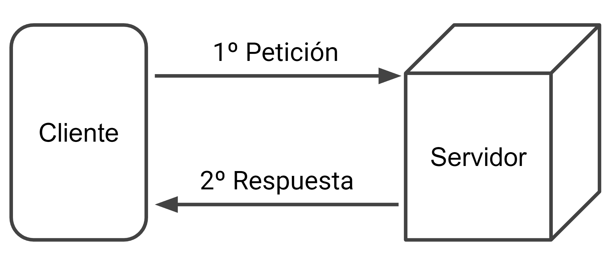
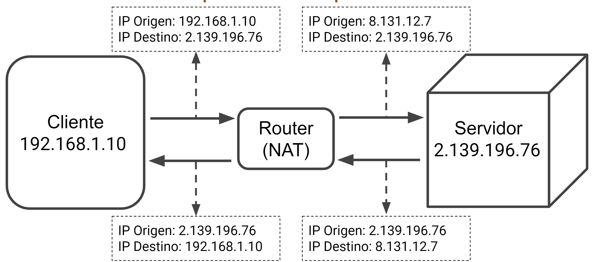

## 1. Introducció

En aquest article es tractarà la història de la web així com el seu funcionament bàsic.

## 2. Història d'Internet

<iframe width="560" height="315" src="https://www.youtube.com/embed/mGG5o6vbKyQ" title="YouTube video player" frameborder="0" allow="accelerometer; autoplay; clipboard-write; encrypted-media; gyroscope; picture-in-picture" allowfullscreen></iframe>

<iframe width="560" height="315" src="https://www.youtube.com/embed/l-zFtlzanvQ" title="YouTube video player" frameborder="0" allow="accelerometer; autoplay; clipboard-write; encrypted-media; gyroscope; picture-in-picture" allowfullscreen></iframe>

<iframe width="560" height="315" src="https://www.youtube.com/embed/9hIQjrMHTv4" title="YouTube video player" frameborder="0" allow="accelerometer; autoplay; clipboard-write; encrypted-media; gyroscope; picture-in-picture" allowfullscreen></iframe>

Llegir article [Història d'Internet: com va néixer i quina va ser la seva evolució](https://marketing4ecommerce.net/historia-de-internet/)

Pregunta 1: Com es deia el primer satèl·lit artificial llançat a lespai?

Pregunta 2: En què es basa la teoria de commutació de paquets?

Pregunta 3: Què unia la xarxa ARPANET?

Pregunta 4: Quines dues ciutats es van unir per primera vegada?

Pregunta 5: Quin és el país amb més penetració d'Internet?

Pregunta 6: Quin és el lloc web més visitat del món?

Pregunta 7: Quina va ser la primera xarxa social de la història?

Leer artículo [Historia de Internet](https://www.mastermarketing-valencia.com/marketing-digital/blog/internet-historia-evolucion/#Los_origenes_de_internet_ARPA) hasta la sección "Evolución de Internet en cifras" incluida.

Leer artículo [Historia de internet](https://www.fib.upc.edu/retro-informatica/historia/internet.html) hasta la sección "WWW" incluida.

## 3. Història del web

Veure fins l'any 2001...

<iframe width="560" height="315" src="https://www.youtube.com/embed/NWUZCTTLQcg" title="YouTube video player" frameborder="0" allow="accelerometer; autoplay; clipboard-write; encrypted-media; gyroscope; picture-in-picture" allowfullscreen></iframe>

  
Què és una pàgina web?

  

Una pàgina web és un document HTML. Aquest document HTML és interpretat per un navegador:

- Google Chrome
- Mozilla Firefox
- Internet Explorer
- Microsoft Edge
- Opera
- Safari

<!-- Comentari perquè no es desquariringui la cosa -->

  
És el mateix Internet que la web?

  

No. WEB = INTERNET + HTTP

## 4. La web 1.0

El web primitiu, el del segle 20, era el que es caracteritza principalment per ser unidireccional i realitzat sobre continguts estàtics. Les primeres pàgines que vam veure a Internet publicaven continguts de text que, una vegada publicats, no s'actualitzaven llevat que el webmaster modifiqués aquests continguts i tornés a pujar el web de nou a internet.

La web 1.0 tenia un caràcter principalment divulgatiu i es van començar a penjar d'internet documents i informació principalment cultural. A poc a poc les empreses van començar a prendre-hi part i les primeres webs d'empresa van sorgir, amb dissenys molt pobres (no hi havia eines, ni tecnologia, ni connexió suficient per fer-ho millor) i continguts que ràpidament quedaven antiquats en ser complex actualitzar-los.

## 5. La web 2.0

La web 2.0 es va consolidar a mitjans de la primera dècada d'aquest segle. Sustentada sota unes connexions a internet evolucionades (ja teníem ADSL), i millors eines per desenvolupar web, millors servidors, etc., la web 2.0, també anomenada "la xarxa social", omple Internet de blocs, wikis, fòrums i finalment, xarxes socials. L'objectiu de la web 2.0 és la compartició del coneixement, és la web col·laborativa i ha estat un dels atractius principals per atraure usuaris (basta veure els usuaris de facebook que, fins a facebook, no tocaven un ordinador).

Pregunta: El web de Homer Simpson és 1.0 o 2.0?

<iframe width="560" height="315" src="https://www.youtube.com/embed/P5MWN3TQeY4" title="YouTube video player" frameborder="0" allow="accelerometer; autoplay; clipboard-write; encrypted-media; gyroscope; picture-in-picture" allowfullscreen></iframe>

## 6. Web 3.0

La web 3.0 és:

- Web semàntica
- Experiència de navegació personalitzada a través de:
- Analitzar l'historial de cada usuari
- Analitzar dades de conducta web de cada usuari
- Desenvolupar tecnologies 3.0 com la Intel·ligència Artificial.
- Crear una base de dades global.
- Analitzar la geolocalització de lusuari.
- Etc.

Llegir article [¿En qué consiste la web semántica?](https://www.ionos.es/digitalguide/online-marketing/marketing-para-motores-de-busqueda/web-semantica/).

 
Quin va ser el motiu de l'èxit de Google?

 

La resposta de l'èxit actual de Google és senzilla: va ser el primer cercador, com a tal, que es va prendre seriosament la feina.

Google va néixer a finals dels anys 90, com la tesi doctoral de Larry Page i Sergey Brin. El 1998 es va estrenar a Internet i des de llavors s'ha consagrat com el principal motor de cerca al món.

La seva innovació principal va ser tenir en compte l'autoritat de les pàgines, guanyada a través d'enllaços. Google va desenvolupar un sistema per quantificar aquesta autoritat, i el va anomenar "PageRank".

Tot i que cal afegir que, a conseqüència de la gran importància que Google atorgava als enllaços, molts -si no és que tots- llocs web han estat creant enllaços no orgànics durant anys, aconseguint més autoritat de la que correspondria de forma natural.

Per això, i per intentar combatre aquest problema, les actualitzacions més recents de l'algorisme de Google s'han centrat en altres mètriques, com ara senyals socials, interacció de l'usuari i qualitat dels continguts, entre d'altres.

## 8. Arquitectura client-servidor

El web té una arquitectura client-servidor.

_Arquitectura client-servidor_

 
Quina diferència hi ha entre una arquitectura client servidor i una arquitectura p2p?

 

**Client-Servidor**: és un model d'aplicació distribuïda en què les tasques es reparteixen entre els proveïdors de recursos o serveis, anomenats servidors, i els demandants, anomenats clients. Un client fa peticions a un altre programa, el servidor, que li dóna resposta. Aquesta idea també es pot aplicar a programes que s'executen sobre un ordinador, encara que és més avantatjosa en un sistema operatiu multiusuari distribuït a través d'una xarxa d'ordinadors.

**P2P**: és una xarxa d'ordinadors on tots o alguns aspectes funcionen sense clients ni servidors fixos, sinó una sèrie de nodes que es comporten com a iguals entre si. És a dir, actuen simultàniament com a clients i servidors respecte als altres nodes de la xarxa. Les xarxes P2P permeten lintercanvi directe dinformació, en qualsevol format, entre els ordinadors interconnectats.

Una de les diferències, és que al “CS” es necessita un servidor, i un client, a diferència del “P2P”, que permet a qualsevol usuari ser client o servidor. Un dels avantatges del "P2P" és que la connexió sempre estarà activa, ja que amb que hi hagi un client, el servidor està actiu, però al "CS" es requereix que el servidor principal estigui actiu. Al "P2P" tot usuari o client té les mateixes funcions que un altre igual que ell, aspecte contrari al "CS" en el qual un servidor té les funcions que els clients no tenen.

**Pregunta: Sabríeu dir-me 5 navegadors web?**

_Arquitectura client-servidor amb NAT_

**Pregunta: Què signifiquen les sigles NAT?**

## 9. Adreces d'Internet

### 9.1. Adreces IP

<iframe width="560" height="315" src="https://www.youtube.com/embed/gVUE2IDwWA0" title="YouTube vídeo player" frameborder="0" allow="accelerometer; autoplay; clipboard- write; encrypted-media;
