## Exercicis CSS

### **Exercici 1: Selectors**

A partir del codi HTML i CSS que es mostra a continuació, afegeix els selectors CSS que falten per aplicar els estils als elements indicats en els comentaris:
``` { .html}
<!doctype html>  
<html>  
<head>

		<meta charset="UTF-8">  
		<title>Exercici de selectors</title>

		<style type="text/css">  
			/* Tots els elements de la pàgina */  
			{ font: 1em/1.3 Arial, Helvetica, sans-serif; }  
	   
			/* Tots els paràgrafs de la pàgina */  
			{ color: #555; }  
   
			/* Tots els paràgrafs continguts en #primero */  
			{ color: #336699; }  
   
			/* Tots els enllaços de la pàgina */  
			{ color: #CC3300; }  
   
			/* Els elements "em" continguts en #primero */  
			{ background: #FFFFCC; padding: .1em; }  
   
			/* Tots els elements "em" de classe "especial" en tota la pàgina */  
			{ background: #FFCC99; border: 1px solid #FF9900; padding: .1em; }  
   
			/* Elements "span" continguts en .normal */  
			{ font-weight: bold; }  
   
		</style>  
	</head>  
   
	<body>  
   
		<div id="primero">

			<p>Lorem ipsum dolor sit amet, <a href="#">consectetuer adipiscing elit</a>.   
			Praesent blandit nibh at felis. Sed nec diam in dolor vestibulum aliquet.   
			Duis ullamcorper, nisi non facilisis molestie, <em>lorem sem aliquam nulla</em>,   
			id lacinia velit mi vestibulum enim.</p>  
   
		</div>  
   
		<div class="normal">

			<p>Phasellus eu velit sed lorem sodales egestas. Ut feugiat. <span><a href="#">  
			Donec porttitor</a>, magna eu varius luctus,</span> metus massa tristique massa,   
			in imperdiet est velit vel magna. Phasellus erat. Duis risus. <a href="#">Maecenas   
			dictum</a>, nibh vitae pellentesque auctor, tellus velit consectetuer tellus, tempor  
			pretium felis tellus at metus.</p>  
   
			<p>Cum sociis natoque <em class="especial">penatibus et magnis</em> dis parturient   
			montes, nascetur ridiculus mus. Proin aliquam convallis ante. Pellentesque habitant  
			morbi tristique senectus et netus et malesuada fames ac turpis egestas. Nunc aliquet.   
			Sed eu metus. Duis justo.</p>  
   
			<p>Donec facilisis blandit velit. Vestibulum nisi. Proin volutpat, <em class="especial">  
			enim id iaculis congue</em>, orci justo ultrices tortor, <a href="#">quis lacinia eros   
			libero in eros</a>. Sed malesuada dui vel quam. Integer at eros.</p>

		</div>  
   
	</body>  
<html>
```

### **Exercici 2: Selectors \- Color**

A partir del codi HTML proporcionat, afegeix les regles CSS necessàries per a que la pàgina resultant tingui el mateix aspecte que el de la següent imatge:


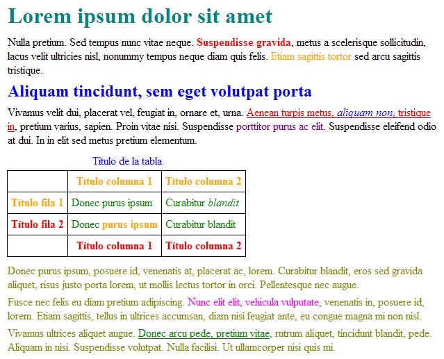

**Colors emprats**

    teal,  
    red,  
    orange,  
    blue,  
    purple,  
    olive,  
    fuchsia,  
    green

**Codi HTML**
```html
<!doctype html>  
<html>  
<head>

		<meta charset="UTF-8">  
		<title>Exercici de selectors</title>

		<style type="text/css">  
			/* No borrar la siguiente regla css porque es necesaria para ver los bordes de la tabla */  
			table, tr, th, td {border:1px solid #000; border-collapse:collapse; padding:5px;}  
		</style>

	</head>

	<body>

		<h1 id="titulo">Lorem ipsum dolor sit amet</h1>  
   
		<p>Nulla pretium. Sed tempus nunc vitae neque. <strong>Suspendisse gravida</strong>, metus a   
		scelerisque sollicitudin, lacus velit ultricies nisl, nonummy tempus neque diam quis felis.   
		<span class="destacado">Etiam sagittis tortor</span> sed arcu sagittis tristique.</p>  
   
		<h2 id="subtitulo">Aliquam tincidunt, sem eget volutpat porta</h2>  
   
		<p>Vivamus velit dui, placerat vel, feugiat in, ornare et, urna.  <a href="#">Aenean turpis   
		metus, <em>aliquam non</em>, tristique in</a>, pretium varius, sapien. Proin vitae nisi.    
		Suspendisse <span class="especial">porttitor purus ac elit</span>. Suspendisse eleifend odio   
		at dui. In in elit sed metus pretium elementum.</p>  
   
		<table summary="Descripción de la tabla y su contenido">  
		<caption>Título de la tabla</caption>  
			<thead>  
  				<tr>  
    					<th scope="col"></th>  
					<th scope="col" class="especial">Título columna 1</th>  
   					<th scope="col" class="especial">Título columna 2</th>  
  				</tr>  
			</thead>  
   
			<tfoot>  
  				<tr>  
   					<th scope="col"></th>  
 					<th scope="col">Título columna 1</th>  
					<th scope="col">Título columna 2</th>  
  				</tr>  
			</tfoot>  
   
			<tbody>  
  				<tr>  
 					<th scope="row" class="especial">Título fila 1</th>  
					<td>Donec purus ipsum</td>  
					<td>Curabitur <em>blandit</em></td>  
				</tr>  
  				<tr>  
					<th scope="row">Título fila 2</th>  
					<td>Donec <strong>purus ipsum</strong></td>  
					<td>Curabitur blandit</td>  
 				</tr>  
			</tbody>  
		</table>  
   
		<div id="adicional">

			<p>Donec purus ipsum, posuere id, venenatis at, <span>placerat ac, lorem</span>.   
			Curabitur blandit, eros sed gravida aliquet, risus justo porta lorem, ut mollis   
			lectus tortor in orci. Pellentesque nec augue.</p>  
   
			<p>Fusce nec felis eu diam pretium adipiscing. <span id="especial">Nunc elit elit,  
			vehicula vulputate</span>, venenatis in, posuere id, lorem. Etiam sagittis, tellus   
			in ultrices accumsan, diam nisi feugiat ante, eu congue magna mi non nisl.</p>  
   
			<p>Vivamus ultrices aliquet augue. <a href="#">Donec arcu pede, pretium vitae</a>,   
			rutrum aliquet, tincidunt blandit, pede. Aliquam in nisi. Suspendisse volutpat.   
			Nulla facilisi. Ut ullamcorper nisi quis mi.</p>  
		</div>

	</body>  
</html>
```

Tingueu en compte que la propietat que cal utilitzar és color i que com a valor es poden indicar directament el nom color.

Els noms dels colors estan estandaritzats i es corresponen amb el nom en anglès de cada color. En aquest exercici, cal utilitzar els següents colors: teal, red, blue, orange, purple, olive, fuchsia i green. Los nombres de los colores también están estandarizados y se corresponden con el nombre en inglés de cada color. En este ejercicio, se deben utilizar los colores: teal, red, blue, orange, purple, olive, fuchsia y green.

### **Exercici 3: Color, Text i Font**

L’objectiu de l’activitat és usant propietats CSS de color, de text i de font, formata la la pàgina en html per a que tingui el següent aspecte.

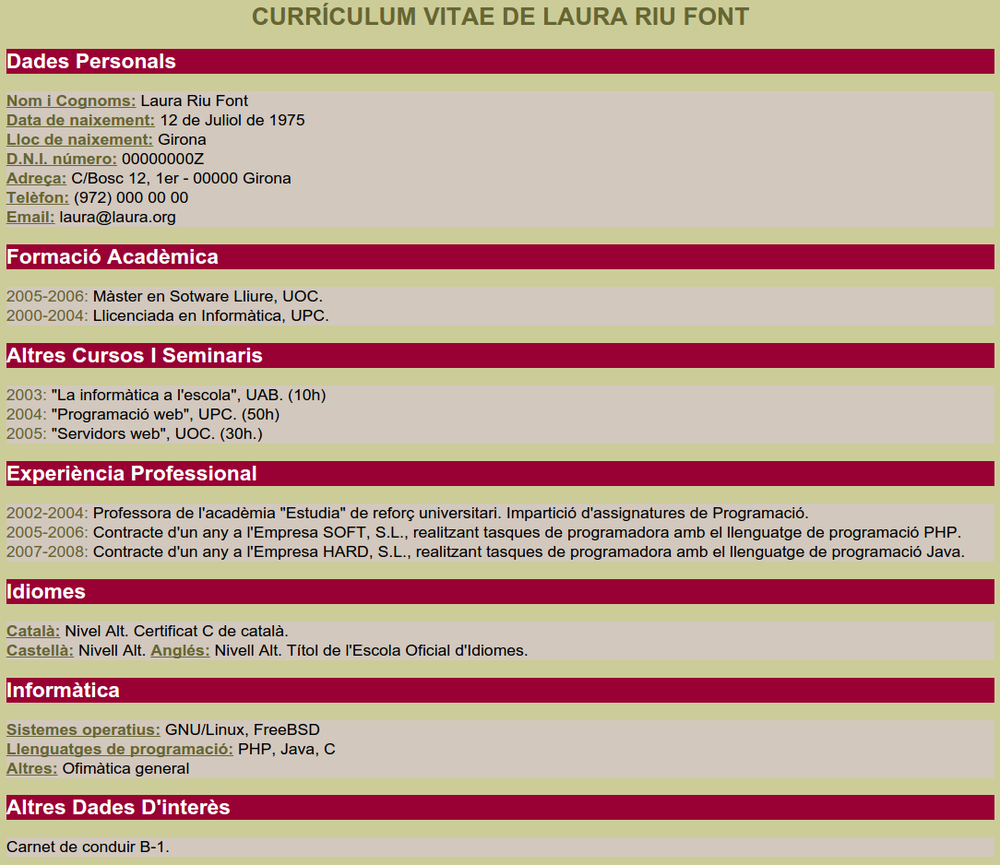

**Atributs**

* background-color, color
* font-family, font-size, font-style, font-weight
* text-align, text-transform; text-decoration

**Valors Atributs**

* Colors: \#CCCC99; black; \#666633; \#990033; \#FFFFFF; \#D2C8BD;
* Font: sans-serif;
* Alineació text: justify;
* Mida font: 150%; 130%;
* Transformació text: uppercase; capitalize;
* Estil font: normal;
* Pes font: bold; normal;
* Decoració text: underline;

```html
<!doctype html>
<html>
<head>
    <title>Currículum</title>
    <meta charset="UTF-8">
    <link href="estils/curriculum.css" rel="stylesheet" type="text/css" />
</head>
<body>
<h1>Currículum Vitae de Laura Riu Font</h1>
<h2>Dades personals</h2>
<p>
    <em>Nom i Cognoms:</em> Laura Riu Font<br />
    <em>Data de naixement:</em> 12 de Juliol de 1975<br />
    <em>Lloc de naixement:</em> Girona<br />
    <em>D.N.I. número:</em> 00000000Z<br />
    <em>Adreça:</em> C/Bosc 12, 1er - 00000 Girona<br />
    <em>Telèfon:</em> (972) 000 00 00<br />
    <em>Email:</em> laura@laura.org
</p>
<h2>Formació acadèmica</h2>
<p>
    <strong>2005-2006:</strong> Màster en Sotware Lliure, UOC.<br />
    <strong>2000-2004:</strong> Llicenciada en Informàtica, UPC.</p>

<h2>Altres cursos i seminaris</h2>
<p>
    <strong>2003:</strong> "La informàtica a l'escola", UAB. (10h)<br />
    <strong>2004:</strong> "Programació web", UPC. (50h)<br />
    <strong>2005:</strong> "Servidors web", UOC. (30h.)<br />
</p>
<h2>Experiència professional</h2>
<p>
    <strong>2002-2004:</strong> Professora de l'acadèmia "Estudia" de reforç universitari. Impartició d'assignatures de Programació.<br />
    <strong>2005-2006:</strong> Contracte d'un any a l'Empresa SOFT, S.L., realitzant tasques de programadora amb el llenguatge de programació PHP.<br />
    <strong>2007-2008:</strong> Contracte d'un any a l'Empresa HARD, S.L., realitzant tasques de programadora amb el llenguatge de programació Java.
</p>
<h2>Idiomes</h2>
<p>
    <em>Català:</em> Nivel Alt. Certificat C de català.<br />
    <em>Castellà:</em> Nivell Alt.
    <em>Anglés:</em> Nivell Alt. Títol de l'Escola Oficial d'Idiomes.<br />
</p>
<h2>Informàtica</h2>
<p>
    <em>Sistemes operatius:</em> GNU/Linux, FreeBSD<br />
    <em>Llenguatges de programació:</em> PHP, Java, C<br />
    <em>Altres:</em> Ofimàtica general
</p>
<h2>Altres dades d'interès</h2>
<p>Carnet de conduir B-1.</p>
</body>
</html>

```

### **Exercici 4: El model de caixa i el model visual**

L’objectiu de l’activitat és fer una pàgina web que reculli informació de quatre distribucions de GNU/Linux, usant les propietats CSS de color, text i font, el model de caixa i el model visual.

Cerqueu una breu descripció de quatre distribucions de GNU/Linux i el seu logotip. Creeu una web que tingui un menú superior fix d’enllaços que vagin a parar a cadascuna de les descripcions, que estaran en el mateix document.

Cada descripció ha de tenir les seccions següents:

* Bàner amb el logotip repetit de la distribució com a fons.
* Títol amb el nom de la distribució.
* Descripció de la distribució.
* Enllaç extern a la pàgina oficial de la distribució.

**Atributs**

* background-color, color
* background-image
* text-align, text-decoration, line-height
* font-family
* clear
* margin-top; margin-bottom
* border
* padding

**Valors Atributs**

* Colors: \#F3F3CC; \#9EB847; \#FFFFFF; \#C87533; \#FEBF10; \#33170D;
* Font: sans-serif;
* Alineació text: center;
* Netejar: both;
* Marges: 5em; 0.5em;
* Farciment: 0 0.5em 0.5em; 0.2em;
* Vores: dotted thin \#33170D;
* Alçada línia: 2em;
* Imatge de fons: url("../img/xxxx.png");
* Decoració text: none; underline;

Exemple:

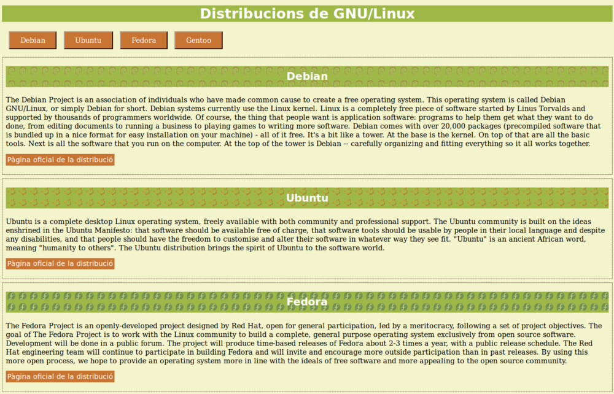

Useu el Bluefish per fer aquesta activitat.

### **Exercici 5: Posicionament i model de caixa**

L’objectiu d’aquesta activitat és agafar destresa amb el treball amb capes HTML i CSS3.

Elaboreu amb capes HTML i CSS3 una imatge com la que es mostra a la figura.

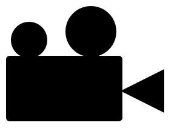

Feu servir:

* Principalment la propietat position de CSS per elaborar aquest exercici.
* La propietat border-radius i border per donar forma als diferents components de la figura proposada, ja sigui el rectangle, els triangle o els cercles.
* Doneu color a les caixes corresponents, amb la propietat background-color.

Useu el Bluefish per fer aquesta activitat.

```html
<!doctype html>
<html>
    <head>
        <meta charset="utf-8">
        <title>Solucio càmara</title>
    </head>
    
    <body>
        <div id="cerclepetit" class="fons"></div>
        <div id="cerclegran" class="fons"></div>
        <div id="coscamara" class="fons"></div>
        <div id="triangle"></div>
    </body>

</html>

```

**Atributs**

* background-color
* width, height
* border-radius, border-top, border-right, border-bottom
* position
* left, top
* margin-left

**Valors Atributs**

* Colors: \#000;
* Amplades: 50px; 70px; 160px; 0;
* Alçades: 50px; 70px; 90px; 0;
* Cantonades: 25px; 35px; 5px;
* Posicionament: absolute; relative;
* Esquerra: 15px; 90px;
* A dalt: 53px; 32px; 100px; 110px;
* Vores: 30px solid transparent; 60px solid black; 30px solid transparent;
* Marges: 158px;

### **Exercici 6: Posicionament float**

L’objectiu d’aquesta activitat és treballar el posicionament per la creació d’un layout.

Elaboreu un layout com el que es mostra a la figura.

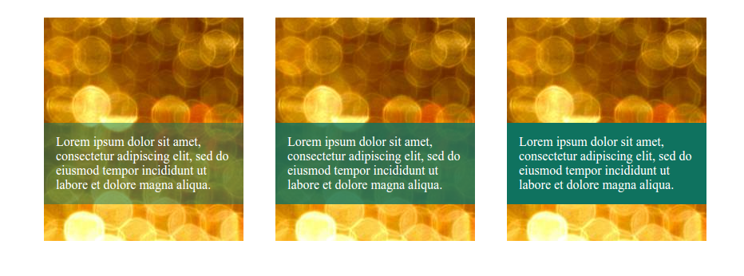

Feu servir les següents característiques:

* La propietat float pels tres elements centrals.
* Feu servir margin per separar els elements centrals.
* Feu servir padding perquè el text contingut a les àrees de color verd no toqui la vora.
* Doneu colors diferents als textos i a les caixes corresponents, amb les propietats color i background-color.
* Feu servir z-index o posicionament per superposar el text a les imatges.

Useu el Bluefish per fer aquesta activitat.

```html
<!DOCTYPE html>
<html>
<head>
    <meta charset="UTF-8">
    <title>Solució columnes</title>

</head>

<body>
<div id="contenidor">
    <article>
        <p id="primera">Lorem ipsum dolor sit amet, consectetur
            adipiscing elit, sed do eiusmod tempor incididunt ut
            labore et dolore magna aliqua.
        </p>
    </article>
    <article>
        <p id="segona">Lorem ipsum dolor sit amet, consectetur
            adipiscing elit, sed do eiusmod tempor incididunt ut
            labore et dolore magna aliqua.
        </p>
    </article>
    <article>
        <p>Lorem ipsum dolor sit amet, consectetur adipiscing
            elit, sed do eiusmod tempor incididunt ut labore et
            dolore magna aliqua.
        </p>
    </article>
</div>
</body>
</html>

```

**Atributs**

* color, background-color, background-image
* max-width
* margin
* width, height
* float
* position
* bottom
* padding

**Valors Atributs**

* Colors: rgb(15,114,95); white; rgba(15,114,95,0.8); rgba(15,114,95,0.5);
* Posicionament: absolute; relative;
* A baix: 30px;
* Mida màxima: 960px;
* Marges: 0 auto; 20px;
* Amplades: 250px;
* Alçades: 280px;
* Flotació: left;
* Imatge de fons: url("./imatges/imatgefons.jpg");
* Farciment: 15px;

### **Exercici 7: Maquetació web**

L’objectiu de l’activitat és construir una estructura web amb algunes propietats CSS addicionals.

Heu de crear un document HTML i el document CSS corresponent per generar l’estructura següent:

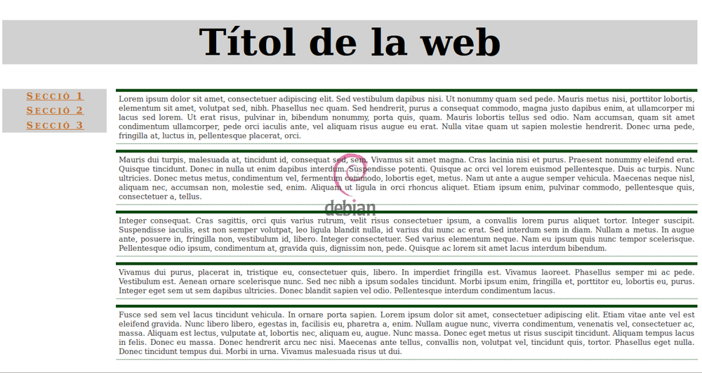

i que es compleixin els requisits següents:

* En el cos hi ha d’haver una imatge de fons fixada al mig de la pantalla.
* El títol ha de tenir color de fons gris clar, el text ha d’estar centrat i la mida de la lletra ha de ser molt gran.
* Els paràgrafs que hi hagi en el cos han de complir el següent:
* El text ha d’estar justificat.
* La lletra ha de ser de color gris fosc.
* La mida de la lletra ha de ser petita.
* Han de tenir una vora superior gruixuda de color verd fosc i una vora inferior puntejada de ::\*color verd fosc.
* Els marges superior i inferior han de ser de 10 px.
* Tots els farciments han de ser de 5 px.
* Cada ítem del menú ha de complir el següent:
* El text ha d’estar centrat.
* Les minúscules han de ser smallcaps.
* El color de fons ha de ser gris clar.
* La lletra ha de ser de color taronja fosc i negreta.
* Hi ha d’haver una mica de separació entre les lletres.

Useu el Bluefish per fer aquesta activitat.
```html
<!doctype html>
<html>
<head>
    <title>Estructura</title>
    <meta charset="UTF-8">
    <link href="estils/sense_taules.css" type="text/css" rel="stylesheet" />
</head>
<body>
<header id="cap">
    <h1>Títol de la web</h1>
</header>
<section id="lateral">
    <nav id="menu">
        <ul>
            <li><a href="#">Secció 1</a></li>
            <li><a href="#">Secció 2</a></li>
            <li><a href="#">Secció 3</a></li>
        </ul>
    </nav>
</section>
<section id="cos">
    <p>Lorem ipsum dolor sit amet, consectetuer adipiscing elit. Sed vestibulum
        dapibus nisi. Ut nonummy quam sed pede. Mauris metus nisi, porttitor lobortis,
        elementum sit amet, volutpat sed, nibh. Phasellus nec quam. Sed hendrerit, purus
        a consequat commodo, magna justo dapibus enim, at ullamcorper mi lacus sed
        lorem. Ut erat risus, pulvinar in, bibendum nonummy, porta quis, quam. Mauris
        lobortis tellus sed odio. Nam accumsan, quam sit amet condimentum ullamcorper,
        pede orci iaculis ante, vel aliquam risus augue eu erat. Nulla vitae quam ut
        sapien molestie hendrerit. Donec urna pede, fringilla at, luctus in,
        pellentesque placerat, orci.</p>

    <p>Mauris dui turpis, malesuada at, tincidunt id, consequat sed, sem.
        Vivamus sit amet magna. Cras lacinia nisi et purus. Praesent nonummy eleifend
        erat. Quisque tincidunt. Donec in nulla ut enim dapibus interdum. Suspendisse
        potenti. Quisque ac orci vel lorem euismod pellentesque. Duis ac turpis. Nunc
        ultricies. Donec metus metus, condimentum vel, fermentum commodo, lobortis eget,
        metus. Nam ut ante a augue semper vehicula. Maecenas neque nisl, aliquam nec,
        accumsan non, molestie sed, enim. Aliquam ut ligula in orci rhoncus aliquet.
        Etiam ipsum enim, pulvinar commodo, pellentesque quis, consectetuer a,
        tellus.</p>

    <p>Integer consequat. Cras sagittis, orci quis varius rutrum, velit risus
        consectetuer ipsum, a convallis lorem purus aliquet tortor. Integer suscipit.
        Suspendisse iaculis, est non semper volutpat, leo ligula blandit nulla, id
        varius dui nunc ac erat. Sed interdum sem in diam. Nullam a metus. In augue
        ante, posuere in, fringilla non, vestibulum id, libero. Integer consectetuer.
        Sed varius elementum neque. Nam eu ipsum quis nunc tempor scelerisque.
        Pellentesque odio ipsum, condimentum at, gravida quis, dignissim non, pede.
        Quisque ac lorem sit amet lacus interdum bibendum.</p>

    <p>Vivamus dui purus, placerat in, tristique eu, consectetuer quis, libero.
        In imperdiet fringilla est. Vivamus laoreet. Phasellus semper mi ac pede.
        Vestibulum est. Aenean ornare scelerisque nunc. Sed nec nibh a ipsum sodales
        tincidunt. Morbi ipsum enim, fringilla et, porttitor eu, lobortis eu, purus.
        Integer eget sem ut sem dapibus ultricies. Donec blandit sapien vel odio.
        Pellentesque interdum condimentum lacus.</p>

    <p>Fusce sed sem vel lacus tincidunt vehicula. In ornare porta sapien.
        Lorem ipsum dolor sit amet, consectetuer adipiscing elit. Etiam vitae ante vel
        est eleifend gravida. Nunc libero libero, egestas in, facilisis eu, pharetra a,
        enim. Nullam augue nunc, viverra condimentum, venenatis vel, consectetuer ac,
        massa. Aliquam est lectus, vulputate at, lobortis nec, aliquam eu, augue. Nunc
        massa. Donec eget metus ut risus suscipit tincidunt. Aliquam tempus lacus in
        felis. Donec eu massa. Donec hendrerit arcu nec nisi. Maecenas ante tellus,
        convallis non, volutpat vel, tincidunt quis, tortor. Phasellus eget nulla. Donec
        tincidunt tempus dui. Morbi in urna. Vivamus malesuada risus ut dui.</p>
</section>
</body>
</html>

```

**Atributs**

* color, background-color
* text-align
* font-size, font-weight, font-variant
* letter-spacing
* width
* margin, margin-left, margin-top, margin-bottom
* padding, padding-left
* background
* border-top, border-bottom
* list-style-type
* display
* float

**Valors Atributs**

* Colors: \#D1D1D1; \#3F3F3F; \#C7712B;
* Alineació text: center; justify;
* Estil llista: none;
* Mida font: xx-large; small;
* Pes font: bold;
* Variant font: small-caps;
* Espai entre lletres: 0.2em;
* Vores: thick solid \#0A4911; thin dotted \#0A4911;
* Marges: 15%; 10px; 0;
* Amplades: 15%;
* Flotació: left;
* Imatge fons: url("../img/debian.png") no-repeat fixed center center;
* Farciment: 1em; 5px; 0; 0.2em 0.2em 0.2em 0.4em ;
* Visualització: block;

### **Exercici 3: Marges \- Farciments**

A partir del cdi HTML y CSS proporcionats, determina les regles CSS necessàries per afegir els següents marges i farciments:

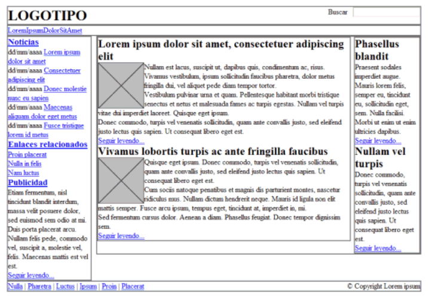

1\. L'element \#cabecera ha de tenir un farciment de 1em en tots els costats.

2\. L'element \#menu ha de tenir un farciment 0.5em en tots els costats i un marge inferior de 0.5em.

3\. La resta d'elements (\#noticias, \#publicidad, \#principal, \#secundario) han de tenir 0.5em de farciment en tots els seus costats, excepte l'element \#pie, que només ha de tenir farciment en la zona superior i inferior.

4\. Els elements .articulo han de mostrar una separació entre ells de 1em.

5\. Les imatges dels articles han de mostrar un marge de 0.5em en tots els seus costats.

6\. L'element \#publicidad està separat 1em del seu element superior.

7\. L'element \#pie ha de tenir un marge superior de 1em.

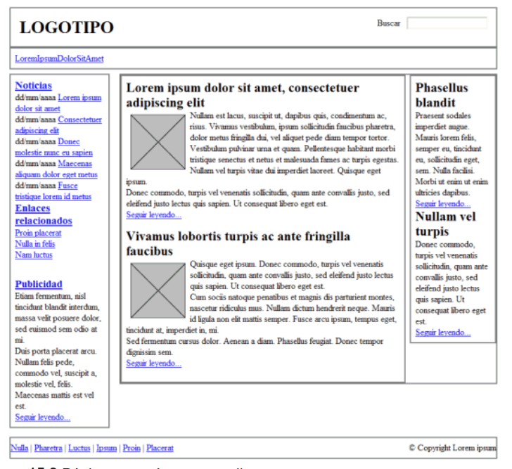

**Codi HTML**

```html
<!doctype html>  
<html>  
<head>

		<meta charset="UTF-8">  
	   	<link rel="stylesheet" type="text/css" href="ex3_estils.css" title="style" />  
		<title>Lorem ipsum</title>

	</head>

	<body>  
		<!-- Contenedor -->  
		<div id="contenedor">

			<!-- Cabecera -->  
			<div id="cabecera">

				<div id="logo">  
					<h1><span>LOGOTIPO</span></h1>  
				</div>  
	  
				<div id="buscador">  
					<form action="#" method="post">  
						Buscar   <input name="busqueda" type="text" />  
					</form>  
				</div>  
			  
				<div class="clear"></div>  
			</div>  
		  
			<!-- /Cabecera -->  
		  
			<!-- Menu principal -->  
			<div id="menu">

				<ul id="menu_principal">  
					<li><a href="#">Lorem</a></li>  
					<li><a href="#">Ipsum</a></li>  
					<li><a href="#">Dolor</a></li>  
					<li><a href="#">Sit</a></li>  
					<li><a href="#">Amet</a></li>  
				</ul>

				<div class="clear"></div>  
			</div>  
	

			<!-- Lateral -->  
			<div id="lateral">  
		  
				<!-- Noticias -->  
				<div id="noticias">  
	  
					<h3><a href="#">Noticias</a></h3>

					<p><span class="fecha">dd/mm/aaaa</span> <a href="#">  
					Lorem ipsum dolor sit amet</a></p>  
					<p><span class="fecha">dd/mm/aaaa</span> <a href="#">  
					Consectetuer adipiscing elit</a></p>  
					<p><span class="fecha">dd/mm/aaaa</span> <a href="#">  
					Donec molestie nunc eu sapien</a></p>  
					<p><span class="fecha">dd/mm/aaaa</span> <a href="#">  
					Maecenas aliquam dolor eget metus</a></p>  
					<p><span class="fecha">dd/mm/aaaa</span> <a href="#">  
					Fusce tristique lorem id metus</a></p>  
				  
					<h3><a href="#">Enlaces relacionados</a></h3>

						<ul>  
							<li><a href="#">Proin placerat</a></li>  
							<li><a href="#">Nulla in felis</a></li>  
							<li><a href="#">Nam luctus</a></li>  
						</ul>  
				</div>  
				<!-- /Noticias -->  
	  
				<!-- Publicidad -->  
				<div id="publicidad">  
					<h3><a href="#">Publicidad</a></h3>

						<p>Etiam fermentum, nisl tincidunt blandit interdum,   
						massa velit posuere dolor, sed euismod sem odio at mi.</p>  
						<p>Duis porta placerat arcu. Nullam felis pede, commodo   
						vel, suscipit a, molestie vel, felis. Maecenas mattis   
						est vel est.</p>  
						<p><a href="#">Seguir leyendo...</a></p>  
				</div>  
				<!-- /Publicidad -->

			</div>  
			<!-- /Lateral -->  
	  
			<div id="contenido">  
	  
				<!-- Principal -->  
				<div id="principal">  
		  
					<div class="articulo">

						<h2>Lorem ipsum dolor sit amet, consectetuer adipiscing elit</h2>  
		  
						  
			  
						<p>Nullam est lacus, suscipit ut, dapibus quis, condimentum ac,   
						risus. Vivamus vestibulum, ipsum sollicitudin faucibus pharetra,   
						dolor metus fringilla dui, vel aliquet pede diam tempor tortor.</p>  
						<p>Vestibulum pulvinar urna et quam. Pellentesque habitant morbi   
						tristique senectus et netus et malesuada fames ac turpis egestas.  
						Nullam vel turpis vitae dui imperdiet laoreet. Quisque eget ipsum.</p>  
						<p>Donec commodo, turpis vel venenatis sollicitudin, quam ante   
						convallis justo, sed eleifend justo lectus quis sapien. Ut consequat   
						libero eget est.</p>  
						<p><a href="#">Seguir leyendo...</a></p>  
					</div>  
	  
					<div class="articulo">

						<h2>Vivamus lobortis turpis ac ante fringilla faucibus</h2>  
		  
						  
			  
						<p>Quisque eget ipsum. Donec commodo, turpis vel venenatis sollicitudin,   
						quam ante convallis justo, sed eleifend justo lectus quis sapien. Ut  
						consequat libero eget est.</p>  
						<p>Cum sociis natoque penatibus et magnis dis parturient montes, nascetur  
						ridiculus mus. Nullam dictum hendrerit neque. Mauris id ligula non elit   
						mattis semper. Fusce arcu ipsum, tempus eget, tincidunt at, imperdiet   
						in, mi.</p>  
						<p>Sed fermentum cursus dolor. Aenean a diam. Phasellus feugiat. Donec   
						tempor dignissim sem.</p>  
						<p><a href="#">Seguir leyendo...</a></p>  
					</div>  
		  
				</div>  
				<!-- /Principal -->  
	  
				<!-- Secundario -->

				<div id="secundario">

					<h2>Phasellus blandit</h2>

						<p>Praesent sodales imperdiet augue. Mauris lorem felis, semper eu,   
						tincidunt eu, sollicitudin eget, sem. Nulla facilisi. Morbi ut enim ut   
						enim ultricies dapibus.</p>  
						<p><a href="#">Seguir leyendo...</a></p>  
	  
					<h2>Nullam vel turpis</h2>

						<p>Donec commodo, turpis vel venenatis sollicitudin, quam ante convallis  
						justo, sed eleifend justo lectus quis sapien. Ut consequat libero eget est.</p>  
						<p><a href="#">Seguir leyendo...</a></p>  
				</div>  
				<!-- /Secundario -->

			</div>  
			<!-- /Contenido -->  
	  
    			<div class="clear"></div>  
	  
    			<!-- Pie -->  
			<div id="pie">

				<span class="enlaces">  
					<a href="#">Nulla</a> |  
					<a href="#">Pharetra</a> |  
					<a href="#">Luctus</a> |  
					<a href="#">Ipsum</a> |  
					<a href="#">Proin</a> |  
					<a href="#">Placerat</a>  
				</span>  
			  
				<span class="copyright">  
					© Copyright Lorem ipsum  
				</span>

				<div class="clear"></div>  
			</div>  
			<!-- /Pie -->

		</div>  
		<!-- /Contenedor -->

	</body>

<html>

```

**Codi CSS**

```css
/* === IMPORTANTE ===================================================  
No modificar estos estilos, ya que son imprescindibles para  
que la página se vea correctamente.  
================================================================== */

/*-- Básico ----------------------------------------------------------*/  
ul, ul li { margin: 0; padding: 0; list-style: none; }  
h1, h2, h3, p, form { margin: 0; padding: 0; }  
.clear { clear: both; }  
img { border: none; }

/*-- Layout ----------------------------------------------------------*/  
#contenedor {  
width: 90%;  
max-width: 900px;
@media (max-width: 900px) {
    body {
        width: auto;
    }
}

@media (min-width: 901px) {
    body {
        width: 900px;
    }
}
margin: 0 auto;  
}

#cabecera, #menu, #lateral, #contenido, #contenido #principal, #contenido #secundario, #pie {  
border: 2px solid #777;  
}

#cabecera { clear: both; }  
#menu { clear: both; }  
#lateral { float: left; width: 20%; }  
#contenido { float: right; width: 78%; }  
#contenido #principal { float: left; width: 78%; }  
#contenido #secundario { float: right; width: 20%; }  
#pie { clear: both; }

/*-- Cabecera --------------------------------------------------------*/  
#cabecera #logo { float: left; }  
#cabecera #buscador { float: right; }

/*-- Menu ------------------------------------------------------------*/  
#menu ul#menu_principal li { display: inline; float: left; }

/*-- Sección Principal -----------------------------------------------*/  
#contenido #principal .articulo img { width: 100px; float: left; }

/*-- Pie de página ---------------------------------------------------*/  
#pie .enlaces   { float: left; }  
#pie .copyright { float: right; }

/* === IMPORTANTE ===================================================  
A partir de aquí, se pueden añadir todos los estilos propios que   
sean necesarios.  
================================================================== */

```
* [Solució Marges \- Farciments](SolucioMarges.md)

### **Exercici 4: Vores**

A partir del códi HTML y CSS obtinguts en l'exercici 3, determina les regles CSS necessàries per afegir les següents vores:

1\. Elimina la vora gris que mostren per defecte tots els elements.

2\. L'element \#menu ha de tenir una vora inferior de 1 píxel i de color blau (\#004C99).

3\. L'element \#noticias mostra una vora de 1 píxel i de color gris clar (\#C5C5C5).

4\. L'element \#publicidad ha de mostrar una vora discontinua de 1 píxel i de color \#CC6600.

5\. El lateral format per l'element \#secundario mostra una vora de 1 píxel i de color \#CC6600.

6\. L'element \#pie ha de mostrar una vora superior superior i altra inferior de 1 píxel i color gris clar \#C5C5C5.

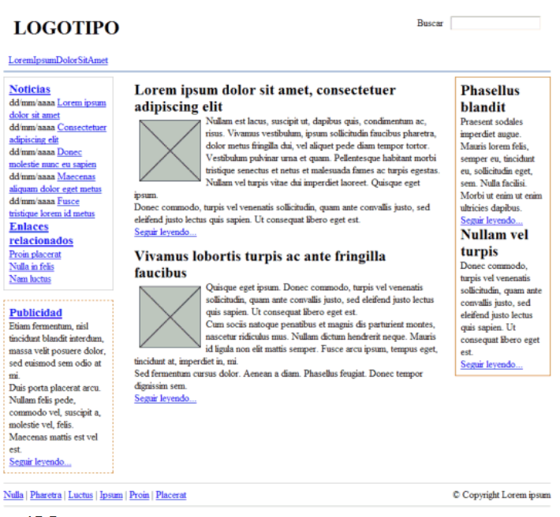

### **Exercici 5: Colors i imatges de fons**

A partir del códi HTML y CSS obtinguts en l'exercici 4, determina les regles CSS necessàries per afegir els següents colors i imatges de fons:

1\. Els elements \#noticias i \#pie tenen un color de fons gris clar (\#F8F8F8).

2\. L'element \#publicidad mostra un color de fons groc clar (\#FFF6CD).

3\. Els elements h2 del lateral \#secundario mostra un color de fons \#DB905C i un petit padding de .2em.

4\. El fons de l'element \#menu es construeix mitjançant una petita imatge anomenada fondo\_menu.gif.

5\. El logotip del lloc es mostra mitjançant una imatge de fons de l'element h1 contingut en l'element \#cabecera (la imatge s'anomena logo.gif).


### **Exercici 6: Posicionament Float**

A partir del codi HTML següent:

```html
<!DOCTYPE html PUBLIC "-//W3C//DTD XHTML 1.0 Transitional//EN" "http://www.w3.org/TR/xhtml1/DTD/xhtml1-transitional.dtd">  
<html xmlns="http://www.w3.org/1999/xhtml">  
<head>  
<meta http-equiv="Content-Type" content="text/html; charset=iso-8859-1" />  
<title>Ejercicio posicionamiento float</title>  
<style type="text/css">  
</style>  
</head>

<body>  
<div>  
« Anterior   Siguiente »  
</div>  
</body>  
</html>

```

Determina les regles CSS necessàries per a que el resultat sigui similar al mostrat en la següent imatge:


### **Exercici 7: Tipografia**

A partir del codi HTML i CSS obtingut en el exercici 5\. determina les regles necessàries per afegir les següents propietats a la tipografia de la pàgina.

1\. La font base de la pàgina ha de ser: color negre, tipus Arial, mida 0.9 em, interlineat 1.4.

2\. Els element h2 de .articulo es mostren en color \#CC6600, amb un mida de lletra de 1.6em, un interlineat de 1.2 i un marge inferior de 0.3em.

3\. Els elements del \#menu han de mostrar un marge a la seva dreta de 1em i els enllaços han de ser de color blanc i mida de lletra 1.3em.

4\. La mida del text de tots els continguts de \#lateral ha de ser de 0.9em. La data de cada notícia ha d'ocupar l'espai de tota la seva línia i mostrar-se en color gris clar \#999. L'element h3 de \#noticias ha de mostrar-se de color \#003366.

5\. El text de l'element \#publicidad és de color gris fosc \#555 i tots els enllaços de color \#CC6600.

6\. Els enllaços contiguts dins de .articulo són de color \#CC6600 i tots els paràgrafs mostren un marge superior e inferior de 0.3em.

7\. Afegeix les regles necessàries per a que el contingut de \#secundario es vegi com en la imatge que es mostra.

8\. Afegeix les regles necessàries per a que el contingut de \#pie es vegi com en la imatge que es mostra.

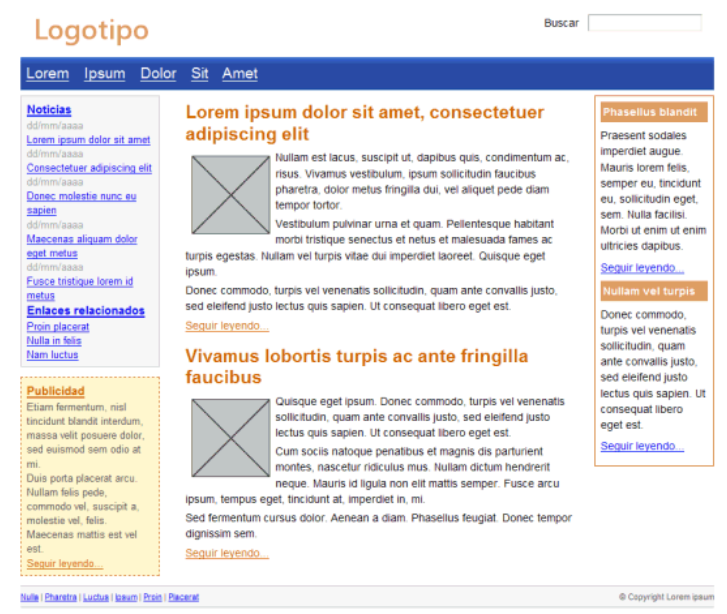

### **Exercici 8: Enllaços**

Defineix les regles CSS que permeten mostrar els enllaços amb els següents estils:

1\. En el seu estat normal, els enllaços es mostren de color vermell \#CC0000.

2\. Quan l'usuari passa el ratolí per sobre l'enllaç, es mostra amb un color de fons vermell \#CC0000 i la lletra de color blanc \#FFF.

3\. Els enllaços visitats es mostren en color gris clar \#CCC.

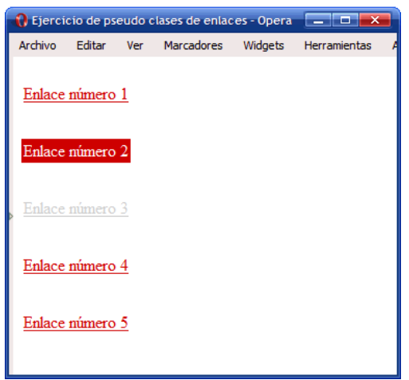

**Codi HTML**
```html
<!DOCTYPE html PUBLIC "-//W3C//DTD XHTML 1.0 Transitional//EN" "http://www.w3.org/TR/xhtml1/DTD/xhtml1-transitional.dtd">  
<html xmlns="http://www.w3.org/1999/xhtml">  
<head>  
<meta http-equiv="Content-Type" content="text/html; charset=iso-8859-1" />  
<title>Ejercicio de pseudo clases de enlaces</title>  
<style type="text/css">  
a {  
margin: 1em 0;  
float: left;  
clear: left;  
padding: 2px;  
}  
</style>  
</head>

<body>  
<a href="#">Enlace n�mero 1</a>

<a href="#">Enlace n�mero 2</a>

<a href="#">Enlace n�mero 3</a>

<a href="#">Enlace n�mero 4</a>

<a href="#">Enlace n�mero 5</a>  
</body>  
</html>

```
### **Exercici 9: Galeria d'imatges**

Defineix les regles CSS que permeten mostrar una galeria d'imatges similar a la que es mostra en la següent imatge:


**Codi HTML**

```html
<!DOCTYPE html PUBLIC "-//W3C//DTD XHTML 1.0 Transitional//EN" "http://www.w3.org/TR/xhtml1/DTD/xhtml1-transitional.dtd">
<html xmlns="http://www.w3.org/1999/xhtml">
<head>
    <meta http-equiv="Content-Type" content="text/html; charset=iso-8859-1" />
    <title>Ejercicio galer?a de im?genes</title>
    <style type="text/css">

    </style>
</head>

<body>
<div id="galeria">
    
    
    
    
    
    
    
    
    
</div>
</body>
</html>

```

### **Exercici 10: Estils menú**

Modifica el menú vertical senzill per obtenir el següent comportament:

1\. Els elements han de mostrar una imatge de fons (flecha\_inactiva.png):

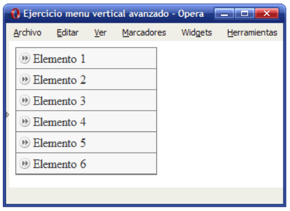

2\. Quan es passa el ratolí per sobre d'un element, s'ha de mostrar una imatge alternativa (flecha\_activa.png):


3\. El color de fons de l'element també ha de variar lleugerament i mostrar un color gris més fosc (\#E4E4E4) quan es passa el ratolí per sobre:


4\. Aquest comportament anterior s'ha de produir quan l'usuari passa el ratolí per sobre de qualsevol zona de l'element del menú, i no només quan es passa el ratolí per sobre del text del element.


**Codi HTML**

```html
<!DOCTYPE html PUBLIC "-//W3C//DTD XHTML 1.0 Transitional//EN" "http://www.w3.org/TR/xhtml1/DTD/xhtml1-transitional.dtd">
<html xmlns="http://www.w3.org/1999/xhtml">
<head>
    <meta http-equiv="Content-Type" content="text/html; charset=iso-8859-1" />
    <title>Ejercicio menu vertical avanzado</title>
    <style type="text/css">
        ul.menu {
            width: 180px;
            list-style: none;
            margin: 0;
            padding: 0;
            border: 1px solid #7C7C7C;
        }
        ul.menu li {
            border-bottom: 1px solid #7C7C7C;
            border-top: 1px solid #FFF;
            background: #F4F4F4;
        }
        ul.menu li a {
            padding: .2em 0 .2em 1.3em;
            display: block;
            text-decoration: none;
            color: #333;
        }
    </style>
</head>

<body>
<ul class="menu">
    <li><a href="#" title="Enlace gen?rico">Elemento 1</a></li>
    <li><a href="#" title="Enlace gen?rico">Elemento 2</a></li>
    <li><a href="#" title="Enlace gen?rico">Elemento 3</a></li>
    <li><a href="#" title="Enlace gen?rico">Elemento 4</a></li>
    <li><a href="#" title="Enlace gen?rico">Elemento 5</a></li>
    <li><a href="#" title="Enlace gen?rico">Elemento 6</a></li>
</ul>
</body>
</html>

```

### **Exercici 11: Estils taules**

Determina les regles CSS necessàries per mostrar la següent taula amb l'aspecte final mostrat en la imatge (modificar el codi HTML que consideris necessari afegint els atributs class oportunos).

Taula original:

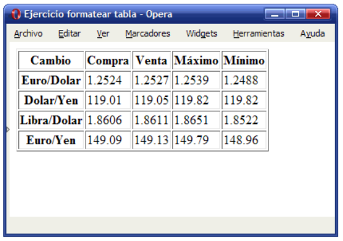

Codi HTML:
 ```html
<!DOCTYPE html PUBLIC "-//W3C//DTD XHTML 1.0 Transitional//EN" "http://www.w3.org/TR/xhtml1/DTD/xhtml1-transitional.dtd">  
<html xmlns="http://www.w3.org/1999/xhtml">  
<head>  
<meta http-equiv="Content-Type" content="text/html; charset=iso-8859-1" />  
<title>Ejercicio formatear tabla</title>  
</head>

<body>  
<table border="1" summary="Tipos de cambio">  
<tr>  
<th scope="col">Cambio</th>  
<th scope="col">Compra</th>  
<th scope="col">Venta</th>  
<th scope="col">Máximo</th>  
<th scope="col">Mínimo</th>  
</tr>  
<tr>  
<th scope="row">Euro/Dolar</th>  
<td>1.2524</td>  
<td>1.2527</td>  
<td>1.2539</td>  
<td>1.2488</td>  
</tr>  
<tr>  
<th scope="row">Dolar/Yen</th>  
<td>119.01</td>  
<td>119.05</td>  
<td>119.82</td>  
<td>119.82</td>  
</tr>  
<tr>  
<th scope="row">Libra/Dolar</th>  
<td>1.8606</td>  
<td>1.8611</td>  
<td>1.8651</td>  
<td>1.8522</td>  
</tr>  
<tr>  
<th scope="row">Euro/Yen</th>  
<td>149.09</td>  
<td>149.13</td>  
<td>149.79</td>  
<td>148.96</td>  
</tr>  
</table>

</body>  
</html>

```

Taula final:

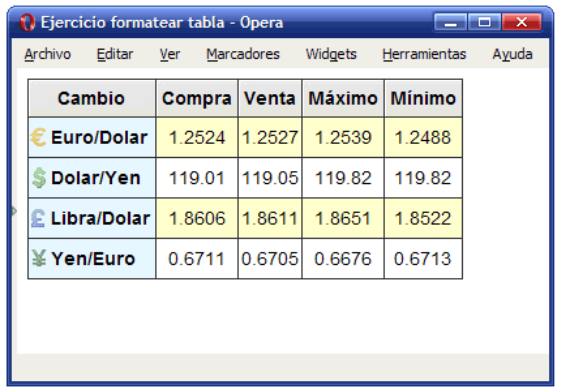

1\. Alinea el text de les cel·les, capçaleres i títol. Defineix les vores de la taula, cel·les i capçaleres (color gris fosc \#333).

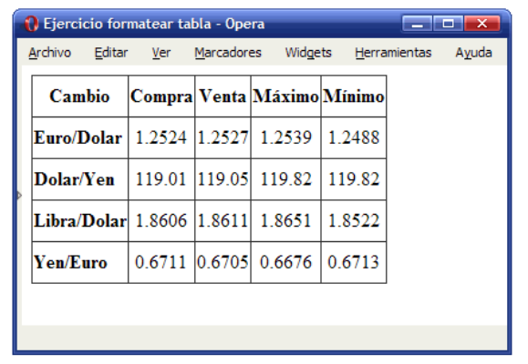

2\. Formateja les capçaleres de fila i columna amb la imatge de fons corresponent en cada casa (fondo\_gris.gif, euro.png, dolar.png, yen.png, libra.png). Modifica el tipus de lletra de la taula i utilitza Arial. El color blau clar és \#E6F3FF.

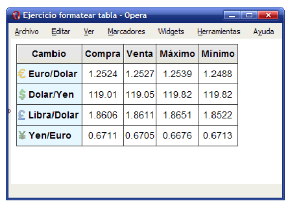

3\. Mostra un color altern en les files de dades (color groc clar \#FFFFCC).


### **Exercici 12: Estils formularis**

A partir del codi HTML proporcionat:

```html
<!DOCTYPE html PUBLIC "-//W3C//DTD XHTML 1.0 Transitional//EN"  
"http://www.w3.org/TR/xhtml1/DTD/xhtml1-transitional.dtd">

<html xmlns="http://www.w3.org/1999/xhtml" lang="es" xml:lang="es">  
<head>  
<title>Ejercicio 12 - Formulario de alta</title>  
<meta http-equiv="Content-Type" content="text/html; charset=utf-8" />

<style type="text/css">  
</style>  
</head>

<body>  
<div id="contenedor">

<h2>Formulario de alta</h2>

<form method="post" action="#">  
<ul>  
<li>  
<label class="titulo" for="nombre">Nombre y apellidos <span class="requerido">*</span></label>  
<div>  
<span>  
<input id="nombre" name="nombre" value="" />  
<label for="nombre">Nombre</label>  
</span>

    <span>  
      <input id="apellido1" name="apellido1" value="" />  
      <label for="apellido1">Primer apellido</label>  
    </span>  
   
    <span>  
      <input id="apellido2" name="apellido2" value="" />  
      <label for="apellido2">Segundo apellido</label>  
    </span>  
</div>

<p class="ayuda">No te olvides de escribir también tu segundo apellido</p>  
</li>

<li>  
<label class="titulo" for="direccion">Dirección <span class="requerido">*</span></label>

<div>  
<span>  
<input id="direccion" name="direccion" value="" />  
<label for="direccion">Calle, número, piso, puerta</label>  
</span>

    <span>  
      <input id="codigopostal" name="codigopostal" value="" />  
      <label for="codigopostal">Código postal</label>  
    </span>  
   
    <span>  
      <input id="municipio" name="municipio" value="" />  
      <label for="municipio">Municipio</label>  
    </span>  
   
    <span>  
      <select id="provincia" name="provincia">  
        <option value=""></option>  
        <option value="provincia1">Provincia 1</option>  
        <option value="provincia2">Provincia 2</option>  
        <option value="provincia3">Provincia 3</option>  
      </select>  
      <label for="provincia">Provincia</label>  
    </span>  
   
    <span>  
      <select id="pais" name="pais">  
        <option value=""></option>  
        <option value="pais1">País 1</option>  
        <option value="pais2">País 2</option>  
        <option value="pais3">País 3</option>  
      </select>  
      <label for="pais">País</label>  
    </span>  
</div>

<p class="ayuda">El código postal es imprescindible para poder recibir los pedidos</p>  
</li>

<li>  
<label class="titulo" for="email">Email</label>

<div>  
<span>  
<input id="email" name="email" value="" />  
</span>  
</div>

<p class="ayuda">Asegúrate de que sea válido</p>  
</li>

<li>  
<label class="titulo" for="telefonofijo">Teléfono <span class="requerido">*</span></label>

<div>  
<span>  
<input id="telefonofijo" name="telefonofijo" value="" />  
<label for="telefonofijo">Fijo</label>  
</span>

    <span>  
      <input id="telefonomovil" name="telefonomovil" value="" />  
      <label for="telefonomovil">Móvil</label>  
    </span>  
</div>

<p class="ayuda">Sin prefijo de país y sin espacios en blanco</p>  
</li>

<li>  
<input id="alta" type="submit" value="Darme de alta →" />  
</li>

</ul>  
</form>

</div>  
</body>  
</html>

```

1\. Aplica les regles CSS necessàries per donar al formulari el següent aspecte:

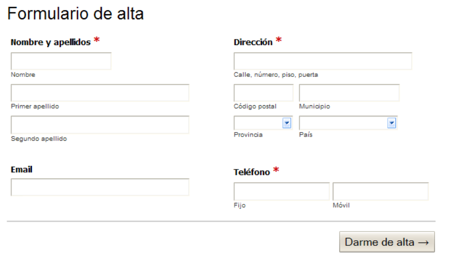

2\. Quan l'usuari passa el ratolí per sobre de cada grup d'elements de formulari (es a dir, per sobre de cada **li**) s'ha de modificar el seu color de fons (suggerència: color groc clar \#FF9). I a més a més, quan l'usuari es posiciona en un quadre de text, s'ha de modificar la seva vora per resaltar el camp que està actiu cada moment (suggerència: color groc \#E6B700):

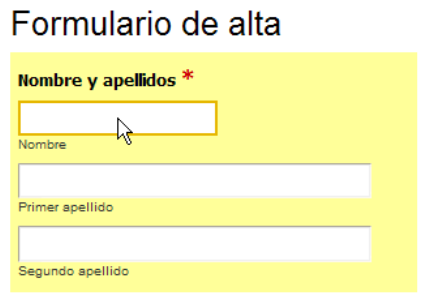

3\. Utilitzant el menor nombre de regles CSS, canvia l'aspecte del formulari per a que es mostri como en la següent imatge:

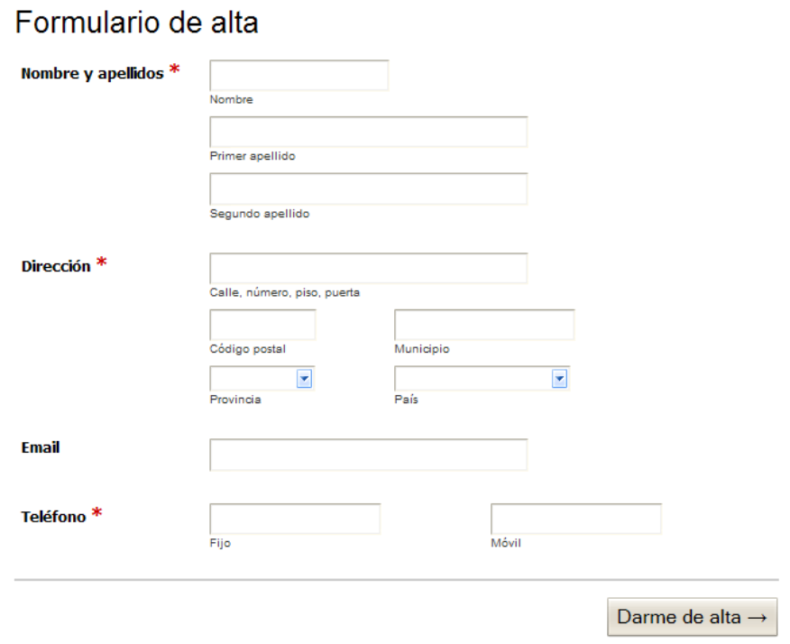

4\. Quan l'usuari passa el ratoli per sobre d'un grup d'elements de fromulari (es a dir, per sobre de cada **li**\>) s'ha de mostrar el missatge d'ajuda associat. Afegeix les regles CSS necessàries per a que el formulari tingui l'aspecte definitiu mostrat en la següent imatge:


### **Exercici 13: Aspecte final**

Determina les regles CSS necessàries per a mostrar la pàgina HTML que es proporciona amb l'estil que se mostra en la següent imatge:


A continuació s'indica una proposta dels passos que es poden seguir per obtenir l'aspecte final desitjat:

* Afegeix els estils bàsics de la pàgina (tipus de lletra Verdana, color de lletra \#192666, imatge de fons anomenada fondo.gif, color de fons \#F2F5FE).
* Defineix l'estructura bàsica de la pàgina: amplada fixa de 770 píxel, centrada en la finestra del navegador, capçalera i peu, columna central de continguts d'amplada 530 píxel i columna secundària de continguts de 200 píxel d'amplada.
* La capçalera té una alçada de 100 píxel i una imatge de fons anomenada cabecera.jpg.
* Los elements del menú de navegació tenen un color de fonds \#253575, un color de lletra \#B5C4E3. Quan el ratolí passa per sobre de cada element, el seu color de fons canvia a \#31479B. Els elements seleccionats es mostren amb un color de fons blanc i un color de lletra \#FF9000:

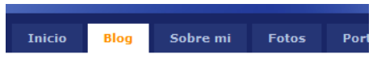

* Amb l'ajuda de les imatges que es proporcionen, mostra cada un dels articles de contingut amb l'estil que es mostra en la següent imatge:

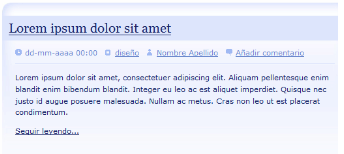

* Afegeix els estils adequats per mostrar els elements de la columna secundària de continguts amb el següent aspecte:

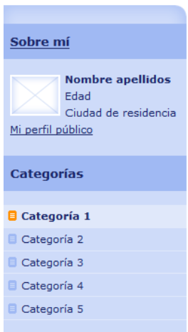

Codi HTML:

```html
<!DOCTYPE html PUBLIC "-//W3C//DTD XHTML 1.0 Strict//EN" "http://www.w3.org/TR/xhtml1/DTD/xhtml1-strict.dtd">  
<html xmlns="http://www.w3.org/1999/xhtml" xml:lang="es" lang="es">  
<head>  
<!-- Este diseño está basado en un diseño web libre llamado CrystalX y que se puede descargar desde  
         la dirección http://www.oswd.org/design/preview/id/3465 -->  
<meta http-equiv="content-type" content="text/html; charset=utf-8" />  
<meta http-equiv="content-language" content="es" />

    <meta name="copyright" content="Design/Code: Vit Dlouhy [Nuvio - www.nuvio.cz]; e-mail: vit.dlouhy@nuvio.cz" />  
      
    <title>Mi sitio web</title>  
    <meta name="description" content="Mi sitio web" />  
    <meta name="keywords" content="sitio, web" />  
      
    <link rel="index" href="./" title="Inicio" />  
    <link rel="stylesheet" media="screen,projection" type="text/css" href="./css/principal.css" />  
</head>

<body>

<!-- Contenedor -->  
<div id="contenedor">

    <!-- Cabecera -->  
    <div id="cabecera">

        <!-- Logo -->  
        <h1 id="logo"><a href="./" title="Mi sitio web">Mi sitio web</a></h1>

        <!-- Buscador -->  
        <div id="buscador">  
            <form action="" method="get">  
                <fieldset>  
                	<legend>Buscador</legend>  
                    <input type="text" name="busqueda" size="30" />  
                    <input type="submit" name="botonbuscar" value="Buscar" />  
                </fieldset>  
            </form>  
        </div> <!-- /buscador -->

		<div class="clear"></div>  
    </div> <!-- /cabecera -->

     <!-- Menú principal -->  
     <div id="menu">  
            <ul>  
                <li><a href="#">Inicio</a></li>  
                <li class="seleccionado"><a href="#">Blog</a></li>  
                <li><a href="#">Sobre mi</a></li>  
                <li><a href="#">Fotos</a></li>  
                <li><a href="#">Portfolio</a></li>  
                <li><a href="#">Contacto</a></li>  
                <li><a href="#">Enlaces</a></li>  
            </ul>

        <div class="clear"></div>  
     </div> <!-- /menú principal -->

     <!-- Contenido -->  
     <div id="contenido">

		<!-- Principal -->  
		<div id="principal">

            <!-- Articulo -->  
            <div class="articulo">  
                <h2><a href="#">Lorem ipsum dolor sit amet</a></h2>  
                <p class="info">  
                    <span class="fecha">dd-mm-aaaa 00:00</span>  
                    <span class="categoria"><a href="#">diseño</a></span>  
                    <span class="autor"><a href="#">Nombre Apellido</a></span>  
                    <span class="comentarios"><a href="#">Añadir comentario</a></span>  
                </p>

                <p>Lorem ipsum dolor sit amet, consectetuer adipiscing elit. Aliquam pellentesque enim blandit enim bibendum blandit.  
                Integer eu leo ac est aliquet imperdiet. Quisque nec justo id augue posuere malesuada. Nullam ac metus. Cras non leo  
                ut est placerat condimentum.</p>

                <p class="btn-more"><a href="#">Seguir leyendo...</a></p>  
            </div> <!-- /articulo -->

            <div class="clear"></div>  
              
            <!-- Articulo -->  
            <div class="articulo">  
                <h2><a href="#">Lorem ipsum dolor sit amet</a></h2>  
                <p class="info">  
                    <span class="fecha">dd-mm-aaaa 00:00</span>  
                    <span class="categoria"><a href="#">diseño</a></span>  
                    <span class="autor"><a href="#">Nombre Apellido</a></span>  
                    <span class="comentarios"><a href="#">Añadir comentario</a></span>  
                </p>

                <p>Lorem ipsum dolor sit amet, consectetuer adipiscing elit. Aliquam pellentesque enim blandit enim bibendum blandit.  
                Integer eu leo ac est aliquet imperdiet. Quisque nec justo id augue posuere malesuada. Nullam ac metus. Cras non leo  
                ut est placerat condimentum.</p>

                <p class="btn-more"><a href="#">Seguir leyendo...</a></p>  
            </div> <!-- /articulo -->

            <div class="clear"></div>  
              
            <!-- Articulo -->  
            <div class="articulo">  
                <h2><a href="#">Lorem ipsum dolor sit amet</a></h2>  
                <p class="info">  
                    <span class="fecha">dd-mm-aaaa 00:00</span>  
                    <span class="categoria"><a href="#">diseño</a></span>  
                    <span class="autor"><a href="#">Nombre Apellido</a></span>  
                    <span class="comentarios"><a href="#">Añadir comentario</a></span>  
                </p>

                <p>Lorem ipsum dolor sit amet, consectetuer adipiscing elit. Aliquam pellentesque enim blandit enim bibendum blandit.  
                Integer eu leo ac est aliquet imperdiet. Quisque nec justo id augue posuere malesuada. Nullam ac metus. Cras non leo  
                ut est placerat condimentum.</p>

                <p class="btn-more"><a href="#">Seguir leyendo...</a></p>  
            </div> <!-- /articulo -->

            <div class="clear"></div>

        </div><!-- /principal -->

        <!-- Secundario -->  
        <div id="secundario">

                <!-- Sobre mi -->  
                <h3><a href="#">Sobre mí</a></h3>

                <div id="sobremi">  
                      
                    <p><strong>Nombre apellidos</strong><br />  
                    Edad<br />  
                    Ciudad de residencia<br />  
                    <a href="#">Mi perfil público</a></p>  
                </div> <!-- /sobre mi -->

                <div class="clear"></div>

                <!-- Categorías -->  
                <h3>Categorías</h3>

                <ul id="categorias">  
                    <li class="seleccionado"><a href="#">Categoría 1</a></li>  
                    <li><a href="#">Categoría 2</a></li>  
                    <li><a href="#">Categoría 3</a></li>  
                    <li><a href="#">Categoría 4</a></li>  
                    <li><a href="#">Categoría 5</a></li>  
                </ul>

                <div class="clear"></div>

                <!-- Archivo -->  
                <h3>Archivo</h3>

                <ul id="archivo">  
                    <li class="seleccionado"><a href="#">Enero 200X</a></li>  
                    <li><a href="#">Diciembre 200X</a></li>  
                    <li><a href="#">Noviembre 200X</a></li>  
                    <li><a href="#">Octubre 200X</a></li>  
                    <li><a href="#">Septiembre 200X</a></li>  
                </ul>

                <div class="clear"></div>

                <!-- Enlaces -->  
                <h3>Enlaces</h3>

                <ul id="enlaces">  
                    <li><a href="#">Enlace 1</a></li>  
                    <li><a href="#">Enlace 2</a></li>  
                    <li><a href="#">Enlace 3</a></li>  
                    <li><a href="#">Enlace 4</a></li>  
                    <li><a href="#">Enlace 5</a></li>  
                </ul>

                <div class="clear"></div>

        </div> <!-- /secundario -->

	<div class="clear"></div>  
    </div> <!-- /contenido -->

    <!-- Pie de página -->  
    <div id="pie">  
        <p id="copyright">© 200X Nombre de empresa</p>  
    </div> <!-- /pie de página -->

</div> <!-- /contenedor -->

</body>  
</html>

```

