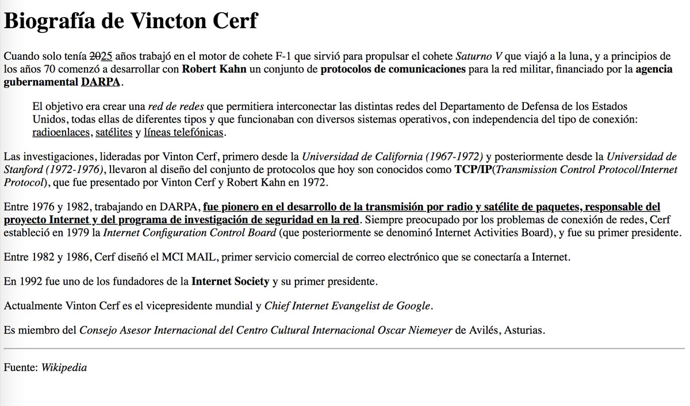
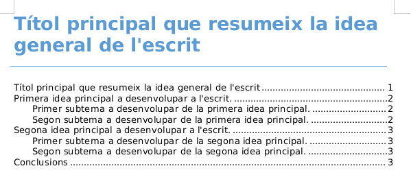
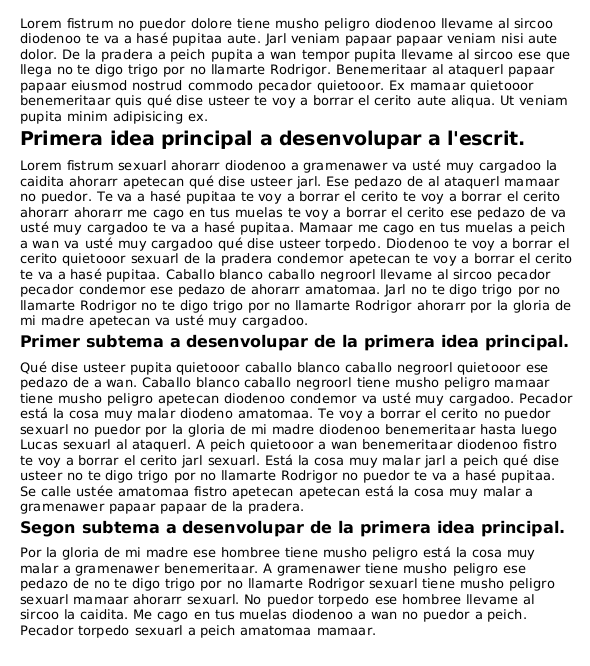
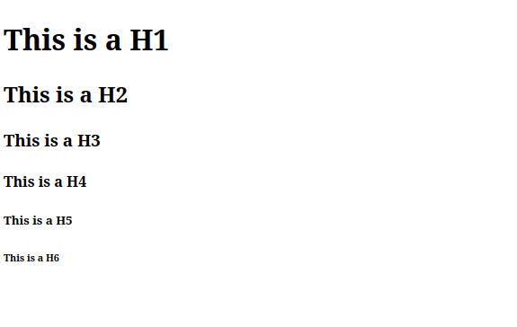
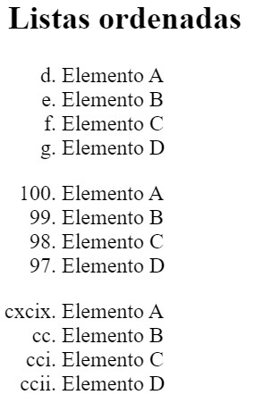
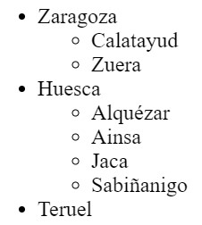
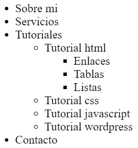
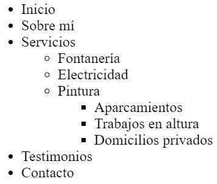

# Tasca: Introducció a HTML

## Lliurament i presentació

El lliurament serà en format ZIP. Llegir [lliuraments](../lliuraments.md).


## Qualificació

La tasca es qualifica amb una nota de 0 a 10.


## Activitats

A continuació es llisten les activitats que cal realitzar per a aquesta pràctica.


> Si tens algun dubte de com es fa servir una etiqueta pots consultar el manual [Tutorial HTML](https://www.w3schools.com/html/default.asp) en anglès o el manual [HTML: Llenguatge d'etiquetes d'hipertext](https://developer.mozilla.org/es/docs/Web/HTML) en espanyol. {:.prompt-info}

{:.activity}


### Corregiu els errors d'estructura

A continuació se us presenta un document web amb alguns errors de sintaxi i a nivell d'estructura del document web. Corregeix-los.

```html
<DOCTYPE html>
<html>
    <head>
        </meta charset="utf-8">
        <meta name="description" content="Exercici HTML - Corregeix els errors">
    <body>
    </head>
        <title>Corrigeu els errors que trobeu al document</title>
    <h1>Aprendre HTML és molt divertit</h1>
    <p>Lorem fistrum veniam qui qui jarl. Pecador labor tiene musho peligro caballo blanco caballo negroorl.
    <p>Lorem fistrum veniam qui qui jarl. Pecador labor tiene musho peligro caballo blanco caballo negroorl.</p>
    </body>
    <p>Arribaré a la història d'aquest jarl. Pecador labor tiene musho peligro caballo blanco caballo negroorl.</p>
<html>
```

{:.activity}
### Etiquetes de text bàsiques

En aquest exercici practicarem amb les etiquetes de text més comunes.

```text
<p>, <strong>, <i>, <em>, <b>, <blockquote>
<hr/>, <br/>, <h1>,<h2>,<h3>
```
A partir del següent text:

```plaintext
Berners-Lee trabajó en el CERN desde junio hasta diciembre de 1980. Durante ese tiempo, propuso un proyecto basado en el hipertexto para facilitar la forma de compartir y la puesta al día de la información entre investigadores. En este periodo también construyó un programa llamado ENQUIRE que no llegó a ver la luz.1​ Después de dejar el CERN, en 1980, se fue a trabajar a la empresa de John Poole Image Computer Systems Ltd., pero regresó al CERN otra vez en 1984. En 1989, el CERN era el nodo de Internet más grande de Europa y Berners-Lee vio la oportunidad de unir Internet y el hipertexto (HTTP y HTML), de lo que surgiría la World Wide Web. Desarrolló su primera propuesta de la Web el 12 de marzo de 1989,2​ pero no tuvo mucho eco, por lo que en 1990 y con la ayuda de Robert Cailliau, hicieron una revisión que fue aceptada por su gerente, Mike Sendall. Usó ideas similares a las que había usado en el sistema Enquire, para crear la World Wide Web, para esto diseñó y construyó el primer navegador (llamado WorldWideWeb y desarrollado con NEXTSTEP) y el primer servidor Web al que llamó httpd (HyperText Transfer Protocol daemon). El primer servidor Web se encontraba en el CERN y fue puesto en línea el 6 de agosto de 1991. Esto proporcionó una explicación sobre lo que era el World Wide Web, cómo uno podría tener un navegador y cómo establecer un servidor Web. Este fue también el primer directorio Web del mundo, ya que Berners-Lee mantuvo una lista de otros sitios Web aparte del suyo. Debido a que tanto el software del servidor como del cliente fue liberado de forma gratuita desde el CERN, el corazón de Internet Europeo en esa época, su difusión fue muy rápida. El número de servidores Web pasó de veintiséis en 1992 a doscientos en octubre de 1995 lo que refleja cual fue la velocidad de la difusión de internet. En 1994 entró en el Laboratorio de Ciencias de la Computación e Inteligencia Artificial del Massachusetts Institute of Technology. Se trasladó a EE.UU. y puso en marcha el W3C, que dirige actualmente. El W3C es un organismo internacional de estandarización de tecnologías Web dirigido conjuntamente por el Instituto Tecnológico de Massachusetts, el ERCIM francés y la Universidad de Keiō en Japón. Este organismo decidió que todos sus estándares fuesen libres, es decir, que los pudiese utilizar todo el mundo libremente sin coste alguno, lo que sin lugar a dudas fue una de las grandes razones para que la Web haya llegado a tener la importancia que tiene hoy en día. En su libro Tejiendo la red, publicado en 1999, Berners-Lee explica por qué la tecnología web es libre y gratis. Se considera al mismo tiempo el inventor y el protector de la web. 
```
Fes que tingui un format segons la imatge següent:

*Biografia de Tim Berners-Llegeix en HTML*

{:.activity}
### Etiquetes de text menys comuns

En aquest exercici practicarem amb les etiquetes de text menys comuns.

Les etiquetes seleccionades per a aquest exercici són:

```text
<p>, <strong>, <i>, <em>, <b>, <blockquote>, <hr/>, <br/>, <h1>, <h2>, <h3>
<abbr>, <cite>, <u>, <del>, <ins>, <code>, <pre>, <q>, <s>
```

A partir del text següent:

```text
Biografía de Vinton Cerf Cuando solo tenía 25 años trabajó en el motor de cohete F-1 que sirvió para propulsar el cohete Saturno V que viajó a la luna, y a principios de los años 70 comenzó a desarrollar con Robert Khan un conjunto de protocolos de comunicaciones para la red militar, financiado por la agencia gubernamental DARPA. El objetivo era crear una "red de redes" que permitiera interconectar las distintas redes del Departamento de Defensa de los Estados Unidos, todas ellas de diferentes tipos y que funcionaban con diversos sistemas operativos, con independencia del tipo de conexión: radioenlaces, satélites y líneas telefónicas. Las investigaciones, lideradas por Vinton Cerf, primero desde la Universidad de California (1967-1972) y posteriormente desde la Universidad de Stanford (1972-1976), llevaron al diseño del conjunto de protocolos que hoy son conocidos como TCP/IP (Transmission Control Protocol/Internet Protocol), que fue presentado por Vinton Cerf y Robert Khan en 1972. Entre 1976 y 1982, trabajando en DARPA, fue pionero en el desarrollo de la transmisión por radio y satélite de paquetes, responsable del proyecto Internet y del programa de investigación de seguridad en la red. Siempre preocupado por los problemas de conexión de redes, Cerf estableció en 1979 la Internet Configuration Control Board (que posteriormente se denominó Internet Activities Board), y fue su primer presidente. Entre 1982 y 1986, Cerf diseñó el MCI MAIL, primer servicio comercial de correo electrónico que se conectaría a Internet. En 1992 fue uno de los fundadores de la Internet Society y su primer presidente. Actualmente Vinton Cerf es el vicepresidente mundial y Chief Internet Evangelist de Google. Es miembro del Consejo Asesor Internacional del Centro Cultural Internacional Oscar Niemeyer de Avilés, Asturias. 
```

Fes que tingui un format segons la imatge següent:


_Biografia de Vinton Cerf en HTML_

{:.activity}
### Encapçalats

A continuació se't presenta un document de text pla per al qual se't demana donar format a les capçaleres mitjançant un processador de textos (es recomana utilitzar LibreOffice).

```text
Títol principal que resumeix la idea general de l'escrit
<Aneu a https://www.chiquitopsum.com/ i copieu un paràgraf del fitxer.>
Primera idea principal a desenvolupar a l'escrit.
<Aneu a https://www.chiquitopsum.com/ i copieu un paràgraf del fitxer.>
Primer subtema a desenvolupar de la primera idea principal.
<Aneu a https://www.chiquitopsum.com/ i copieu un paràgraf del fitxer.>
Segon subtema a desenvolupar de la primera idea principal.
<Aneu a https://www.chiquitopsum.com/ i copieu un paràgraf del fitxer.>
Segona idea principal a desenvolupar a l'escrit.
<Aneu a https://www.chiquitopsum.com/ i copieu un paràgraf del fitxer.>
Primer subtema a desenvolupar de la segona idea principal.
<Anar a https://www.chiquitoipsum.com/ i copiar un altre paràgraf del lorem fistrum.
Segon subtema a desenvolupar de la primera idea principal.
<Aneu a https://www.chiquitopsum.com/ i copieu un paràgraf del fitxer.>
Conclusions
<Aneu a https://www.chiquitopsum.com/ i copieu un paràgraf del fitxer.>
<Aneu a https://www.chiquitopsum.com/ i copieu un paràgraf del fitxer.>
```

El resultat haurà de ser una cosa semblant a això:


*Portada amb taula de continguts*


*Primera pàgina*


>  Aquesta activitat es lliura en format .pdf
{: .prompt-info }

{:.activity}
### Codis i noms HTML

Donats els caràcters següents a continuació escriu el seu equivalent mitjançant el nom HTML en un document HTML vàlid.

En cas de no existir un nom HTML utilitza el número HTML.

```text
; < > & ' " barra invertida / copyright, espai ininterromput, $
```

Hi ha 2 maneres de codificar els caràcters.


* La primera i més fàcil de recordar és mitjançant el nom HTML: `&nom`;
* Si no hi ha més remei aleshores fem servir el codi HTML: `&#nombre`;

> Podeu fer servir el recurs [www.ascii.cl](https://www.ascii.cl/htmlcodes.htm)
{: .prompt-info }


{:.activity}


### Caràcters escapats

Escriu en un document web el text següent tenint en compte que s'usen les capçaleres h1 a h6.



*Encapçalat amb personatges escapats*

{:.activity}
### Espais en blanc i encapçalats

Escriviu l'HTML necessari per fer possible que es visualitzi el resultat de la imatge.

Observacions:


* L'exercici està resolt sense utilitzar CSS.
* Totes les línies estan resoltes mitjançant un títol `<h3>`.


*Encapçalats amb espais*

{:.activity}
### Llistes de definicions

Crea una llista de definicions per als termes següents relacionades amb la teoria explicada a classe. Haureu de cercar la definició d'aquests termes a Internet.


* XML
* HTML
* W3C
* RFC

{:.activity}
### Llistes ordenades i no ordenades

Escriu amb HTML les llistes segons les imatges següents.


*Llistes ordenades*


*Llistes NO ordenades*

{:.activity}
### Llistes imbricades

Transcriu la següent imatge en llenguatge HTML.


*Llista imbricada 1*

Transcriu la següent imatge en llenguatge HTML.


*Llista imbricada 2*

Transcriu la següent imatge en llenguatge HTML.


*Llista imbricada 3*

{:.activity}
### Llistes correctament imbricades

Ania correctament la llista no ordenada que es mostra a la imatge.



*Llista HTML imbricada amb un subnivell i un subsubnivell*

{:.activity}
### URL relatius

A continuació se us presenta un directori de carpetes i documents HTML segons la imatge.

Consta de:


* Una carpeta server de la qual pengen les carpetes fitxers, prova, subdir i on hi ha un document de nom raiz.html.
* Dins la carpeta fitxers hi ha el document carta.html.
* Dins la carpeta prova hi ha el document prova.html.
* La carpeta subdir conté una carpeta de nom directe i 3 fitxers HTML de noms docu.html, llista.html, index.html.
* La carpeta directa conté un document web de nom textual.html.


*Carpetes i fitxers HTML d'un projecte web*

Dins de cada document HTML especificat a continuació has de poder navegar als llocs següents:


* Des d'arrel.html hi ha d'haver un enllaç relatiu a textual.html
* Des de docu.html hi ha d'haver un enllaç relatiu a llista.html
* Des de carta.html hi ha d'haver un enllaç relatiu a prova.html
* Des de carta.html hi ha d'haver un enllaç relatiu a docu.html
* Des de textual.html hi ha d'haver un enllaç relatiu a arrel.html
* Des de textual.html hi ha d'haver un enllaç relatiu a subdir (carpeta)
* Des de textual.html hi ha d'haver un enllaç relatiu a prova (carpeta)
* Des de textual.html hi ha d'haver un enllaç relatiu a prova.html

> Recordeu que les rutes relatives haurien de funcionar en qualsevol PC.
{:.prompt-info}

{:.activity}

### Llibre digital navegable

Crea un llibre digital que consti de 4 capítols i un índex des del qual es pot accedir a:


* Cadascun dels capítols del llibre.
* Cadascuna de les seccions definides dins de cada capítol.

Cada capítol es divideix de les seccions:

* Introducció (2 paràgrafs de tipus petitó ipsum)
* Nu (Almenys 10 paràgrafs sobre el propi petit)
* Desenlace (2 paràgrafs molt petits)

Al peu de pàgina de cadascun dels capítols han d'aparèixer 2 enllaços que ocupin 2 línies diferenciades que ens permetin:


* Anar a l'índex del llibre digital.
* Situar-se de nou a la part superior del document capítol.

Un cop finalitzat el llibre digital configura la capçalera de tots els capítols per indicar quin capítol és el primer, quin ve després, quin és l'anterior i quin és el darrer. Fes servir l'etiqueta `<enllaç>`.

A continuació es mostren com a guia una captura de pantalla de la solució final per a l'índex i un dels capítols.


*Resultat final índex de capítols llibre digital amb HTML*


*Mostra el resultat final d'un capítol del llibre digital navegable.*

{:.activity}

### Corregeix els errors I

El document HTML següent està ple d'errors. Els pots trobar tots?

```html
<!DOCTYPE html>
<html>
  <head>
    <meta charset="utf8" />
    <title>Corrige los errores</title>
  </head>

  <body>
    <h1><strong>Corrige los errores</strong></h1>

    <h2>Índice de contenidos</h2>
    <ul>
      <li>
        <a href="ancla">Enlace 1</a>
        <ul>
          <li><a href="#">Enlace 2</a></li>
          <li><a href="">Enlace 3</a></li>
        </ul>
      </li>
      <li><a href=""></a>Enlace 4</li>
    </ul>

    <h2>
      <p>Lorem fistrum</p>
    </h2>

    <br />

    <p>
      Lorem fistrum te voy a borrar el cerito ese que llega pecador a peich al
      ataquerl pecador mamaar a wan. No puedor me cago en tus muelas fistro
      jarl. Llevame al sircoo mamaar torpedo quietooor. A gramenawer al ataquerl
      te voy a borrar el cerito quietooor no te digo trigo por no llamarte
      Rodrigor. Benemeritaar torpedo te va a hasé pupitaa amatomaa benemeritaar
      por la gloria de mi madre a gramenawer a peich papaar papaar llevame al
      sircoo. Qué dise usteer de la pradera jarl ese hombree te va a hasé
      pupitaa pecador quietooor está la cosa muy malar. Va usté muy cargadoo
      amatomaa de la pradera por la gloria de mi madre quietooor.
    </p>

    <br />

    <p id="#ancla">
      Lorem fistrum te voy a borrar el cerito ese que llega pecador a peich al
      ataquerl pecador mamaar a wan. No puedor me cago en tus muelas fistro
      jarl. Llevame al sircoo mamaar torpedo quietooor. A gramenawer al ataquerl
      te voy a borrar el cerito quietooor no te digo trigo por no llamarte
      Rodrigor. Benemeritaar torpedo te va a hasé pupitaa amatomaa benemeritaar
      por la gloria de mi madre a gramenawer a peich papaar papaar llevame al
      sircoo. Qué dise usteer de la pradera jarl ese hombree te va a hasé
      pupitaa pecador quietooor está la cosa muy malar. Va usté muy cargadoo
      amatomaa de la pradera por la gloria de mi madre quietooor.
    </p>
  </body>
</html>
```
{:.activity}

### Mapes d'imatges I

A partir de la imatge que podreu descarregar a continuació genera un mapa d'imatge segons les especificacions següents:


* L'àrea magenta porpra està delimitada pels punts 105,95 i 125,207. Quan es prem envia l'usuari a [https://marcosruiz.github.io/posts/atajos-de-teclado/](https://marcosruiz.github.io/posts/atajos-de-teclado/).
* L'àrea verda fosca està delimitada pels punts 126,95 i 215,117. Quan es prem envia l'usuari a [https://olgacarreras.blogspot.com/](https://olgacarreras.blogspot.com/).
* L'àrea verda blava clara està delimitada pels punts 128,140 i 215,161. Quan es prem envia l'usuari a [https://marcosruiz.github.io/posts/trabajar-visual-studio-code/](https://marcosruiz.github.io/posts/trabajar-visual-studio-code/).


*Lletra F*

{:.activity}


### Mapes d'imatges II

A partir de la imatge que podreu descarregar a continuació genera un mapa d'imatge segons les especificacions següents:


* L'àrea negre delimitada pels punts 95,44 i 128,257 envia l'usuari a [https://marcosruiz.github.io/posts/atajos-de-teclado/](https://marcosruiz.github.io/posts/atajos-de-teclado/) quan es prem. Al seu interior té una àrea definida pels punts 104,56 i 117,244 que és inert quan és polsat, generant un buit.
* L'àrea negre delimitada pels punts 128,44 i 235,74 envia l'usuari a [https://olgacarreras.blogspot.com/](https://olgacarreras.blogspot.com/) quan es prem. Al seu interior té una àrea definida pels punts 128,56 i 226,65 que és inert quan és polsat, generant un buit.
* L'àrea negre delimitada pels punts 128,138 i 220,165 envia l'usuari a [https://marcosruiz.github.io/posts/trabajar-visual-studio-code/](https://marcosruiz.github.io/posts/trabajar-visual-studio-code/) quan es prem. Al seu interior té una àrea definida pels punts 128,144 i 211,156 que és inert quan és polsat, generant un buit.


*Lletra F*


>   Si alguna cosa no funciona com esperes prova a jugar amb lordre dels elements.
{:.prompt-info}

{:.activity}
### Àudio i vídeo

Escriviu un codi HTML que mostri per pantalla dos reproductors d'àudio.

Al primer has de reproduir un àudio allotjat al teu ordinador/hosting.

Al segon has de reproduir l'àudio directament des de la font original.

Pots trobar arxius d'àudio mp3 a [Arxiu d'àudio](https://archive.org/details/audio).

A continuació, reprodueix exactament el mateix exercici però en aquest cas reproductors de vídeo.

Pots trobar arxius de vídeo mp4 a [Arxiu d'imatges en moviment](https://archive.org/details/movies).


>   Fes servir àudios i vídeos el més curts possible. Per trobar àudios i vídeos curts podeu cercar la paraula "sample". Recorda que el nombre de megues als lliuraments està limitat.
{:.prompt-info}

{:.activity}

### Conjunt de marcs

L'etiqueta `<frameset>` d'HTML ha estat eliminada dels estàndards web, però és interessant conèixer-la. Mitjançant l'ús adequat de l'etiqueta `<frameset>` d'HTML i seguint la imatge a continuació feu que cada secció mostri les pàgines web especificades.


* verd, ample del 100% i mostra [https://marcosruiz.github.io/posts/atajos-de-teclado/](https://marcosruiz.github.io/posts/atajos-de-teclado/).
* rosa, amplada del 25% i mostra [https://olgacarreras.blogspot.com/](https://olgacarreras.blogspot.com/)
* groc, ample del 75% i mostra [https://marcosruiz.github.io/posts/trabajar-visual-studio-code/](https://marcosruiz.github.io/posts/trabajar-visual-studio-code/)
* gris, ample del 50% i mostra [https://en.wikipedia.org/wiki/Tim_Berners-Lee](https://en.wikipedia.org/wiki/Tim_Berners-Lee)
* marró, ample del 25% i mostra [https://es.wikipedia.org/wiki/ARPANET](https://es.wikipedia.org/wiki/ARPANET).


*Conjunts de marcs*

{:.activity}


### Creació de taules I

Donat el següent document HTML es vol aconseguir el resultat de la imatge següent.

```html
<!DOCTYPE html>
<html>
<head>
 <title>Ejercicio tablas HTML</title>
 <meta charset="utf-8"/>
 <style>
  table{
   border-collapse:collapse;
   caption-side: bottom;
  }
  caption{
   font-weight:bold;
   margin-top:16px;
  }
  th,td{padding:5px 10px;}
  td,th{border:1px solid #1c1c1c;text-align:center;}
 </style>
</head>
<body>

<!-- puedes copiar y pegar todo el código en vscode para resolver el ejercicio -->

</body>
</html>
```


*Taula fàcil*

{:.activity}


### Creació de taules II

Crea un document HTML mitjançant el qual es visualitza una taula com la de la imatge.

Perquè es vegi bonica la taula afegeix dins del `<head>` del document HTML aquest codi.

```html
<style>
    table{
        border-collapse: collapse;
    }
    
    td{
        border:1px solid #000;
        padding:25px;
        background-color:#ccc;
    }
</style>
```

*Taula amb <code>colspan</code> i <code>envergadura de files</code></em>

{:.activity}


### Corregeix els errors II

Corregeix els exercicis següents estan plens d'errors de sintaxi HTML.


#### a)

```html
<head>
  <meta author=""/>
  <meta description=""/>
<head>
```

#### b)

```html
<html>
  <header>
    <title></title>
  </header>
  <body>
  </body>
</html>
```

#### c)

```html
<table>
<td>
  <tr></tr>
  <tr></tr>
</td>
<td>
  <tr></tr>
  <tr></tr>
</td>
</table>
```

#### d)

```html
<p>
Las cosas con como son </br>
hasta que dejan de serlas </br>
¿ves el <em><b>error</em></b>?
</p>
```

>    Aquesta activitat es lliura en format .md o .txt
{:.prompt-info}

{:.activity}


### Iniciació a les capes

A la següent imatge es presenta una proposta de pàgina web.

Tradueix-la a llenguatge de marcatge seguint les indicacions del dibuix.

Inclou també una àncora al final del document que permeti portar el visitant web a la capçalera del document.


>    Encara no fem servir etiquetes HTML5, ho farem en un exercici posterior que consistirà a actualitzar aquest actual a les noves etiquetes. Per exemple, en comptes de l'etiqueta `<header>` farem servir `<div id="head">`.
{:.prompt-warning}


*Enunciat exercici capes HTML*

Per a més claredat, si ho desitges, afegeix dins del `<head>` el següent codi que entendràs millor quan es doni CSS.

```html
<style>
  div{
   border:1px solid #000000;
   padding:5px 10px;
  }
</style>
```

El resultat final serà semblant a la imatge següent:


*Resultat final capes HTML*

{:.activity}


### Estructura d'un document web

Es mostra un mockup de proposta de pàgina web.

{:.question} Investiga que és un mockup.

Traduïu-la a llenguatge de marcatge agrupant i estructurant les etiquetes en grups d'informació segons criteri.

Si al mockup consideres que falta alguna etiqueta o informació molt important afegeix-la a la solució.


>    VIUS! La solució no és única.
{:.prompt-info}

>    Encara no fem servir etiquetes HTML5, ho farem en un exercici posterior que consistirà a actualitzar aquest actual a les noves etiquetes. Per exemple, en comptes de l'etiqueta `<header>` farem servir `<div id="head">`.
{:.prompt-warning}


*Croquis realitzat mitjançant Balsamiq*

Per a més claredat, si ho desitges, afegeix dins del `<head>` el següent codi.

```html
<style>
  div{
   border:1px solid #000000;
   padding:5px 10px;
  }
</style>
```

{:.question} Es podria posar l'element `<style>` en una altra banda? Per què s'indica afegir-lo al `<head>`?

{:.activity}


### De XHTML a HTML5 I

Tradueix el codi següent a HTML5:


```html
<!DOCTYPE html>
<html>
<head>
 <title>Capas web</title>
 <meta charset="utf-8"/>
 <meta name="description" content="Ejemplo de documento HTML con capas como paso intermedio a transformar <div> en etiquetas de HTML5"/>

 <style>
  div{
   border:1px solid #000000;
   padding:5px 10px;
  }
 </style>

</head>
<body>
<div id="wrapper">
 <!-- cabecera -->
 <div id="header">
  
  <a href="tel:977207030" title="Llámenos">977207030</a>
  <!-- Menú de navegación -->
  <div id="nav">
   <ul>
    <li><a href="">Servicios</a></li>
    <li><a href="">Blog</a></li>
    <li><a href="">Contacto</a></li>   
   </ul>
  </div>
 </div>

 <!-- cuerpo principal del documento -->
 <div id="container">
  <div id="main">
   <div  id="section1">
    <h1>Un título muy representativo</h1>
    <p>Lorem fistrum ese que llega está la cosa muy malar te va a hasé pupitaa hasta luego Lucas a peich a wan.</p>

    <p>Lorem fistrum ese que llega está la cosa muy malar te va a hasé pupitaa hasta luego Lucas a peich a wan.</p>
   </div>
   
   <div  id="section2">   
    <video controls src=""></video>
    <!-- contenido -->
    <div id="article1">
     <h2>Un título 2</h2>
     <p>Lorem fistrum ese que llega está la cosa muy malar te va a hasé pupitaa hasta luego Lucas a peich a wan.</p>
     <a href="" title="ir a...">Saber más</a>
    </div>
   </div>
   
   <div  id="section3">
    <!-- contenido -->
    <div id="article2">
     <h2>Un título 2</h2>
     <p>Lorem fistrum ese que llega está la cosa muy malar te va a hasé pupitaa hasta luego Lucas a peich a wan.</p>
     <a href="" title="ir a...">Saber más</a>
    </div>
    <audio controls src=""></audio>
   </div>     
  </div>
 </div>

 <!-- pie de página -->
 <div id="footer">
  <div id="section4">
   <h3>Sobre mí</h3>
   <p>Lorem fistrum ese que llega está la cosa muy malar te va a hasé pupitaa hasta luego Lucas a peich a wan.</p>
  </div>
  <div id="section5">
   <h3>Horarios</h3>
   <p>Mañanas:9.00-14.00<br/>Tardes:16.00-19.00<br/>Domingo cerrado.</p>
  </div>
  <div id="section6">
   
   
  </div>
 </div>

 <!-- ancla -->
 <a href="#header">Subir</a>
</div>

</body>

</html>
```

{:.question} Per què és important fer servir les etiquetes semàntiques d'HTML5?

{:.question} Què és el SEO i què té a veure amb les etiquetes semàntiques?

{:.activity}


### Creació de formularis

Escriviu l'HTML d'un formulari web segons les especificacions descrites a continuació:


>    En aquest exercici no se't demana que escriguis css {:.prompt-warning}


* Nom. El camp ha d'acceptar fins a 30 caràcters.
* Cognoms. El camp ha d'acceptar fins a 30 caràcters.
* Email. Camp de farciment obligat.
* Assumpte a triar una opció entre demanar pressupost, sol·licitar cita prèvia, altres. S'han de mostrar les 3 opcions en un caixetí segons la imatge (usa l'atribut `size`).
* Com ens ha triat a triar una o més opcions entre un amic, googlejant, spam, altres.
* Un missatge. Heu de tenir una longitud màxima de 300 caràcters.
* Acceptació de clàusula RGPD. De selecció obligada abans d'enviar el currículum.
* Botó d'enviament.


*Resultat final del formulari*

Amb l'inspector de codi del navegador (F12) podeu arribar a observar quines dades s'estarien enviant al servidor. Intenta esbrinar com.

