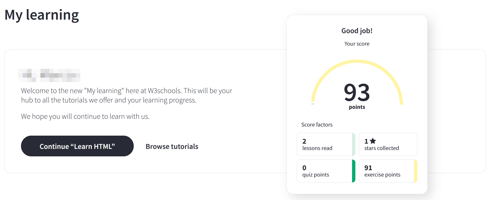

# Tasca: HTML a W3Schools

## Objectiu i durada

L'objectiu d'aquesta pràctica és aprendre a escriure HTML de forma correcta.

Durada: 4 h

## Lliurament i presentació

El lliurament serà en format HTML+PDF+ZIP.

??? tip "Com lliurar la tasca al Classroom"

    Creareu una pàgina web bàsica que inclogui les captures que evidenciïn que has fet el tutorial, 
    juntament amb el teu nom i la data i hora de quan ho has acabat.

    A continuació, una vegada acabada la pàgina, la imprimireu creant un pdf (Imprimeix -> Desa com a pdf)
    
    Finalment creareu un zip que contengui les captures .jpg, la pagina .html i el pdf .pdf i has de seguir
    la següent nomenclatura:

    :material-zip-box: **`<nom_codificat><codi_tasca_del_classroom>_<nombre_fitxer>.zip`**

    Per exemple: tverderagPO01_00.zip que contindria aquests fitxers i noms:

    :material-file-jpg-box: tverderagPO01_01.jpg // captura 1

    :material-file-jpg-box: tverderagPO01_02.jpg // captura 2

    ... i així successivament per la resta de captures

    :material-file-pdf-box: tverderagPO01_03.pdf // impressió en pdf

    :material-language-html5: tverderagPO01_04.html // fitxer que conté la pàgina

    Sempre que ho considereu oportú, me podeu afegir un fitxer de text pla amb el nom `llegeix.me` on me detalleu
    que és el que m'estau entregant i en quin nom (sempre seguint l'estàndar que acabam de posar)

??? info "Com saber el meu nom_codificat"

    L'usuari que has d'usar sempre en les tasques ha de complir el format següent:

    * La inicial del teu primer nom.
    * El teu primer cognom.
    * La inicial del teu segon cognom si en tens.

    Suposem en Tofol Gabriel Verdera Grimalt el seu usuari serà: tverderag.

    **En totes les tasques, cada cop que es faci menció a `<nom_codificat>` hauràs de substituir-lo pel teu usuari.**

    > Sempre que sigui possible haureu d'usar el vostre nom d'usuari de manera que no hi hagi cap dubte sobre l'autoria de les tasques.

## Qualificació

La tasca es qualificarà com a apte o no apte.

## Activitats

> Compte! Si traduïu els exercicis amb el traductor de Google és probable que doni problemes en comprovar les teves solucions.

### Crear compte

Crea un compte amb el correu de l'escola a [W3Schools](https://www.w3schools.com/) i assegura't de fer login abans de començar amb la següent activitat.

### Captura perfil buit

Anar a l'apartat [My learning](https://my-learning.w3schools.com/) i fes una captura de pantalla amb el perfil buit.

### Captura perfil amb la tasca

Realitza els exercicis de [aquest enllaç](https://www.w3schools.com/html/exercise.asp).

Assegura't que se t'afegeixen en el teu apartat de "My learning" quan portis dos o tres exercicis fets.

Fes una o diverses captures quan completis els 88 exercicis, de manera que quedi demostrat que amb el teu compte has realitzat tots els exercicis i tens l'estrella corresponent. Una cosa com el que es mostra a continuació. **Indica l'enllaç del teu perfil públic.**

_Exercicis HTML finalitzats_

### (Voluntària) Qüestionari

Després de la realització dels exercicis estàs preparat per realitzar el [HTML Quiz](https://www.w3schools.com/quiztest/quiztest.asp?qtest=HTML) on pots posar a prova els teus nous coneixements.