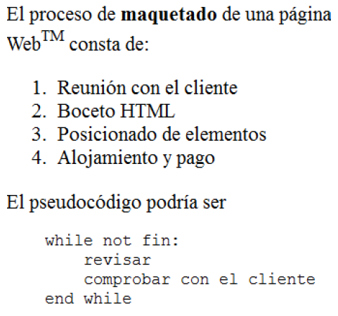

## Solucions Exercicis tipus examen

### Enunciat

*Crea una tabla con la estructura siguiente*


### Solució

El siguiente HTML produce algo muy parecido:
```html
<table border="1">
    <tr>
        <td>Celda 1</td>
        <td>Celda 2</td>
    </tr>
    <tr>
        <td>
            <table border="1">
                <tr>
                    <td>Celda 3a</td>
                    <td>Celda 3b</td>
                    <td>Celda 3c</td>
                </tr>
            </table>
        </td>
        <td>
            <table border="1">
                <tr>
                    <td>Celda 4a</td>
                </tr>
                <tr>
                    <td>Celda 4b</td>
                </tr>
                <tr>
                    <td>Celda 4c</td>
                </tr>
            </table>
        </td>
    </tr>
</table>
```
Mostra solució:
<table border="1">  
<tr>  
<td>Celda 1</td>  
<td>Celda 2</td>  
</tr>  
<tr>  
<td>  
<table border="1">  
<tr>  
<td>Celda 3a</td>  
<td>Celda 3b</td>  
<td>Celda 3c</td>  
</tr>  
</table>  
</td>  
<td>  
<table border="1">  
<tr>  
<td>Celda 4a</td>  
</tr>  
<tr>  
<td>Celda 4b</td>  
</tr>  
<tr>  
<td>Celda 4c</td>  
</tr>  
</table>  
</td>  
</tr>  
</table>

### Enunciat

*Crea una página HTML que produzca este resultado*


Una tabla compleja

### Solució

El HTML siguiente produce el resultado pedido:
``` html
<table border="1">  
<tr><!--Primera fila-->  
<td>  
<table border="1">  
<tr>  
<td>1a</td>  
<td>1b</td>  
</tr>  
</table>  
</td>  
<td>  
<table border="1">  
<tr>  
<td>2a</td>  
<td>2b</td>  
</tr>  
<tr>  
<td>2c</td>  
<td>2c</td>  
</tr>  
</table>  
</td>  
</tr>  
<tr><!--Segunda fila-->  
<td>  
`3a`  
</td>  
<td>  
<table border="1">  
<tr>  
<td>4a1</td>  
<td>4a2</td>  
<td>4a3</td>  
</tr>  
</table>  
</td>  
</tr>  
<tr> <!--Tercera fila-->  
<td>  
<table border="1">  
<tr>  
<td>3b1</td>  
<td>3b2</td>  
</tr>  
<tr>  
<td>3b3</td>  
<td>3b4</td>  
</tr>  
</table>  
</td>  
<td>  
`4b`  
</td>  
</tr>  
</table>
```
Mostra de la solució:
<table border="1">  
<tr><!--Primera fila-->  
<td>  
<table border="1">  
<tr>  
<td>1a</td>  
<td>1b</td>  
</tr>  
</table>  
</td>  
<td>  
<table border="1">  
<tr>  
<td>2a</td>  
<td>2b</td>  
</tr>  
<tr>  
<td>2c</td>  
<td>2c</td>  
</tr>  
</table>  
</td>  
</tr>  
<tr><!--Segunda fila-->  
<td>  
`3a`  
</td>  
<td>  
<table border="1">  
<tr>  
<td>4a1</td>  
<td>4a2</td>  
<td>4a3</td>  
</tr>  
</table>  
</td>  
</tr>  
<tr> <!--Tercera fila-->  
<td>  
<table border="1">  
<tr>  
<td>3b1</td>  
<td>3b2</td>  
</tr>  
<tr>  
<td>3b3</td>  
<td>3b4</td>  
</tr>  
</table>  
</td>  
<td>  
4b  
</td>  
</tr>  
</table>

### Enunciat

*Crea una página HTML que produzca este resultado*



### Solució

### Enunciat

*Crea un formulario como este donde haya 3 opciones en la lista desplegable: «Más de 400», «Menos de 400», «Variables»*


### Solució

El HTML siguiente produce el resultado que nos piden
```html
<!DOCTYPE html>  
<html>  
<head>  
<meta charset="utf-8">  
<title>Formulario fiscal</title>  
</head>  
<body>

<form>  
<fieldset>  
<legend>  
Datos fiscales  
</legend>  
<input type="checkbox" id="enparo"  
name="sit_laboral">  
<label for="enparo">En paro</label>  
<br/>  
<input type="checkbox" id="autonomo"  
name="sit_laboral">  
<label for="autonomo">Autónomo</label>  
<br/>  
<input type="checkbox" id="c_ajena"  
name="sit_laboral">  
<label for="c_ajena">Por c.ajena</label>  
<br/>  
</fieldset>  
<fieldset>  
<legend>Datos personales</legend>  
<label for="nombre">Nombre</label>  
<input type="text" id="nombre">  
<br/>  
<label for="apellidos">Apellidos</label>  
<input type="text" id="apellidos">  
<br/>  
<label for="sueldo">Sueldo</label>  
<select id="sueldo"></select>  
<option>Más de 400 euros</option>  
<option>Menos de 400 euros</option>  
<option>Variable</option>  
</select>  
<br/>  
<input type="checkbox" id="con_ep">  
<label for="con_ep">  
Con enfermedad profesional  
</label> <br/>  
<input type="checkbox" id="con_padres">  
<label for="con_padres">  
Con padres a cargo  
</label> <br/>  
<input type="checkbox" id="con_hijos">  
<label for="con_hijos">  
Con hijos a cargo  
</label> <br/>  
</fieldset>     
</form>  
</body>  
</html>
```
Mostra de la solució:
<!DOCTYPE html>  
<html>  
<head>  
<meta charset="utf-8">  
<title>Formulario fiscal</title>  
</head>  
<body>

<form>  
<fieldset>  
<legend>  
Datos fiscales  
</legend>  
<input type="checkbox" id="enparo"  
name="sit_laboral">  
<label for="enparo">En paro</label>  
<br/>  
<input type="checkbox" id="autonomo"  
name="sit_laboral">  
<label for="autonomo">Autónomo</label>  
<br/>  
<input type="checkbox" id="c_ajena"  
name="sit_laboral">  
<label for="c_ajena">Por c.ajena</label>  
<br/>  
</fieldset>  
<fieldset>  
<legend>Datos personales</legend>  
<label for="nombre">Nombre</label>  
<input type="text" id="nombre">  
<br/>  
<label for="apellidos">Apellidos</label>  
<input type="text" id="apellidos">  
<br/>  
<label for="sueldo">Sueldo</label>  
<select id="sueldo"></select>  
<option>Más de 400 euros</option>  
<option>Menos de 400 euros</option>  
<option>Variable</option>  
</select>  
<br/>  
<input type="checkbox" id="con_ep">  
<label for="con_ep">  
Con enfermedad profesional  
</label> <br/>  
<input type="checkbox" id="con_padres">  
<label for="con_padres">  
Con padres a cargo  
</label> <br/>  
<input type="checkbox" id="con_hijos">  
<label for="con_hijos">  
Con hijos a cargo  
</label> <br/>  
</fieldset>     
</form>  
</body>  
</html>

### Enunciat

*Crea un formulario como este*


```html
<!DOCTYPE html>  
<html>  
<head>  
<meta charset="utf-8">  
<title>Formulario</title>  
</head>  
<body>  
<form>  
<fieldset>  
<legend>Datos fiscales</legend>  
<select multiple="multiple">  
<option>Automoción</option>  
<option selected="selected">  
Metal  
</option>  
<option>Informática</option>  
<option selected="selected">  
Finanzas  
</option>  
</select>  
<br/>  
<input type="checkbox" id="autonomo">  
<label for="autonomo">  
Autónomo  
</label>  
<input type="checkbox" id="c_ajena">  
<label for="c_ajena">  
Por c. ajena  
</label>  
<input type="checkbox" id="nosabe">  
<label for="nosabe">  
No sabe  
</label>  
<br/>  
Describa su función:<br/>  
<textarea>Escriba aquí</textarea>  
</fieldset>  
</form>

</body>  
</html>
```
Mostra de la solució:
<!DOCTYPE html>  
<html>  
<head>  
<meta charset="utf-8">  
<title>Formulario</title>  
</head>  
<body>  
<form>  
<fieldset>  
<legend>Datos fiscales</legend>  
<select multiple="multiple">  
<option>Automoción</option>  
<option selected="selected">  
Metal  
</option>  
<option>Informática</option>  
<option selected="selected">  
Finanzas  
</option>  
</select>  
<br/>  
<input type="checkbox" id="autonomo">  
<label for="autonomo">  
Autónomo  
</label>  
<input type="checkbox" id="c_ajena">  
<label for="c_ajena">  
Por c. ajena  
</label>  
<input type="checkbox" id="nosabe">  
<label for="nosabe">  
No sabe  
</label>  
<br/>  
Describa su función:<br/>  
<textarea>Escriba aquí</textarea>  
</fieldset>  
</form>

</body>  
</html>

### Enunciat

*Crea un formulario como este*


### Solució
```html
<form>  
<fieldset>  
<legend>  
Laboral  
</legend>  
<input type="checkbox" name="contratos[]"  
id="ajena">  
Por cuenta ajena  
<input type="checkbox"  
name="contratos[]"  
id="autonomo">  
Autónomo  
<br/>  
¿Alguna vez en el extranjero?  
<br/>  
<input type="radio"  
name="en_extranjero"  
id="si_en_extranjero">  
Sí

                <select name="lugar">  
                        <option id="en_ue">  
                                Dentro de la UE  
                        </option>  
                        <option id="en_asia">  
                                En Asia  
                        </option>  
                        <option id="en_hispanoamerica">  
                                En Hispanoamérica  
                        </option>  
                        <option id="en_eeuu">  
                                En EE.UU  
                        </option>  
                        <option id="en_otro">  
                                En otro  
                        </option>  
                </select>  
                <br/>  
                <input type="radio"  
                           name="en_extranjero"  
                           id="no_en_extranjero">  
                No  
        </fieldset>  
        <fieldset>  
                <legend>  
                        Personal  
                </legend>  
                Apellidos y nombre:  
                <input type="text"  
                           id="ap_nombre">  
                <br/>  
                Conocimientos sobre:<br/>  
                <select name="cono" multiple>  
                        <option id="informatica">  
                                Informática  
                        </option>  
                        <option id="conduccion">  
                                Conducción  
                        </option>  
                        <option id="finanzas">  
                                Finanzas  
                        </option>  
                        <option id="leyes">  
                                Leyes  
                        </option>  
                </select>  
        </fieldset>

</form>
```
Mostra de la solució:
<form>  
<fieldset>  
<legend>  
Laboral  
</legend>  
<input type="checkbox" name="contratos[]"  
id="ajena">  
Por cuenta ajena  
<input type="checkbox"  
name="contratos[]"  
id="autonomo">  
Autónomo  
<br/>  
¿Alguna vez en el extranjero?  
<br/>  
<input type="radio"  
name="en_extranjero"  
id="si_en_extranjero">  
Sí

                <select name="lugar">  
                        <option id="en_ue">  
                                Dentro de la UE  
                        </option>  
                        <option id="en_asia">  
                                En Asia  
                        </option>  
                        <option id="en_hispanoamerica">  
                                En Hispanoamérica  
                        </option>  
                        <option id="en_eeuu">  
                                En EE.UU  
                        </option>  
                        <option id="en_otro">  
                                En otro  
                        </option>  
                </select>  
                <br/>  
                <input type="radio"  
                           name="en_extranjero"  
                           id="no_en_extranjero">  
                No  
        </fieldset>  
        <fieldset>  
                <legend>  
                        Personal  
                </legend>  
                Apellidos y nombre:  
                <input type="text"  
                           id="ap_nombre">  
                <br/>  
                Conocimientos sobre:<br/>  
                <select name="cono" multiple>  
                        <option id="informatica">  
                                Informática  
                        </option>  
                        <option id="conduccion">  
                                Conducción  
                        </option>  
                        <option id="finanzas">  
                                Finanzas  
                        </option>  
                        <option id="leyes">  
                                Leyes  
                        </option>  
                </select>  
        </fieldset>

</form>