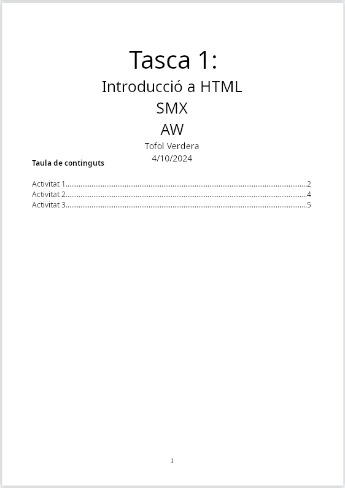

# Lliurament i presentació de tasques

En totes les tasques cal seguir el format següent:

## Lliurament i presentació en format PDF

Si el lliurament de la tasca ha de ser un document PDF, el nom tindrà el format següent:

`<el teu usuari>_t<nombre de la tasca amb dos dígits>.pdf`{: .filepath}

Assegureu-vos que el nom no contingui la lletra ñ, els titlles ni els caràcters especials estranys. Així, per exemple, l'alumne Marcos Ruiz García per a la primera tasca tindria el nom següent:

`tverderag_t01.pdf`{: .filepath}

1. Ha de contenir una portada, número de la tasca, títol de la tasca, nom del mòdul professional, nom del cicle formatiu, autor(s) i data de realització.
2. Ha de tenir un índex actualitzat amb hiperenllaços a les diferents seccions i el número de pàgina on són.
3. Heu de tenir cada pàgina numerada.
4. Les activitats han d'estar numerades i ordenades correctament. Per exemple: `1. Activitat`, `Activitat 1`, `1. <Títol de l'activitat>` o `Activitat 1: <Títol de l'activitat>` al lliurament de l'alumne.
5. Cada activitat ha de tenir **l'enunciat en negreta** i la resposta en text normal.
6. Cada imatge ha de tenir un text que la presenti o un peu de foto amb el format següent: `Figura <número>: <Breu descripció de la figura>`.
7. Les ordres, documents de configuració i codi font han de quedar reflectits al PDF del lliurament en text pla per permetre copiar i enganxar d'una manera ràpida.
8. Les ordres, documents de configuració i codi font que es mostrin al document PDF han de tenir un estil de lletra monospace com pot ser el tipus de lletra Consoles o Courier New. `$sudo apt install neofetch`.
9. Per a les activitats a mà cal fer una foto a la resolució de l'exercici i afegir-la al PDF.

A més:

1. El document no ha de contenir faltes ortogràfiques.
2. En el cas d'utilitzar captures de pantalla, les captures també han de demostrar lautoria de les activitats. Per tant, aquestes captures hauran de ser de tota la pantalla de lalumne perquè es vegi la data de realització i el nom del fitxer que està obert.

_Exemple de portada_

_Exemple d'activitat_

> Us deixo a [codiUsuari_tXX.docx](../../assets/codiUsuari_tXX.docx) una plantilla en format DOCX realitzada amb WPS Office que compleix la majoria dels requisits.  Recordau eliminar els símbols "<" i ">" en utilitzar aquesta plantilla!
{:.prompt-info}

## Lliurament i presentació en format ZIP

Si el lliurament de la tasca ha de ser un document ZIP, el nom tindrà el format següent:

`<el teu usuari>_t<nombre de la tasca amb dos dígits>.zip`{: .filepath}

Assegureu-vos que el nom no contingui la lletra ñ, els accents ni els caràcters especials estranys. Així, per exemple, l'alumne Tofol Verdera Grimalt per a la primera tasca tindria el nom següent:

`tverderag_t01.zip`{: .filepath}

A l'arrel del fitxer ZIP s'haurà de trobar el document PDF (en cas que es demani) amb el nom `tverderag_t01.zip.pdf`{: .filepath} i les activitats en el format que correspongui:

* Les activitats de XML han d'estar en format XML amb el nom `<el teu usuari>_a<Nombre de l'activitat amb dos dígits>.xml`{: .filepath}. Per exemple: `tverderag_a01.xml`{: .filepath}.
* Les activitats d'HTML han d'estar en format HTML amb el nom `<el teu usuari>_a<Nombre de l'activitat amb dos dígits>.html`{: .filepath}. Per exemple: `tverderag_a01.html`{: .filepath}.
* Les activitats de Packet Tracer 6.2 han d'estar en format PKT amb el nom `<el teu usuari>_a<Nombre de l'activitat amb dos dígits>.pkt`{: .filepath}. Per exemple: `tverderag_a01.pts`{: .filepath}.
* Les activitats de JavaScript han d'estar en format JS amb el nom `<el teu usuari>_a<Nombre de l'activitat amb dos dígits>.js`{: .filepath}. Per exemple: `tverderag_a01.js`{: .filepath}.
* Les activitats amb altres tipus d'extensió han d'estar en format corresponent `<el teu usuari>_a<Nombre de l'activitat amb dos dígits>.<extensió>`{: .filepath}. Per exemple: `tverderag_a01.jar`{: .filepath}.

## Lliurament i presentació en format presentació

Si el lliurament de la tasca ha de ser un document PDF, el nom tindrà el format següent:

`<el teu usuari>_t<nombre de la tasca amb dos dígits>.pdf`{: .filepath}

Assegureu-vos que el nom no contingui la lletra ñ, els titlles ni els caràcters especials estranys. Així, per exemple, l'alumne Marcos Ruiz García per a la primera tasca tindria el nom següent:

`tverderag_t01.pdf`{: .filepath}

En cas que no es pugui traslladar la presentació desenvolupada a format PDF, s'haurà de lliurar un document PDF amb un nombre de captures adequat i un enllaç web públic amb la presentació real.

El document PDF SEMPRE ha de contenir una portada, número de la tasca, títol de la tasca, nom del mòdul professional, nom del cicle formatiu, autor(s) i data de realització.

## Com saber el meu nom d'usuari

L'usuari que has d'usar sempre en les tasques ha de complir el format següent:

* La inicial del teu primer nom.
* El teu primer cognom.
* La inicial del teu segon cognom si en tens.

Suposem en Tofol Verdera Grimalt el seu usuari serà: tverderag.

En totes les tasques, cada cop que es faci menció a `<el teu usuari>` hauràs de substituir-lo pel teu usuari.

> Sempre que sigui possible haureu d'usar el vostre nom d'usuari perquè no hi hagi cap dubte sobre l'autoria de les tasques. {:.prompt-warning}
