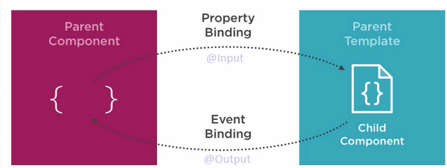

# Introducción a Angular


Angular es un framework de desarrollo web de código abierto, mantenido por Google, para la creación de aplicaciones web front-end dinámicas. Se basa en TypeScript, una extensión de JavaScript que añade tipado estático, para mejorar la legibilidad, mantenibilidad y robustez del código. 

Angular cambia totalmente la manera de programar. Reduce significativamente el código que hay que escribir a cambio de ser muy rígido en la manera de tratar con los elementos de la aplicación. Por tanto, tiene una curva de aprendizaje un poco alta al principio. 

**Evolución del nombre y versiones**

El framework ha experimentado cambios en su nombre y esquema de versiones a lo largo del tiempo:

* **Hasta la versión 1.7:** Angular.js
* **Desde la versión 2:** Angular 2, 4, 5, 6, 7, ..., 18 (actual)

Cada 6 meses libera una nueva versión. Suelen ser bastante compatibles entre las que están próximas y las últimas son retrocompatibles, excepto entre la 1 y la 2, donde cambió casi todo. 

**Características principales**

* **Expressivitad en las plantillas HTML:** Permite crear interfaces de usuario dinámicas y declarativas utilizando sintaxis HTML enriquecida.
* **Diseño modular y Lazy Loading:** Promueve la organización del código en módulos reutilizables y la carga en diferido de componentes para optimizar el rendimiento.
* **Facilidad para reutlizar componentes:** Fomenta la creación de componentes reutilizables que encapsulan funcionalidad y lógica de negocio, mejorando la modularidad y mantenibilidad del código.
* **Comunicación fluida con el backend:** Facilita la comunicación entre la aplicación Angular y el servidor backend, permitiendo diversas tecnologías como RESTful APIs, WebSockets y Server-Side Rendering.
* **Herramientas de desarrollo potentes:** Ofrece una completa suite de herramientas de desarrollo, como Augury, Karma y Jasmine, para facilitar la creación, prueba y depuración de aplicaciones.
* **Integración con frameworks de diseño:** Se integra perfectamente con frameworks de diseño populares como Bootstrap, Angular Material e Ionic, permitiendo crear interfaces de usuario atractivas y consistentes.
* **Single Page Applications (SPAs):** Permite la creación de aplicaciones web de una sola página (SPAs).
* **Arquitectura extensible:** Posee un sistema modular extensible que facilita la incorporación de nuevas funcionalidades y bibliotecas de terceros.
* **Reactividad simplificada:** Simplifica la gestión de la reactividad en la interfaz de usuario, permitiendo que los cambios en los datos se reflejen automáticamente en la vista.
* **DOM virtual:** Implementa un DOM virtual que optimiza el rendimiento y reduce las manipulaciones directas del DOM real.
* **Pensado para grandes aplicaciones:** Está diseñado para el desarrollo de aplicaciones web a gran escala, ofreciendo características como el enrutado, la gestión de estado y la inyección de dependencias.

**Tipos de aplicaciones web con Angular**

Angular se puede utilizar para desarrollar diferentes tipos de aplicaciones web:

* **Páginas web tradicionales:** Permite generar páginas web dinámicas con HTML generado en el servidor y Javascript para la interacción y las peticiones AJAX.
* **Single Page Applications (SPAs):** Facilita la creación de SPAs que generan el HTML en el cliente a partir de datos JSON o XML enviados por el servidor. Puede que este tipo de APPs sean para las que está más preparado. 
* **Progressive Web Applications (PWAs):** Brinda soporte para el desarrollo de PWAs, que ofrecen una experiencia similar a las aplicaciones nativas, con la posibilidad de funcionar sin conexión y acceso a las capacidades del dispositivo.
* **Aplicaciones híbridas:** Permite la creación de aplicaciones híbridas que se ejecutan dentro de un navegador web mínimo embebido en la aplicación nativa, utilizando tecnologías como Cordova o Ionic.

## Requisitos previos para comenzar con Angular

**Instalación de herramientas básicas**

Antes de adentrarnos en el mundo de Angular, es necesario contar con algunas herramientas esenciales para el desarrollo:

**1. Node.js:**

```bash
sudo apt install nodejs
```

**2. npm:**

```bash
sudo apt install npm
```

**3. TypeScript:**

```bash
sudo npm install -g typescript
```

**4. CLI de Angular:**

* La interfaz de línea de comandos de Angular (CLI) facilita la creación, desarrollo y mantenimiento de proyectos Angular. 

```bash
sudo npm install -g @angular/cli
```

**5. Editor de texto:**

* En Visual Studio
    * Angular 2 TypeScript Emmet
    * Angular Language Service
    * Angular Snippets
    * Material icon Theme

**6. Navegador web:**

https://angular.io/guide/devtools 

**8. Actualización de Node.js:**

```bash
sudo npm install -g n
sudo n stable
sudo npm install -g npm
```

### El "contrato" del framework:

Es importante tener en cuenta que la adopción de un framework como Angular implica un compromiso por parte del desarrollador. Al utilizar un framework, se aceptan ciertas limitaciones y responsabilidades:

* **Inversión de tiempo:** Se requiere un tiempo de aprendizaje para comprender el funcionamiento del framework y sus mejores prácticas.
* **Cambio de hábitos:** El uso de un framework implica un cambio en la forma de abordar el desarrollo web, lo que puede requerir la adaptación de hábitos y metodologías de trabajo previas.
* **Restricciones en el uso de librerías:** Algunos frameworks pueden limitar el uso de ciertas librerías o herramientas externas, obligando a trabajar dentro del ecosistema propio del framework.
* **Abstracción y potencial falta de comprensión:** La abstracción que ofrece el framework puede, en ocasiones, dificultar la comprensión profunda del funcionamiento interno de las aplicaciones.
* **Dependencia y actualizaciones:** El desarrollo queda sujeto a las actualizaciones y evoluciones del framework, lo que puede requerir cambios constantes en el código y la adaptación a nuevas versiones.
* **Compromiso a largo plazo:** La adopción de un framework implica un compromiso a largo plazo con la tecnología elegida, lo que puede dificultar el cambio a otro framework en el futuro.
* **Potencial pérdida de habilidades básicas:** El uso excesivo de un framework puede llevar a la pérdida de práctica y dominio de las habilidades de desarrollo web básicas.

**Silos y portabilidad del código:**

Es importante recordar que el uso de un framework específico puede crear un "silo" en el desarrollo, dificultando la reutilización del código en otros proyectos que no utilicen el mismo framework. 

**Alternativas:**

Es importante destacar que el desarrollo web no se limita únicamente al uso de frameworks. La opción de trabajar con JavaScript puro ("Vanilla JS") junto con librerías puntuales como JQuery, Lodash, Ramda, Mocha o RxJS sigue siendo una alternativa viable para muchos proyectos.

https://javarome.medium.com/design-noframework-bbc00a02d9b3 

Antes de embarcarse en el desarrollo con Angular, es crucial evaluar cuidadosamente las necesidades del proyecto, las habilidades del equipo y las implicaciones a largo plazo de adoptar un framework. 


## Primeros pasos con Angular: ¡Hola Mundo!

En este capítulo, daremos nuestros primeros pasos en el mundo de Angular creando una sencilla aplicación que muestre el clásico mensaje "Hola Mundo". A lo largo del camino, conoceremos algunos conceptos básicos del framework y la estructura de un proyecto Angular.

**Preparación del entorno**

1. **Instalación de herramientas previas:**

```bash
sudo npm install -g @angular/cli [--force]
ng new my-app
cd my-app 
ng serve -o
```


2. **Creación de un nuevo proyecto:**

```bash
ng new mi-aplicacion
```

Este comando creará la estructura básica del proyecto.

**Estructura del proyecto:**

La estructura de un proyecto Angular típico se compone de las siguientes carpetas:

* **src:** Contiene el código fuente de la aplicación, incluyendo componentes, servicios, módulos y otros elementos.
* **assets:** Almacena recursos estáticos como imágenes, fuentes y archivos CSS.
* **environments:** Define las variables de entorno para diferentes configuraciones (desarrollo, producción, etc.).
* **node_modules:** Contiene las dependencias de terceros instaladas mediante npm.
* **package.json:** El archivo de configuración del proyecto, donde se especifican las dependencias, scripts y metadatos del proyecto.
* **tsconfig.json:** La configuración de TypeScript para el proyecto.

**Creando el "Hola Mundo":**

1. **Editando el componente principal:**

   Modificar el contenido del archivo `app.component.ts` de la siguiente manera:

   ```typescript
   import { Component } from '@angular/core';  // Importación del decorado

   @Component({
     selector: 'app-root',
     standalone: true,
     imports: [CommonModule, RouterOutlet], // Los componentes standalone tienen imports
     templateUrl: './app.component.html',
     styleUrls: ['./app.component.css']
   })
   export class AppComponent {  // Un componente es una clase decorada
     title = 'Mi primera aplicación Angular';
   }
   ```

   Este código define un componente llamado `AppComponent` con un selector `app-root`. El selector indica cómo se usará este componente en la plantilla HTML. El componente tiene un título definido como `Mi primera aplicación Angular`.

2. **Creando la plantilla HTML:**

   El archivo `app.component.html`, dentro de las etiquetas `<body>`:

   ```html
   <p>¡Hola Mundo!</p>
   ```


3. **Ejecutando la aplicación:**

   En la terminal, ejecutar el siguiente comando para iniciar el servidor de desarrollo local:

```bash
ng serve -o
```

   Esto abrirá un navegador web en la dirección `http://localhost:4200`.


### Angular CLI

El Angular CLI (Command Line Interface) actúa como un asistente que permite crear, generar, compilar, ejecutar y mantener un proyecto Javascript. Se podría programar sin ella, pero sus comandos despliegan unas plantillas de elementos típico de Angular en un instante y evitan el error humano en cosas rutinarias. 

#### Generando elementos del framework:

El CLI facilita la generación de los elementos básicos que componen una aplicación Angular. Veamos algunos de los comandos más utilizados:

* **ng generate component <nombre-componente>**: Crea un nuevo componente con el nombre especificado.
* **ng generate directive <nombre-directiva>**: Genera una directiva para modificar el comportamiento del DOM.
* **ng generate pipe <nombre-pipe>**: Crea un pipe para transformar datos en la vista.
* **ng generate service <nombre-servicio>**: Genera un servicio para encapsular lógica y compartir datos entre componentes.
* **ng generate class <nombre-clase>**: Genera una clase simple de TypeScript.
* **ng generate interface <nombre-interface>**: Crea una interfaz para definir contratos de tipos.
* **ng generate enum <nombre-enum>**: Genera una enumeración para definir un conjunto de valores constantes.
* **ng generate module <nombre-modulo>**: Crea un nuevo módulo para organizar el código de la aplicación.
* **ng generate guard <nombre-guard>**: Genera un guard para controlar el acceso a rutas en la aplicación.

> `generate`puede ser resumido con `g`, por ejemplo: **ng g component <nombre-componente>**

#### Añadiendo e integrando librerías:

El CLI también permite incorporar librerías externas al proyecto de forma sencilla. Por ejemplo, para añadir el popular `@angular/material` que ofrece componentes de diseño predefinidos:

```bash
ng add @angular/material
```

#### Actualizando Angular:

```bash
ng update --all
```

#### Compilando la aplicación:

Para generar una versión optimizada de la aplicación lista para producción, se utiliza el comando `ng build`. Puedes añadir la opción `--prod` para habilitar optimizaciones adicionales:

```bash
ng build [--prod]
```

**Creando un nuevo proyecto:**

Para iniciar un nuevo proyecto Angular, se utiliza el comando `ng new`:

```bash
ng new mi-proyecto-angular
```


## Componentes en Angular

Cada componente encapsula una parte específica de la interfaz de usuario (UI) y su funcionalidad asociada, promoviendo la modularidad y la reutilización de código. A modo de bloques de construcción, los componentes se ensamblan para crear aplicaciones web dinámicas y escalables.

**Importando el decorador fundamental:**

Para declarar un componente, es necesario importar el decorador `Component` desde el paquete `@angular/core`. Este decorador proporciona metadatos esenciales sobre el componente, como su selector, plantilla y estilos.

```typescript
import { Component } from '@angular/core';
```

**Estructura de un componente:**

Un componente se define como una clase TypeScript decorada con `@Component`. La estructura básica de un componente incluye:

* **Selector:** Un identificador único que define cómo se utilizará el componente en el HTML. Se especifica mediante la propiedad `selector` del decorador.
* **Plantilla:** El código HTML que define la estructura visual del componente. Se define mediante la propiedad `templateUrl` del decorador, que apunta a un archivo HTML externo.
* **Estilos:** Las reglas CSS que definen la apariencia del componente. Se definen mediante la propiedad `styleUrls` del decorador, que apunta a un archivo CSS externo.
* **Lógica del componente:** El código TypeScript que define el comportamiento del componente, como propiedades, métodos y eventos. Este código se escribe dentro de la clase del componente.

**Componentes Standalone:**

En Angular, los componentes pueden existir de dos maneras: como parte de un módulo o como componentes Standalone. Los componentes Standalone no requieren de un módulo para funcionar y se definen de forma independiente. Para declarar un componente Standalone, se utiliza la propiedad `standalone` del decorador `@Component` y se establece en `true`.

El los próximos puntos, vamos a explorar cómo hacer componentes dinámicos y reactivos y cómo comunicar componentes y los componentes con otros elementos del framework. 

### Reactividad

La reactividad web permite simplificar la manera en la que se actualizan los datos entre la interfaz y el estado de la aplicación. Esta gestión de la reactividad, en Angular está basada en `RxJS` y actualmente también en `Signals`. En ocasiones usaremos los elementos de RxJS de forma explícita, pero en el caso de las plantillas de los componentes, se hace de forma mucho más simplificada mediante interpolaciones. 

#### Interpolación

La interpolación en Angular es una herramienta fundamental para inyectar datos dinámicos en las plantillas HTML, permitiendo que la interfaces de usuario sean reactivas y se actualicen automáticamente en función de los cambios en los datos.

La interpolación permite incrustar expresiones JavaScript dentro de las plantillas HTML utilizando las llaves dobles `{{ }}`. El valor de la expresión se evalúa y se inserta en el lugar correspondiente.

La interpolación hace que las plantillas sean dinámicas, ya que el contenido se actualiza automáticamente cuando los valores de las variables o las expresiones cambian en el código TypeScript. Esto permite crear interfaces de usuario que responden a eventos, interacciones del usuario o cambios en los datos.

**Casos de uso comunes:**

* **Mostrar valores de variables:** Puedes mostrar el valor de cualquier variable o propiedad de un componente dentro de una plantilla. Por ejemplo:

```html
<p>Nombre: {{ nombre }}</p>

```

* **Ejecutar métodos de componentes:** Puedes llamar a métodos de tu componente dentro de la plantilla y mostrar el resultado. Por ejemplo:

```html
<p>Resultado: {{ metodoComponente() }}</p>
```

**Limitaciones:**

* **Dirección única:** La interpolación solo funciona en una dirección, desde JavaScript hacia HTML. No se pueden modificar variables o propiedades desde la plantilla.
* **Expresiones simples:** Las expresiones dentro de la interpolación deben ser simples y no deben contener instrucciones de control de flujo como `if`, `for` o `while`.

**Contexto de las expresiones:**

Las expresiones dentro de la interpolación se evalúan en el contexto del componente actual. No tienen acceso directo a variables o funciones globales.

**Buenas prácticas:**

* **Mantén la simplicidad:** Utiliza expresiones simples y evita código complejo dentro de la interpolación.
* **Usa `innerHTML` para contenido HTML:** Si la variable contiene código HTML, utiliza la directiva `[innerHTML]` para evitar problemas de seguridad.

#### Vincular atributos

Angular permite vincular atributos HTML a propiedades de componentes utilizando la sintaxis `[]`. Por ejemplo:

```html

<div [style.height.px]="imageHeight"></div>
```

**Directivas `ngStyle` y `ngClass`:**

Las directivas `ngStyle` y `ngClass` proporcionan mayor flexibilidad para manipular estilos y clases CSS a partir de variables o expresiones. Ambas requieren la importación del módulo `CommonModule`.

**`ngStyle`:**

* Permite aplicar estilos dinámicos a elementos HTML.
* Acepta un objeto literal o una variable que contenga pares clave-valor para los estilos.

```html
<p [ngStyle]="{'font-size': tamano+'px'}">Hola Mundo</p>
<div [ngStyle]="styleObject">...</div>
```

**`ngClass`:**

* Permite aplicar clases CSS dinámicamente a elementos HTML.
* Acepta un objeto literal, una variable o un array que contenga las clases que se aplicarán.

```html
<p [ngClass]="clase">Hola Mundo</p>
<p [ngClass]="[clase, claseParrafo ]">Hola Mundo</p>
<p [ngClass]="{'text-danger': danger, 'text-info': !danger}">Hola Mundo</p>
```

#### Vinculación bidireccional `[(ngModel)]`

La vinculación bidireccional permite sincronizar el valor de un elemento de entrada (como `input` o `textarea`) con una propiedad de un componente. Requiere la importación del módulo `FormsModule`.

```html
<input type="text" [(ngModel)]="filterSearch" class="form-control"
name="filterDesc" id="filterDesc" placeholder="Filter...">
```

#### Vincular eventos

Los eventos de los elementos HTML se pueden vincular a métodos de componentes utilizando la sintaxis `()`.

```html
<button class="btn btn-sm"
[ngClass]="{'btn-danger': showImage, 'btn-primary': !showImage}"
(click)="toggleImage()">
{{showImage?'Ocultar':'Mostrar'}} imagen
</button>

```


### Directivas estructurales

Las directivas estructurales en Angular permiten controlar el flujo condicional de las plantillas HTML, mostrando o ocultando contenido en función de diversos criterios. 

**Directiva `@if`:**

La directiva `@if` funciona similar a la instrucción `if` en JavaScript, permitiendo mostrar o esconder contenido en base a una condición booleana. Su sintaxis es la siguiente:

```html
@if (expresiónBooleana) {
  } else {
  }
```

**Ejemplo:**

```html
@if (names.length > 0) {
  <ul>
    <li *ngFor="let name of names">{{ name }}</li>
  </ul>
} else {
  <p>No hay nombres para mostrar</p>
}
```

**Directiva `@for`:**

La directiva `@for` itera sobre una colección de datos, mostrando un elemento HTML por cada elemento de la colección. Su sintaxis es la siguiente:

```html
@for (elemento of colección; trackBy clave) {
  <p>{{ elemento }}</p>
}
```

**Ejemplo:**

```html
@for (let nombre of nombres) {
  <p>{{ nombre }}</p>
}
```

**Directiva `@switch`:**

La directiva `@switch` funciona como la instrucción `switch` en JavaScript, permitiendo mostrar o esconder contenido en función de una expresión que puede tener varios valores. Su sintaxis es la siguiente:

```html
@switch (expresión) {
  case valor1:
    break;
  case valor2:
    break;
  default:
    }
```

**Ejemplo:**

```html
@switch (tipoUsuario) {
  case 'admin':
    <button>Administrar usuarios</button>
    break;
  case 'user':
    <button>Ver mis datos</button>
    break;
  default:
    <p>Usuario no reconocido</p>
}
```

**Directivas `@empty` y `trackBy`:**

Las directivas `@empty` y `trackBy` son opcionales y proporcionan funcionalidades adicionales:

* **`@empty`:** Define el contenido a mostrar cuando la colección de datos está vacía.

* **`trackBy`:** Especifica un valor único para cada elemento de la colección, lo que optimiza la actualización del DOM al iterar sobre la colección.

**Modernización a partir de Angular 17:**

A partir de Angular 17, las directivas estructurales `@if`, `@for` y `@switch` se han simplificado y no requieren la importación de ninguna librería adicional. Además, la sintaxis se ha hecho más intuitiva y fácil de leer. Es muy probable que encontremos ejemplos con ngFor, ngIf... Estos todavía funcionan, pero no se recomienda usarlos ya. 

**@let**

Con @let podemos crear variables en el entorno de las plantillas. Estas también tienen ámbito de bloque y no pueden ser reasignadas.  Veamos algún ejemplo:

```html
@let name = 'Frodo';
<h1>Dashboard for {{name}}</h1>
Hello, {{name}}

<!-- Use with a template variable referencing an element -->
<input #name>

@let greeting = 'Hello ' + name.value;

<!-- Use with an async pipe -->
@let user = user$ | async;
```

https://blog.angular.dev/introducing-let-in-angular-686f9f383f0f 

### Interfaces

Las interfaces en Angular son un mecanismo fundamental para definir la estructura de objetos de datos. Proporcionan un contrato que describe las propiedades que un objeto debe tener y sus respectivos tipos. Esto mejora la legibilidad, mantenibilidad y seguridad del código, ya que Angular puede detectar errores en tiempo de compilación si se intenta utilizar un objeto que no cumple con la interfaz definida. 

Typescript necesita saber el contenido de los objetos y el tipo de todo. Se puede usar `any` en ocasiones contadas, pero siempre es mejor crear la interfaz. 

**¿Por qué utilizar interfaces?**

* **Claridad y definición:** Las interfaces documentan de forma explícita la estructura de los objetos, mejorando la comprensión del código.
* **Detección temprana de errores:** Angular puede detectar en tiempo de compilación si se intenta utilizar un objeto que no cumple con la interfaz, evitando errores en tiempo de ejecución.
* **Refactorización segura:** Al modificar la estructura de una interfaz, Angular te avisará de los lugares donde se utilizan objetos afectados, facilitando la refactorización segura del código.
* **Autocompletado:** Los editores de código modernos utilizan las interfaces para ofrecer autocompletado y sugerencias de tipos, mejorando la productividad del desarrollador.

**Creando una interfaz:**

Para crear una interfaz, se utiliza la palabra clave `interface` seguida por el nombre de la interfaz y un bloque con llaves que define sus propiedades:

```typescript
export interface IProduct {
  id: number;
  description: string;
  price: number;
  available: Date;
  imageUrl: string;
  rating: number;
}
```

Cada propiedad de la interfaz se define con su nombre, seguido de dos puntos `:` y el tipo de dato esperado.

**Utilizando interfaces:**

Una vez definida la interfaz, puedes utilizarla para declarar variables o propiedades de componentes que deben contener objetos con esa estructura. Por ejemplo:

```typescript
products: IProduct[] = [
  {
    id: 1,
    description: 'SSD hard drive',
    available: new Date('2016-10-03'),
    price: 75,
    imageUrl: 'assets/ssd.jpg',
    rating: 5
  },
  // ... otros productos
];
```

En este ejemplo, el array `products` está tipado como un array de objetos que cumplen con la interfaz `IProduct`. Esto garantiza que cada objeto del array tenga las propiedades esperadas y del tipo correcto.

### Ciclo de vida de los componentes


<figure id="id2">
<a class="reference internal image-reference" href="../../../imatges/components.png"></a>
<figcaption style="font-size:0.7em;">
Estructura de una aplicación web típica<a class="headerlink" href="#id2" title="Link to this image">#</a>
</figcaption>
</figure>

Los componentes son elementos reutilizables por naturaleza. Se pueden importar y utilizar en otros componentes, promoviendo la modularidad y evitando la duplicación de código. Esto facilita la creación de interfaces de usuario consistentes y escalables.

Los componentes tienen un ciclo de vida definido por una serie de métodos que se llaman en diferentes momentos de su existencia. Algunos de los métodos más importantes son:

* **`constructor`:** Se llama cuando se crea una instancia del componente. El constructor se utiliza para inyectar dependencias y configurar valores iniciales. No se recomienda colocar lógica de inicialización aquí porque puede ejecutarse antes de que las propiedades de entrada estén configuradas.
* **`ngOnInit`:** Se llama una vez que el componente se ha inicializado y está listo para usarse.
* **`ngAfterContentInit`:** Se llama después de que se haya inicializado el contenido del componente.
* **`ngAfterViewInit`:** Se llama después de que se haya renderizado el componente completamente.
* **`ngOnChanges`:** Se llama cada vez que cambia una propiedad de entrada del componente. Puede ejecutarse demasiadas veces.
* **`ngDoCheck`:** Se llama en cada ciclo de detección de cambios de Angular. Se usar raramente porque se ejecuta muchas veces, sólo si los eventos o cambios no son suficientes.
* **`ngOnDestroy`:** Se llama cuando el componente se destruye.

#### ngOnInit

`OnInit` es una interfaz que obliga a implementar el método `ngOnInit()`. Esta interfaz forma parte del ciclo de vida de un componente, y su uso es esencial para inicializar el componente una vez que Angular ha configurado sus propiedades de entrada.

```typescript
import { Component, OnInit } from '@angular/core';
import { ActivatedRoute } from '@angular/router';
import { ProductsService } from '../products.service';

@Component({
  selector: 'app-product-detail',
  templateUrl: './product-detail.component.html',
})
export class ProductDetailComponent implements OnInit {
  constructor(
    private activatedRoute: ActivatedRoute,
    private productsService: ProductsService
  ) { }

  ngOnInit(): void {
    this.activatedRoute.params.subscribe(params => {
      const productId = params['id'];
      // Aquí se puede usar el productId para obtener los detalles del producto
      // desde el servicio de productos
      this.productsService.getProductById(productId).subscribe(product => {
        // Manejo de los datos del producto
        console.log(product);
      });
    });
  }
}
```

El método `ngOnInit` se llama una vez que la inicialización del componente está completa. Es especialmente útil para cualquier tipo de inicialización que deba ocurrir después de que Angular haya configurado todas las propiedades de entrada del componente.

Al ejecutar `ngOnInit`nos aseguramos que todas las dependencias de datos de entrada han sido configuradas y obtenidas. Es el momento de que el componente pida nuevos datos si los necesita. Casi todos los componentes que obtienen datos de un servicio lo implementan.

### Comunicación entre componentes

Los componentes se pueden anidar en una estructura jerárquica, lo que permite crear interfaces de usuario complejas y modulares. Un componente padre puede contener uno o más componentes hijos, y cada componente hijo puede contener a su vez otros componentes hijos. Todo esto se hace importando el componente y usando la etiqueta HTML definida en la propiedad `selector`. 

Los componentes pueden comunicarse entre sí mediante diferentes mecanismos, como:

* **Entrada y salida de datos:** Los componentes pueden intercambiar datos a través de propiedades de entrada y salida @Input y @Output.
* **Servicios:** Los componentes pueden compartir lógica y datos mediante servicios, que son clases que encapsulan funcionalidad reutilizable.
* **Eventos:** Los componentes pueden emitir eventos que otros componentes pueden escuchar y responder. 

A su vez, esa comunicación suele ser internamente reactiva mediante `Observables` o `Signals`. Veremos cómo funciona la comunicación típica entre componentes padres e hijos y más adelante veremos cómo comunicarse a través de un servicio.  


#### @Input

<figure id="id3">
<a class="reference internal image-reference" href="../../../imatges/inputoutputparentchild.png"></a>
<figcaption style="font-size:0.7em;">
Diagrama de comunicación entre componentes padres e hijos.<a class="headerlink" href="#id3" title="Link to this image">#</a>
</figcaption>
</figure>

Los componentes padres pueden enviar datos a sus componentes hijos mediante propiedades de entrada, y los componentes hijos pueden emitir eventos que sus componentes padres pueden escuchar.

HTML de la plantilla del componente padre. Observa `[p]="product"`:

```html
<h1>Catalogue</h1>
<div class="row row-cols-1 row-cols-md-2 g-4">
  <div class="col">
    @for (product of products; track $index;){
    <app-product-item [p]="product">
    </app-product-item>
    }
  </div>
</div>
```

El componente hijo:

```typescript
import { Component, Input } from '@angular/core';
...

@Component({
  selector: 'app-product-item',
  templateUrl: './product-item.component.html',
})
export class ProductItemComponent {
  @Input() p!: Product;
}
```
- La propiedad `p` está decorada con `@Input`, lo que permite que este componente reciba un valor desde su componente padre.
- `p!: Product` indica que `p` es una propiedad obligatoria de tipo `Product`. El `!` es una aserción de no nulo/no indefinido, lo que le dice a TypeScript que confíe en que `p` será inicializada correctamente.

El decorador `@Input` en Angular se utiliza para marcar una propiedad de un componente como pública, permitiendo que este reciba datos desde un componente padre, lo cual es esencial para la comunicación entre componentes en Angular y facilita el flujo de datos de padres a hijos. Este enfoque promueve la **modularidad** al facilitar la creación de componentes reutilizables y modulares, mejora la **claridad** al hacer explícito qué datos necesita un componente para funcionar y optimiza el **mantenimiento** al separar claramente la lógica de la presentación de datos, lo que resulta en un código más limpio y fácil de gestionar en aplicaciones complejas.

Existen varias opciones y formas de usar `@Input`, cada una con sus características y beneficios.

**Ejemplo 1: `@Input` Requerido**

```typescript
@Input({ required: true }) name: string;
```

En este ejemplo, la propiedad `name` está marcada como requerida. Si el componente padre no proporciona un valor para `name`, Angular generará un error. Esto asegura que todos los componentes hijos tengan los datos necesarios para funcionar correctamente.

**Ejemplo 2: `@Input` con Getters y Setters**

```typescript
private myCourses: Course[];

@Input()
get courses() {
  return this.myCourses;
}
set courses(courses: Course[]) {
  this.myCourses = courses;
}
```

Aquí se define una propiedad `courses` con `@Input`, pero se utiliza un enfoque más avanzado con getters y setters. Esto permite controlar la forma en que los datos se asignan y se acceden. En este caso, `myCourses` es una propiedad privada y `courses` es una propiedad pública que expone `myCourses` de manera controlada. Cada vez que se asignan nuevos cursos, se puede agregar lógica adicional en el setter para manejar la asignación de los datos.

**Ejemplo 3: `@Input` con Alias**

```typescript
@Input('userName') name: string;
```

Este ejemplo muestra cómo se puede usar un alias con `@Input`. La propiedad pública del componente hijo será `name`, pero el componente padre puede pasarle datos usando el nombre `userName`. Esto es útil cuando se quiere mantener una convención de nombres específica en el componente hijo, pero se quiere proporcionar un nombre más descriptivo o claro para el componente padre.


##### Property has no initializers...

En TypeScript, el error "Property has no initializers..." se produce cuando se declara una propiedad sin asignarle un valor inicial. Esto es particularmente relevante cuando se utiliza el decorador `@Input()` en Angular, ya que indica que una propiedad será inicializada por el componente padre, lo cual podría no suceder siempre. Es importante manejar este caso adecuadamente para evitar errores en tiempo de ejecución y asegurar que el código sea robusto.

Existen varias formas de solucionar este problema en TypeScript:

1. **Utilizar el operador `!`**:
   
   ```typescript
   @Input() products!: IProduct[];
   ```
   Esta opción no es recomendable porque el operador `!` le dice a TypeScript que confíe en que la propiedad será inicializada eventualmente, lo que podría no ser cierto. Esto puede ocultar errores potenciales y llevar a problemas difíciles de depurar.

2. **Utilizar `| undefined` o `?`**:

   ```typescript
   @Input() products?: IProduct[];
   // o
   @Input() products: IProduct[] | undefined;
   ```
   Esta es la solución más recomendable. Indica explícitamente que la propiedad `products` puede no ser inicializada, permitiendo a TypeScript manejar correctamente este caso. Esto obliga a tratar la propiedad como potencialmente `undefined`, lo cual ayuda a prevenir errores en tiempo de ejecución.

3. **Desactivar `strictPropertyInitialization` en `tsconfig.json`**:

   ```json
   {
     "compilerOptions": {
       "strictPropertyInitialization": false
     }
   }
   ```
   Esta opción no es recomendable porque desactiva la verificación estricta de inicialización de propiedades en todo el proyecto. Esto puede llevar a pasar por alto otros errores de inicialización, reduciendo la seguridad y robustez del código.

Para manejar adecuadamente la inicialización de propiedades en Angular y TypeScript, es importante usar técnicas que indiquen claramente las posibles opciones de inicialización. Usar `| undefined` o `?` es la mejor práctica, ya que proporciona una forma segura y explícita de tratar con propiedades opcionales. Se debería evitar el uso del operador `!`, a menos que sea una propiedad que, seguro que va a llegar. 


#### @Output

En Angular, el decorador `@Output` se utiliza para permitir que un componente hijo emita eventos personalizados que puedan ser capturados por su componente padre. Esto es útil para la comunicación de eventos y datos desde un componente hijo hacia su padre, facilitando la interacción entre componentes.

El uso del decorador `@Output` en Angular permite una comunicación eficaz entre componentes hijo y padre mediante eventos personalizados.  Al emitir eventos desde el hijo y capturarlos en el padre, se puede gestionar fácilmente la lógica de la aplicación y mantener una separación clara de responsabilidades entre los componentes.

En este ejemplo, un componente hijo emite un evento personalizado cuando se produce un cambio en la puntuación (`ratting`). El componente padre escucha este evento y actúa en consecuencia.

##### Paso 1: Configuración en el Componente Hijo

Primero, definimos un `EventEmitter` en el componente hijo que emitirá el evento cuando cambie la puntuación:

```typescript
import { Component, EventEmitter, Output } from '@angular/core';

@Component({
  selector: 'app-rating',
  templateUrl: './rating.component.html',
})
export class RatingComponent {
  @Output() rattingChanged = new EventEmitter<number>();

  auxRatting: number;

  puntuar(i: number): void {
    this.auxRatting = i;
    this.rattingChanged.emit(this.auxRatting);
  }
}
```

- `@Output() rattingChanged = new EventEmitter<number>();`: Define un evento `rattingChanged` que emitirá un número.
- `puntuar(i: number): void`: Esta función se llama cuando se cambia la puntuación y emite el nuevo valor usando `rattingChanged.emit(this.auxRatting)`.

##### Paso 2: Captura del Evento en el Componente Padre

En el componente padre, se escucha el evento emitido por el hijo y se define una función para manejar el cambio de puntuación:

```html
<!-- product-list.component.html -->
<app-rating (rattingChanged)="changeRatting($event, product)"></app-rating>
```

```typescript
import { Component } from '@angular/core';
import { Product } from './product.model';

@Component({
  selector: 'app-product-list',
  templateUrl: './product-list.component.html',
})
export class ProductListComponent {

  products: Product[];

  changeRatting(stars: number, p: Product): void {
    p.ratting = stars;
  }
}
```

- `(rattingChanged)="changeRatting($event, product)"`: El componente padre escucha el evento `rattingChanged` del componente hijo y llama a la función `changeRatting`, pasando el valor del evento `$event` y el producto correspondiente `product`.
- `changeRatting(stars: number, p: Product): void`: Esta función actualiza la puntuación (`ratting`) del producto con el nuevo valor recibido desde el componente hijo.

### Pipes

Los Pipes en Angular  permiten transformar los datos directamente en las plantillas antes de mostrarlos. Al igual que los filtros en Linux, los pipes toman una entrada, la procesan y devuelven una salida transformada. Angular proporciona varios pipes predefinidos, pero también es posible crear pipes personalizados para satisfacer necesidades específicas.

#### Uso de Pipes Predefinidos

En Angular, los pipes se utilizan en las plantillas después de la variable, separados por el símbolo `|`. Un punto importante es que los pipes no modifican la variable original, sino que retornan una versión transformada de la misma. Algunos pipes predefinidos en Angular incluyen:

- `uppercase`: Convierte el texto a mayúsculas.
- `currency`: Formatea un número como una moneda.
- `date`: Formatea una fecha según el formato especificado.

Aquí hay un ejemplo de cómo usar algunos de estos pipes predefinidos en una tabla que muestra una lista de productos:

```html
<tr *ngFor="let product of products">
    <td>
        
    </td>
    <td>{{ product.description }}</td>
    <td>{{ product.price | currency:'EUR':'symbol'}}</td>
    <td>{{ product.available | date:'dd/MM/y' }}</td>
</tr>
```

En este ejemplo:
- El pipe `uppercase` se usa para convertir la descripción del producto a mayúsculas.
- El pipe `currency` formatea el precio del producto en euros.
- El pipe `date` formatea la fecha de disponibilidad del producto en el formato `dd/MM/y`.

#### Creación de Pipes Personalizados

Si los pipes predefinidos no cumplen con todas las necesidades de transformación de datos, Angular permite crear pipes personalizados. La creación de un pipe personalizado implica los siguientes pasos:

1. **Generar el Pipe**: Utilizar el comando Angular CLI para generar el esqueleto del pipe.
   ```sh
   ng g pipe pipes/nombreDelPipe
   ```

2. **Implementar el Pipe**: Definir la lógica de transformación en el pipe generado. Aquí hay un ejemplo de un pipe personalizado que filtra productos basándose en un criterio de búsqueda:
   ```typescript
   import { Pipe, PipeTransform } from '@angular/core';
   import { Product } from '../product/product';

   @Pipe({
       name: 'productFilter'
   })
   export class ProductFilterPipe implements PipeTransform {
       transform(products: Product[], filterBy: string): Product[] {
           const filter = filterBy ? filterBy.toLocaleLowerCase() : null;
           return filter ? 
               products.filter(p => p.name.toLocaleLowerCase().includes(filter)) 
               : products;
       }
   }
   ```

   En este pipe personalizado:
   - La función `transform` toma dos argumentos: una lista de productos y un criterio de búsqueda.
   - Convierte el criterio de búsqueda a minúsculas para realizar una comparación insensible a mayúsculas.
   - Filtra los productos cuyo nombre incluye el criterio de búsqueda.

3. **Usar el Pipe Personalizado**: Aplicar el pipe en la plantilla para filtrar los productos según el criterio de búsqueda.

   ```html
   <tr *ngFor="let product of products | productFilter: filter">
       <td>{{ product.name }}</td>
       <td>{{ product.price | currency:'EUR':'symbol' }}</td>
       <td>{{ product.available | date:'dd/MM/y' }}</td>
   </tr>
   ```


## Directivas en Angular

Las directivas en Angular son un mecanismo potente para manipular el DOM de manera declarativa. Pueden modificar elementos HTML y su comportamiento en función de la lógica de la aplicación. Existen tres tipos principales de directivas en Angular:

1. **Directivas de componente:** Se definen mediante el selector en el decorador `@Component` y son las que hemos creado hasta ahora.
2. **Directivas de atributo:** Modifican el comportamiento de un elemento. Ejemplos comunes son `NgClass` y `NgStyle`.
3. **Directivas estructurales:** Manipulan la estructura del DOM, como `ngIf`, `ngFor` y `ngSwitch`, controlando si un elemento se muestra o no.

### Crear directivas de atributo

Podemos crear nuestras propias directivas de atributo para añadir comportamientos personalizados a los elementos HTML. Vamos a crear una directiva llamada `Resaltado` que cambiará el color de fondo de un elemento cuando el ratón pase sobre él.

Primero, generamos la directiva con Angular CLI:

```sh
ng g directive directives/resaltado
```

Luego, implementamos la lógica en el archivo `resaltado.directive.ts`:

```typescript
import { Directive, ElementRef, HostListener, Input } from '@angular/core';

@Directive({
  selector: '[appResaltado]'
})
export class ResaltadoDirective {
  @Input('appResaltado') nuevoColor: string;

  constructor(private el: ElementRef) {}

  @HostListener('mouseenter') entrarMouse() {
    this.el.nativeElement.style.backgroundColor = this.nuevoColor;
  }

  @HostListener('mouseleave') saleMouse() {
    this.el.nativeElement.style.backgroundColor = null;
  }
}
```

En el archivo de plantilla HTML, utilizamos nuestra directiva `Resaltado`:

```html
<div class="col-md-4" [appResaltado]="color">
  <!-- Contenido del elemento -->
</div>
```

### ElementRef vs Renderer2

`ElementRef` nos da una referencia directa a un elemento del DOM una vez renderizado. Sin embargo, utilizar `ElementRef` puede exponer riesgos de seguridad y no es la mejor práctica en aplicaciones que necesitan ser multiplataforma. En cambio, `Renderer2` proporciona una abstracción adicional, permitiendo manipular el DOM de manera segura y compatible con aplicaciones de servidor y Web Workers.

Ejemplo con `Renderer2`:

```typescript
import { Directive, ElementRef, HostListener, Input, Renderer2 } from '@angular/core';

@Directive({
  selector: '[appMostrar]'
})
export class MostrarDirective {
  @Input() elementMostrar!: any;

  constructor(private el: ElementRef, private renderer: Renderer2) {}

  @HostListener('mouseenter') entrarMouse() {
    this.renderer.setStyle(this.elementMostrar, 'display', '');
  }

  @HostListener('mouseleave') saleMouse() {
    this.renderer.setStyle(this.elementMostrar, 'display', 'none');
  }
}
```

En el archivo de plantilla HTML, utilizamos nuestra directiva `Mostrar`:

```html
<li appMostrar 
[elementMostrar]="ocultar">
  <!-- Contenido del elemento -->
</li>

<p #ocultar style="margin-bottom: 0; display:none;">
  Producción: <span *appForDelay="100; let p of placa.production">{{p}}W</span>
</p>
```

### Crear directivas estructurales

Las directivas estructurales, como `ngIf`, `ngFor` y `ngSwitch`, utilizan el asterisco (*) para simplificar la manipulación de etiquetas `<ng-template>` que rodean al elemento que están manipulando.

Vamos a crear una directiva estructural llamada `ForDelay` que retrasa la visualización de elementos en un bucle.

Primero, generamos la directiva:

```sh
ng g directive directives/for-delay
```

Implementamos la lógica en el archivo `for-delay.directive.ts`:

```typescript
import { Directive, Input, TemplateRef, ViewContainerRef } from '@angular/core';

@Directive({
  selector: '[appForDelay]'
})
export class ForDelayDirective {
  private items: Array<number> = [];
  private delay = 0;

  constructor(private templateRef: TemplateRef<any>, private viewContainer: ViewContainerRef) {}

  @Input() set appForDelay(t: number) {
    this.delay = t;
  }

  @Input() set appForDelayOf(array: number[]) {
    this.items = array;
    this.renderItems();
  }

  private async renderItems() {
    for (let item of this.items) {
      this.viewContainer.createEmbeddedView(this.templateRef, {
        $implicit: item
      });
      await this.delayTime(this.delay);
    }
  }

  private delayTime(ms: number) {
    return new Promise(resolve => setTimeout(resolve, ms));
  }
}
```

En el archivo de plantilla HTML, utilizamos nuestra directiva `ForDelay`:

```html
<span *appForDelay="100; let p of placa.production">{{p}}W</span>
```

### Eventos

En Angular, la manera más simple de gestionar eventos es con la sintaxis `( )` en el elemento HTML correspondiente. Esto crea una suscripción externa. Para una suscripción interna, usamos `@HostListener`.

Ejemplo de suscripción interna con `@HostListener`:

```typescript
import { Directive, HostListener } from '@angular/core';

@Directive({
  selector: '[appScroll]'
})
export class ScrollDirective {
  imgY = 100;

  @HostListener('window:scroll', ['$event'])
  homeScroll($event: Event) {
    let scrollOffset = window.scrollY;
    this.imgY = 100 - scrollOffset / 2;
    if (this.imgY < 0) {
      this.imgY = 20;
    }
  }
}
```

En el archivo de plantilla HTML, utilizamos nuestra directiva `Scroll`:

```html
<div appScroll>
  <!-- Contenido del elemento -->
</div>
```


## Módulos en Angular

A medida que una aplicación de Angular crece en tamaño y complejidad, no es sostenible mantener toda la funcionalidad en un solo módulo `AppModule` y organizar los componentes únicamente en directorios. En Angular, los módulos (`NgModules`) son la manera recomendada de organizar y estructurar aplicaciones grandes y complejas. Un módulo es una clase con el decorador `@NgModule` que define un contenedor para un conjunto coherente de componentes, directivas, pipes y servicios.

Angular permite la carga diferida (lazy loading) de módulos, lo que ayuda a mejorar el rendimiento de la aplicación cargando módulos solo cuando se necesitan. Esta técnica es especialmente útil para grandes aplicaciones con muchas rutas y funcionalidades diversas.

### Arrays del Decorador @NgModule

El decorador `@NgModule` define varios arrays que especifican cómo se organiza el módulo:

- **bootstrap**: Solo se utiliza en el `AppModule`, define el componente inicial que se debe cargar al iniciar la aplicación.

- **declarations**: Contiene los componentes, directivas y pipes que pertenecen a este módulo. Cada componente, directiva o pipe solo puede estar declarado en un único módulo, pero puede ser exportado para ser utilizado en otros módulos. La declaración es necesaria para que estos elementos sean compilados y utilizados en la aplicación.

- **exports**: Permite compartir los componentes, directivas y pipes con otros módulos. También se pueden exportar módulos completos para crear un meta-módulo que importe otros módulos. Sin embargo, no se pueden exportar servicios, ya que estos son inyectables a nivel global por defecto.

- **imports**: Contiene otros módulos (de terceros o propios) que el módulo necesita. Lo que se importa son los elementos que esos módulos exportan.

- **providers**: Define los servicios que deben estar disponibles en toda la aplicación. Normalmente, solo se declara en el `AppModule` para evitar conflictos y asegurar que el servicio esté disponible de manera global. Los servicios pueden ser autoinyectables con `providedIn: 'root'` en su decorador `@Injectable`.

### Criterios para Separar la Aplicación en Módulos

Separar una aplicación en módulos bien definidos facilita la gestión, el mantenimiento y la escalabilidad del código. A continuación se detallan algunos criterios para organizar los módulos en una aplicación Angular:

- **Módulos de Dominio**: Se utilizan para organizar el código sin representar necesariamente una ruta. Por ejemplo, un módulo que contiene componentes relacionados con un menú de navegación.

- **Módulos de Sección**: Representan secciones, rutas o páginas específicas de la aplicación. Por ejemplo, módulos para gestionar productos, clientes o facturas.

- **Módulos de Servicios**: Se utilizan para organizar servicios que serán utilizados en toda la aplicación. Normalmente, estos módulos solo se importan en el `AppModule`. Un ejemplo típico es `HttpClientModule`.

- **Módulos de Componentes**: Contienen componentes que pueden ser reutilizados en diversos módulos de la aplicación. Por ejemplo, un módulo que contiene una vista modal para mostrar imágenes en tamaño completo.

### Ejemplo de un Módulo en Angular

A continuación, se muestra un ejemplo de cómo definir un módulo en Angular.

#### Definición del Módulo

```typescript
import { NgModule } from '@angular/core';
import { CommonModule } from '@angular/common';
import { FormsModule } from '@angular/forms';
import { ProductListComponent } from './product-list/product-list.component';
import { ProductDetailComponent } from './product-detail/product-detail.component';

@NgModule({
  declarations: [
    ProductListComponent,
    ProductDetailComponent
  ],
  imports: [
    CommonModule,
    FormsModule
  ],
  exports: [
    ProductListComponent,
    ProductDetailComponent
  ]
})
export class ProductModule { }
```

#### Descripción del Módulo

En este ejemplo, `ProductModule` es un módulo que encapsula toda la funcionalidad relacionada con los productos en la aplicación. Los componentes `ProductListComponent` y `ProductDetailComponent` son declarados y exportados para que puedan ser utilizados en otros módulos si es necesario.

- **declarations**: Declara `ProductListComponent` y `ProductDetailComponent` para que puedan ser utilizados dentro del módulo.
- **imports**: Importa `CommonModule` para obtener acceso a las directivas comunes de Angular, como `ngIf` y `ngFor`, e `FormsModule` para trabajar con formularios basados en plantillas.
- **exports**: Exporta los componentes `ProductListComponent` y `ProductDetailComponent` para que puedan ser utilizados en otros módulos de la aplicación.

### Organización de Módulos en una Aplicación Grande

Para una aplicación grande, es esencial seguir una estructura modular clara y bien definida. A continuación, se describe una posible estructura de módulos para una aplicación compleja:

#### Módulo Principal (AppModule)

El `AppModule` es el módulo principal de la aplicación y generalmente contiene la configuración de los servicios globales, el enrutador principal y el componente raíz.

```typescript
import { NgModule } from '@angular/core';
import { BrowserModule } from '@angular/platform-browser';
import { AppRoutingModule } from './app-routing.module';
import { AppComponent } from './app.component';
import { HttpClientModule } from '@angular/common/http';
import { CoreModule } from './core/core.module';

@NgModule({
  declarations: [
    AppComponent
  ],
  imports: [
    BrowserModule,
    AppRoutingModule,
    HttpClientModule,
    CoreModule
  ],
  providers: [],
  bootstrap: [AppComponent]
})
export class AppModule { }
```

#### Módulo de Core

El `CoreModule` puede contener servicios singleton que se utilizan en toda la aplicación y otros elementos que deberían ser únicos y cargados una sola vez.

```typescript
import { NgModule, Optional, SkipSelf } from '@angular/core';
import { CommonModule } from '@angular/common';

@NgModule({
  imports: [
    CommonModule
  ],
  providers: [
    // Servicios singleton
  ],
  exports: [
    // Componentes y directivas compartidos
  ]
})
export class CoreModule {
  constructor(@Optional() @SkipSelf() parentModule: CoreModule) {
    if (parentModule) {
      throw new Error('CoreModule is already loaded. Import it in the AppModule only.');
    }
  }
}
```

#### Módulo de Característica (Feature Module)

Los módulos de característica encapsulan funcionalidad específica de una sección de la aplicación, como gestión de productos, clientes o facturas.

```typescript
import { NgModule } from '@angular/core';
import { CommonModule } from '@angular/common';
import { ProductRoutingModule } from './product-routing.module';
import { ProductListComponent } from './product-list/product-list.component';
import { ProductDetailComponent } from './product-detail/product-detail.component';

@NgModule({
  declarations: [
    ProductListComponent,
    ProductDetailComponent
  ],
  imports: [
    CommonModule,
    ProductRoutingModule
  ]
})
export class ProductModule { }
```

#### Módulo de Rutas (Routing Module)

El módulo de rutas se encarga de definir las rutas para la navegación de la aplicación.

```typescript
import { NgModule } from '@angular/core';
import { RouterModule, Routes } from '@angular/router';
import { ProductListComponent } from './product-list/product-list.component';
import { ProductDetailComponent } from './product-detail/product-detail.component';

const routes: Routes = [
  { path: 'products', component: ProductListComponent },
  { path: 'products/:id', component: ProductDetailComponent }
];

@NgModule({
  imports: [RouterModule.forChild(routes)],
  exports: [RouterModule]
})
export class ProductRoutingModule { }
```


