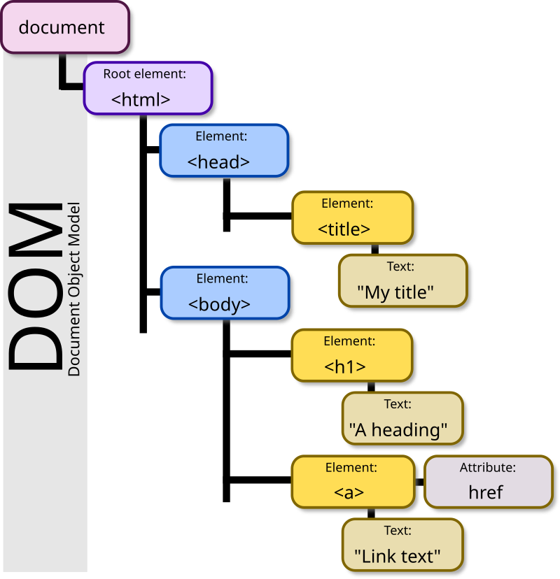

# DOM

### DOM en JavaScript

{align="right", width="400px"}

El DOM (Document Object Model) és una interfície de programació que permet als scripts actualitzar el contingut, l'estructura i l'estil d'un document mentre aquest s'està visualitzant al navegador.

#### Estructura del Document HTML

El DOM representa l'estructura d'un document HTML i l'entorn en el que s'executa com una jerarquia d'objectes. Els principals
components són:

-   **Window**: Representa la finestra del navegador i és l'objecte global en els scripts del navegador.
-   **Document**: Representa el document HTML que es carrega a la finestra.

A més de `window` i `document`, hi ha diversos altres objectes principals accessibles a l'entorn d'una pàgina web, aquests es denominen `Web APIs` :

1.  **Navigator**: Proporciona informació sobre el navegador. -   `navigator.userAgent` -   `navigator.language` -   `navigator.geolocation` -   `navigator.getBattery()`
2.  **Screen**: Proporciona informació sobre la pantalla de l'usuari. -   `screen.width` -   `screen.height` -   `screen.availWidth` -   `screen.availHeight`
3.  **History**: Permet la manipulació de l'historial del navegador. -   `history.back()` -   `history.forward()` -   `history.go()`
4.  **Location**: Proporciona la URL actual de la finestra. -   `location.href` -   `location.hostname` -   `location.pathname` -   `location.search` -   `location.hash` -   `location.reload()`
5.  **Storage APIs**: LocalStorage, sessionStorage, IndexedDB
6.  **Network APIs**: XMLHttpRequest, fetch
7.  **Console**: Proporciona accés a la consola de depuració del navegador.
8.  **WebSocket**: Proporciona una interfície per a les connexions WebSocket.
9.  **Worker**: Permet l'execució de scripts en segon pla.

### DOM: Window

`Window` és un objecte predefinit en els navegadors web que representa la finestra en la qual es mostra el document. Alguns mètodes importants de `window` inclouen:

-   `alert()`, `prompt()`: Mètodes per mostrar diàlegs.
-   `setTimeout(funció, temps)`: Executa una funció després d'un temps especificat.
-   `setInterval(funció, temps)`: Executa una funció repetidament a intervals de temps especificats.
-   `clearTimeout(identificador)`: Cancel·la un `setTimeout` programat.

Aquests mètodes no solen invocar-se amb `window.setTimeout()`, per exemple, perquè són accessibles directament en estar en l'àmbit global. De fet, qualsevol funció o variable `var` declarada en l'àmbit global passa a ser un atribut de l'objecte window:

``` javascript
var globalVar = "I'm global!";
function globalFunction() { console.log("I'm a global function!");
}
console.log(window.globalVar); // "I'm global!"
window.globalFunction(); // "I'm a global function!"
```

Això no passa amb variables declarades amb `let` o `const`. L'especificació d'ECMAScript busca millorar la claredat i previsibilitat del codi. En evitar que let i const es converteixin en propietats de l'objecte window, es fomenta un disseny de codi més modular i amb menys
dependències globals.

> Window no està disponible quan programem per`Node` o altres intèrprets de
> servidor. Per aquesta raó, el Javascript dedicat al DOM hauria d'estar
> separat de funcions normals, de manera que aquestes es puguin
> reaprofitar si part de la lògica es mou al servidor.

### DOM: Buscar Nodes

Per manipular elements del DOM, primer els hem de trobar. Els mètodes més comuns són:

-   `document.getElementById(id)`: Troba un element pel seu ID.
-   `getElementsByTagName(tag)`: Troba tots els elements amb un nom d'etiqueta específic.
-   `getElementsByName(name)`: Troba tots els elements amb un nom especificat.
-   `querySelector(selector)`: Retorna el primer element que coincideix amb un selector CSS.
-   `querySelectorAll(selector)`: Retorna un `Nodelist` de tots els elements que coincideixen amb un selector CSS.

``` javascript
let element = document.getElementById('exampleId');
let elements = document.getElementsByTagName('p');
let elementByName = document.getElementsByName('exampleName');
let firstElement = document.querySelector('.exampleClass');
let allElements = document.querySelectorAll('.exampleClass');
```

El resultat dels mètodes que troben més d'un node és un `HTMLCollection` o un `NodeList` . Si volem tractar-lo com un array cal convertir-lo amb `Array.from()` o `[... HTMLCollection]`.

Sovint, necessitem accedir a un node específic a partir d'un ja existent al DOM. Per a això, podem utilitzar els següents mètodes aplicats a un element de l'arbre DOM:

-   `element.parentElement`:retorna l'element pare del node actual.
-   `element.children`: retorna una col·lecció de tots els elements fills del node actual (només elements HTML, no inclou comentaris ni nodes de text).
-   `element.childNodes`: retorna una col·lecció de tots els nodes fills, incloent comentaris i nodes de text, per la qual cosa no es fa servir freqüentment.
-   `element.firstElementChild`: retorna el primer fill que és un element HTML.
-   `element.firstChild`: retorna el primer node fill, incloent nodes de text o comentaris.
-   `element.lastElementChild`: similar a `firstElementChild`, però retorna l'últim fill element HTML.
-   `element.lastChild`: similar a `firstChild`, però retorna l'últim node fill.
-   `element.nextElementSibling`:retorna el següent germà que és un element HTML.
-   `element.nextSibling`: retorna el següent node germà, incloent nodes de text o comentaris.
-   `element.previousElementSibling`: similar a `nextElementSibling`, però retorna el germà anterior que és un element HTML.
-   `element.previousSibling`: similar a `nextSibling`, però retorna el germà anterior.
-   `element.hasChildNodes()`:indica si el node té nodes fills.
-   `element.childElementCount`:retorna el nombre d'elements fills.
-   `element.closest(selector)`: retorna l'ancestre més proper que coincideix amb el selector donat. Per exemple, si l'element és un `<td>` dins d'una taula, `element.closest('table')` retornarà la taula a la qual pertany.

El DOM proporciona accessos directes (dreceres) per obtenir elements comuns:

-   `document.documentElement`: obté el node de l'element`<html>`.
-   `document.head`: obté el node de l'element `<head>`.
-   `document.body`: obté el node de l'element `<body>`.
-   `document.title`: obté el node de l'element `<title>`.
-   `document.links`: obté una col·lecció de tots els hipervincles del document.
-   `document.anchors`: obté una col·lecció de totes les àncores del document.
-   `document.forms`: obté una col·lecció de tots els formularis del document.
-   `document.images`: obté una col·lecció de totes les imatges del document.
-   `document.scripts`: obté una col·lecció de tots els scripts del document.

> No hi ha una manera millor que d'altres en totes les ocasions de trobar 
> els nodes. Si no volem fallar es pot fer servir `querySelector`i usar
> selectors de CSS. D'aquesta manera, canviar el selector és canviar la
> "query". No obstant això, els altres selectors més primitius pot que
> siguin més ràpids en certes ocasions.

### DOM: Modificar Nodes

Un cop hem trobat els nodes, podem modificar-los. Alguns mètodes útils inclouen:

-   `.innerHTML`, `.innerText`, `.outerHTML`: Per canviar el contingut HTML o text d'un element.
-   `.insertAdjacentHTML(position, text)`: Insereix text HTML en una posició específica. <https://lenguajejs.com/dom/crear/insertadjacent-api/>
-   `.append(content, element)`, `.prepend(content, element)`: Afegeix contingut al principi o al final d'un element.
-   `.after()`, `.before()`: Insereix un element abans o després de l'element actual.
-   `.cloneNode(deep)`: Clona un node, amb o sense els seus fills.
-   `.remove()`: Elimina un node.

Mètodes més antics però encara en ús inclouen `removeChild()` i `appendChild()`.

``` javascript
let element = document.getElementById('exampleId');
element.innerHTML = 'Nou contingut';
element.insertAdjacentHTML('beforeend', '<p>Més contingut</p>');
element.append('Text addicional');
element.remove();
```

#### Atributs

Els elements solen tenir atributs. Alguns són especials com el `id` o la `class`. El `id`està accessible directament com a atribut de l'element, així com el `className`, tot i que després veurem que és millor manipular-lo d'una altra manera. Altres atributs com `value` en els `Input`o `scr` en els `` també poden ser llegits i modificats com a propietats. Es tracta dels atributs **estàndard**.

Per als atributs que no tenen accés directe perquè no són estàndard, podem fer servir `setAttribute()` `getAttribute()`, `hasAttribute()` o `removeAttribute()`:

``` javascript
const button = document.querySelector("button");

button.setAttribute("name", "helloButton");
button.setAttribute("disabled", "");
```

#### Propietats

Atès que els elements HTML en ser analitzats i convertits al DOM es converteixen en objectes, aquests són manipulables com qualsevol objecte, podent afegir o modificar propietats, fins i tot aquelles que venen en l'HTML com a atributs estàndard.

> Atributs com a `id` se sincronitzen perfectament amb la propietat.
> Altres com `value` no se sincronitzen directament:
> <https://es.javascript.info/dom-attributes-and-properties#sincronizacion-de-propiedad-y-atributo>

> Hi ha uns atributs que se sincronitzen de forma especial amb les
> propietats. Són els que comencen per `data-`, que es guarden en un
> objecte `.dataset` de l'element en el DOM. Això ho expliquem a la
> secció de **Atributs de dades**.

### DOM: Estils

Per manipular els estils d'un element, podem usar propietats de estil i classes CSS.

-   `.style.property`: Modifica un estil CSS directament.
-   `.className`: Canvia el nom de la classe de l'element.
-   `.classList.add()`, `.classList.toggle()`, `.classList.remove()`, `.classList.replace()`: Mètodes per manipular classes CSS de manera més dinàmica.

``` javascript
let element = document.getElementById('exampleId');
element.style.color = 'blue';
element.classList.add('new-class');
element.classList.remove('old-class');
```

> ClassName no s'hauria de fer servir, ja que pot molestar si es fa servir classList
> d'altra banda. Usarem classList en totes les ocasions excepte per a
> eliminar totes les classes.

### Creació d'elements (plantilles)

Se pueden crear elementos totalmente de forma programática. Pero puede
ser tedioso. Muchas veces, si sabemos que hay fragmentos de HTML
bastante estáticos, podemos usar `innerHTML` y `.append()` con
plantillas creadas mediante strings.

Para crear elementos del DOM mediante plantillas hay muchas formas.
Obviaremos las más farragosas y nos centraremos en aquellas que son más
rápidas.

#### Creación de Elementos: Template Literal

Els template literals i les interpolacions de cadenes permeten crear contingut dinàmic de manera senzilla.

``` javascript
function generateGraphCard(graph) {
    let cardTemplate = document.createElement('div');
    cardTemplate.classList.add('col');
    cardTemplate.innerHTML = `
        <div class="card">
            <div class="card-header">${graph.title}</div>
            <div class="card-body">
                <div class="graph"></div>
                <p class="card-text">${graph.description}</p>
                <a href="#/graph/${graph.id}" class="btn btn-primary">Full screen</a>
            </div>
        </div>`;
    let graphContainer = cardTemplate.querySelector('.graph');
    graphContainer.append(graph.Data ? generateBarGraph(graph.Data) : graphPlaceholder());
    return cardTemplate;
}
```

#### Creació d'elements mitjançant Tagged Template Literals

Els "Tagged Template Literals" són una característica de JavaScript que et permet crear funcions que accepten una plantilla literal i les seves interpolacions. Aquestes funcions són invocades de forma molt diferent, ja que no tenen (parentesi) i s'entén que el primer argument és la plantilla i la resta d'arguments són els diferents valors de les variables interpolades.

En lloc de rebre una sola cadena de text amb les interpolacions `${}`, la funció d'etiqueta rep dos arguments separats: un array de strings i un arrelament amb els valors interpolats.
 
``` typescript
(()=>{
  function miTaggedTemplateLiteral(strings, ...values) { return console.log(strings, ...values);
  }
  let nombre = "Carlos";
  let edad = 32;
  miTaggedTemplateLiteral`Hola soy ${nombre} y tengo ${edad} años`;
})();
```

```text
[ "Hola sóc ", " i tinc ", " anys" ] Carles 32
```

En el següent exemple, extret de <https://exploringjs.com/es6/ch_template-literals.html#sec_html-tag-function-implementation> es pot veure com fer una funció per a tagged temperate literal que
personalitzi una plantilla.

``` typescript
function htmlEscape(str) {
  return str.replace(/&/g, '&amp;') // first!
            .replace(/>/g, '&gt;')
            .replace(/</g, '&lt;')
            .replace(/"/g, '&quot;')
            .replace(/'/g, '&#39;')
            .replace(/`/g, '&#96;');
}
function html(templateObject, ...substs) {
  // Use raw template strings: we don’t want
  // backslashes (\n etc.) to be interpreted
  const raw = templateObject.raw;

  let result = '';

  substs.forEach((subst, i) => {
      // Retrieve the template string preceding
      // the current substitution
      let lit = raw[i];

      // In the example, map() returns an Array:
      // If `subst` is an Array (and not a string),
      // we turn it into a string
      if (Array.isArray(subst)) {
          subst = subst.join('');
      }

      // If the substitution is preceded by an exclamation
      // mark, we escape special characters in it
      if (lit.endsWith('!')) {
          subst = htmlEscape(subst);
          lit = lit.slice(0, -1);
      }
      result += lit;
      result += subst;
  });
  // Take care of last template string
  result += raw[raw.length-1]; // (A)

  return result;
}
const tmpl = addrs => html`
    <table>
    ${addrs.map(addr => html`
        <tr><td>!${addr.first}</td></tr>
        <tr><td>!${addr.last}</td></tr>
    `)}
    </table>
`;
const data = [
    { first: '<Jane>', last: 'Bond' },
    { first: 'Lars', last: '<Croft>' },
];
console.log(tmpl(data));
```

```html
    <table>
    
        <tr><td>&lt;Jane&gt;</td></tr>
        <tr><td>Bond</td></tr>
    
        <tr><td>Lars</td></tr>
        <tr><td>&lt;Croft&gt;</td></tr>
    
    </table>
```

Aquest seria el resultat:

<table>

    <tr><td>&lt;Jane&gt;</td></tr>
    <tr><td>Bond</td></tr>

    <tr><td>Lars</td></tr>
    <tr><td>&lt;Croft&gt;</td></tr>

</table>

### Creació d'Elements: Interpolacions, Wrapper, fragments

Podem fer servir funcions per extreure i implementar interpolacions en template literals.

``` javascript
function extractInterpolations(template) {
    let regex = /\{\{([^\{\}]*)\}\}/g;
    return [...template.matchAll(regex)];
}

function applyInterpolations(template, data) {
    return extractInterpolations(template).reduce((T, [I, att]) => 
        T = T.replace(I, data[att]), template);
}

function wrapElement(innerHTML) {
    let wrapper = document.createElement('div');
    wrapper.innerHTML = innerHTML;
    return wrapper.firstElementChild;
}

function renderNews(news) {
    let newsTemplate = `
        <article id="article_{{id}}">
            <a href="{{link}}"><h2>{{headline}}</h2></a>
            <time>{{date}}</time><address>{{authors}}</address>
            <p>{{short_description}}</p>
            <p>{{category}}</p>
        </article>`;
    return wrapElement(applyInterpolations(newsTemplate, news));
}
```

Aquest exemple és una mica més complicat del que s'espera poder fer a aquestes alçades. No obstant això, és interessant intentar entendre el seu funcionament. S'hi fan servir `{{}}` com a interpolacions com a `Angular`. Aquesta pot ser una base per fer un motor de plantilles com tenen els frameworks. D'altra banda, es crea un div que actua de `Wrapper`, és a dir, que envolta el veritable element per poder treballar només amb strings fins al final, però retornar un `Element`,
gràcies a `innerHTML`.

Com a millora a l'exemple anterior, el `Wrapper` pot ser un `fragment`. Aquest té millor rendiment, no només permet treure el primer element fill, per la qual cosa no necessitem un divan que els contingui i no genera un node addicional. És molt eficient inserint múltiples nodes, per inserir en bucle.

``` javascript
function renderComments(comments) {
    const fragment = document.createDocumentFragment();

    comments.forEach(comment => {
        const commentElement = document.createElement('div');
        commentElement.className = 'comment';
        commentElement.innerHTML = `
            <h4>${comment.author}</h4>
            <p>${comment.text}</p>
            <time>${comment.date}</time>
        `;
        fragment.appendChild(commentElement); // Afegir cada comentari al fragment, no al DOM
    });

   return fragment;
}

// Dades d'exemple
const comments = [
    { author: "Aina", text: "Bon article!", date: "2024-11-11" },
    { author: "Lluis", text: "Gràcies per la informació.", date: "2024-11-10" },
    { author: "Marta", text: "M'ha resultat molt útil.", date: "2024-11-09" }
];

// Crida a la funció per renderitzar els comentaris
 document.getElementById('comments-section').appendChild(renderComments(comments)); 
 // Inserir tots els comentaris alhora;
```
#### Creació d'elements amb`<template>`

L'etiqueta `<template>` és especial. El seu interior no es renderitza com la resta, però queda accessible per ser buscat. La utilitat és crear plantilles en HTML que puguin ser clonades i emplenades com es desitja.

Vegem aquest HTML extret del web de referència:

<https://developer.mozilla.org/en-US/docs/Web/HTML/Element/template>:

``` html
<table id="producttable">
  <thead>
    <tr>
      <td>UPC_Code</td>
      <td>Product_Name</td>
    </tr>
  </thead>
  <tbody>
    <!-- dades opcionals es poden incloure aquí opcionalment -->
  </tbody>
</table>

<template id="productrow">
  <tr>
    <td class="record"></td>
    <td></td>
  </tr>
</template>
```

I amb aquest javascript obtenim el contingut del temperat, es clona i s'omple les vegades que sigui necessari:

``` javascript
// Test to see if the browser supports the HTML template element by checking
// for the presence of the template element's content attribute.
if ("content" in document.createElement("template")) {
  // Instantiate the table with the existing HTML tbody
  // and the row with the template
  const tbody = document.querySelector("tbody");
  const template = document.querySelector("#productrow");

  // Clone the new row and insert it into the table
  const clone = template.content.cloneNode(true);
  let td = clone.querySelectorAll("td");
  td[0].textContent = "1235646565";
  td[1].textContent = "Stuff";

  tbody.appendChild(clone);

  // Clone the new row and insert it into the table
  const clone2 = template.content.cloneNode(true);
  td = clone2.querySelectorAll("td");
  td[0].textContent = "0384928528";
  td[1].textContent = "Acme Kidney Beans 2";

  tbody.appendChild(clone2);
} else {
  // Find another way to add the rows to the table because
  // the HTML template element is not supported.
}
```

> Qualsevol de les formes que hem vist per crear elements,
> mitjançant template literal o funcions tagged, creant les nostres
> interpolacions o amb templates és vàlida i combinable. Per aconseguir el
> que els frameworks fan amb els seus motors de plantilla hi ha molt de camí per fer, 
> perquè no s'ha parlat del `shadow DOM` i altres tècniques
> avançades com els `custom elements` per aconseguir plantilles amb
> reactivitat. Si aconsegueixes fer un motor de plantilles suficientment
> genèric per a l'aplicació en la qual estem treballant, l'ús de
> frameworks queda molt menys justificat.

### Esperar a que es carregui el DOM

Podem assegurar-nos que el DOM estigui completament carregat abans d'executar el nostre script utilitzant `DOMContentLoaded`.

``` javascript
(function () {
    "use strict";
    document.addEventListener("DOMContentLoaded", function () {
        for (let i = 0; i < 100; i++) {
            let container = document.getElementById("content");
            let number = document.createElement("p");
            number.innerHTML = i;
            container.appendChild(number);
        }
    });
})();
```

També podem col·locar el nostre script al final del cos (`body`)del document HTML.

Si, a més, hi afegim l'atribut `defer` a un script, aquest es descarregarà de manera asíncrona i s'executarà quan l'HTML hagi estat totalment interpretat i just abans que `DOMContentLoaded`.

Si cal esperar que carregui també tot el CSS, és a dir el `CSSOM`, podem recórrer a l'esdeveniment `load`, que espera a carregar i interpretar tot el CSS. Però si no és necessari, és millor esperar només al DOM. Això és perquè hi ha recursos molt pesants com imatges o vídeos que pot fins i tot que no arribin a carregar.

> En general, recomanarem fer servir `DOMContentLoaded`en comptes de posar el
> script al final o `load`perquè en ser executat al principi, ja hi ha
> coses que es pot anar executant sense necessitat de DOM abans que
> carregui totalment. En qualsevol cas, els script en ***Mòduls***
> sempre s'executen en mode`defer`.

## Atributs de Dades

HTML5 permet agregar atributs personalitzats no visuals a les etiquetes utilitzant `data-*`. Aquests atributs poden ser accessibles a través de JavaScript fent servir `dataset`.

``` html
<article
    id="electriccars"
    data-columns="3"
    data-index-number="12314"
    data-parent="cars">
    ...
</article>
```

``` javascript
let article = document.getElementById('electriccars');
console.log(article.dataset.columns); // 3
console.log(article.dataset.indexNumber); // 12314
```

## Formularis a JavaScript

En una aplicació web, la validació dels formularis es realitza tant en el costat del client com en el del servidor.

> De fet, l'única validació estrictament necessària s'ha de fer en
> el servidor per evitar peticions il·legals per clients com postman
> o curl.

Però es pot fer servir Javascript per a molt més que validar formularis. Per exemple, ens pot ajudar a autocompletar camps, descarregar dades en segon pla o tractar amb imatges o dades complexes abans d'enviar al servidor.

## Atributs de Formularis

El contingut dels camps d'entrada en un formulari es pot visualitzar i modificar utilitzant l'atribut `value`. Altres elements del formulari, com els botons d'opció (ràdio button) i les caselles de verificació (checkbox), han de tenir un `name` comú i també utilitzen els atributs `value` i `checked`. Per als elements `select`, s'utilitzen els atributs `options` i `selectedIndex`.

Observa l'exemple a continuació, que fa servir la manera (obsoleta) d'associar esdeveniments `onclick` per executar una funció que informi dels valors dels inputs del formulari:

``` html
<!DOCTYPE html>
<html lang="ca">
<head>
    <meta charset="UTF-8">
    <meta name="viewport" content="width=device-width, initial-scale=1.0">
    <title>Formulari d'Exemple</title>
</head>
<body>
    <form id="exampleForm">
        <label for="textInput">Text:</label>
        <input type="text" id="textInput" value="Text inicial"><br><br>
        
        <label>Opcions:</label>
        <input type="radio" name="options" value="opcio1" checked> Opció 1
        <input type="radio" name="options" value="opcio2"> Opció 2<br><br>
        
        <label for="checkboxInput">Casella:</label>
        <input type="checkbox" id="checkboxInput" checked><br><br>
        
        <label for="selectInput">Selecciona:</label>
        <select id="selectInput">
            <option value="1">Opció 1</option>
            <option value="2" selected>Opció 2</option>
            <option value="3">Opció 3</option>
        </select><br><br>
        
        <button type="button" onclick="manipulateValues()">Veure i Manipular Valors</button>
    </form>

    <script src="script.js"></script>
</body>
</html>
```

``` javascript
function manipulateValues() {
    // Obtenir el valor del camp de text
    let textInput = document.getElementById('textInput');
    console.log('Valor del camp de text:', textInput.value);
    textInput.value = 'Nou text';

    // Obtenir el valor del radi button seleccionat
    let selectedOption = document.querySelector('input[name="options"]:checked');
    console.log('Valor del radi button seleccionat:', selectedOption.value);
    // Canviar la selecció del ràdio button
    document.querySelector('input[name="options"][value="opcio2"]').checked = true;

    // Obtenir el valor del checkbox
    let checkboxInput = document.getElementById('checkboxInput');
    console.log('Checkbox està marcat:', checkboxInput.checked);
    // Canviar l'estat del checkbox
    checkboxInput.checked = !checkboxInput.checked;

    // Obtenir el valor del select
    let selectInput = document.getElementById('selectInput');
    console.log('Valor del select:', selectInput.value);
    // Canviar la selecció del select
    selectInput.value = '3';
}
```

## Cicle Tradicional del Formulari

Tradicionalment, un formulari està dissenyat per enviar dades mitjançant HTTP al servidor. En enviar (submit) un formulari, el navegador empaqueta les dades i les envia utilitzant el mètode HTTP especificat (com GET o POST). Els formularis poden incloure validació interna mitjançant HTML, cosa que és més ràpida que JavaScript però ofereix menys
control i personalització. La validació interna d'HTML genera pseudo-classes que poden estilitzar-se amb CSS.

``` html
<!DOCTYPE html>
<html lang="ca">
<head>
    <meta charset="UTF-8">
    <meta name="viewport" content="width=device-width, initial-scale=1.0">
    <title>Formulari amb Validació</title>
    <link rel="stylesheet" href="styles.css">
</head>
<body>
    <form id="validationForm">
        <label for="name">Nom:</label>
        <input type="text" id="name" name="name" required><br><br>
        
        <label for="email">Correu Electrònic:</label>
        <input type="email" id="email" name="email" required><br><br>
        
        <label for="password">Contrasenya:</label>
        <input type="password" id="password" name="password" required minlength="6"><br><br>
        
        <button type="submit">Enviar</button>
    </form>

    <script src="script.js"></script>
</body>
</html>
```

``` css
/* Estils bàsics */
form {
    width: 300px;
    margin: 0 auto;
}

label {
    display: block;
    margin-bottom: 5px;
}

input {
    width: 100%;
    padding: 8px;
    margin-bottom: 10px;
    border: 1px solid #ccc;
    border-radius: 4px;
    box-sizing: border-box;
}

/* Pseudo-classes per a la validació */
input:required {
    border-left: 5px solid #0000FF; /* Vora blava per a camps requerits */
}

input:valid {
    border-left: 5px solid #00FF00; /* Vora verda per a camps vàlids */
}

input:invalid {
    border-left: 5px solid #FF0000; /* Vora vermell per a camps invàlids */
}

/* Pseudo-classe per a camp enfocat */
input:focus {
    outline: none;
    border-color: #66AFE9;
    box-shadow: 0 0 8px rgba(102, 175, 233, 0.6);
}
```

``` javascript
document.getElementById('validationForm').addEventListener('submit', function(event) {
    event.preventDefault(); // Evita l'enviament del formulari per a la demostració
    alert('Formulari enviat correctament (validació exitosa)');
});
```

Aquest exemple demostra com utilitzar pseudo-classes CSS per estilitzar formularis amb validació interna en HTML.

## Cicle del Formulari amb JavaScript

Podem interceptar i aturar el cicle per defecte d'un formulari per validar-lo i enviar-lo utilitzant JavaScript. D'aquesta manera, podem evitar tenir un botó `submit` i controlar completament el procés d'enviament. Si el formulari envia dades al servidor i es refresca, JavaScript perd el control del programa. Per evitar això, podem utilitzar `preventDefault()` dins de l'esdeveniment `submit` o retornar `false`.

### Exemple d'Interceptar Submit amb JavaScript

Podem manejar esdeveniments de formularis per personalitzar el seu comportament. Un exemple comú és l'ús de l'esdeveniment `onsubmit` per executar una funció de validació abans d'enviar el formulari. Si la funció de validació retorna `true`, el formulari s'envia; altrament, es cancel·la l'enviament.

``` html
<form id="formulario" onsubmit="return validar();">
  <input type="text" id="phone-number" required>
  <button type="submit">Enviar</button>
</form>

<script>
function validar() {
  var phoneNumber = document.getElementById('phone-number').value;
  var phoneRGEX = /^[(]{0,1}[0-9]{3}[)]{0,1}[-\s\.]{0,1}[0-9]{3}[-\s\.]{0,1}[0-9]{4}$/;
  var phoneResult = phoneRGEX.test(phoneNumber);
  alert("phone: " + phoneResult);
  return phoneResult; // Retorna true si és vàlid, altrament false
}
</script>
```

## Enviar Formulari per JavaScript

Podem enviar un formulari mitjançant JavaScript utilitzant el mètode `submit()`. Això és útil quan volem enviar el formulari després de realitzar alguna operació addicional o validació personalitzada.

### Exemple d'Enviament per JavaScript

``` html
<button onclick="enviarFormulari()">Enviar</button>

<script>
function enviarFormulari() {
  let formulari = document.getElementById("formulari");
  formulari.submit();
}
</script>
```

Però si no ens val amb enviar el formulari amb `submit()` i volem manipular les seves dades abans d'enviar o enviar una API per POST manualment, obtindrem el contingut input per input o amb `FormData`:

``` javascript
div.querySelector("#buttonSubmit").addEventListener('click', async (event) => {
      event.preventDefault();
      const newProfile = Object.fromEntries(new FormData(div.querySelector('form')).entries());
      updateCurrentProfile(newProfile); // Li passem un objecte. Tot i que en una petició POST tradicional podem enviar un FormData directament amb fetch
    });
```

> Mirar el capítol de comunicació amb el servidor per a més informació
> i exemples amb 'FormData

{== 

Documentació encara en procés 

==}