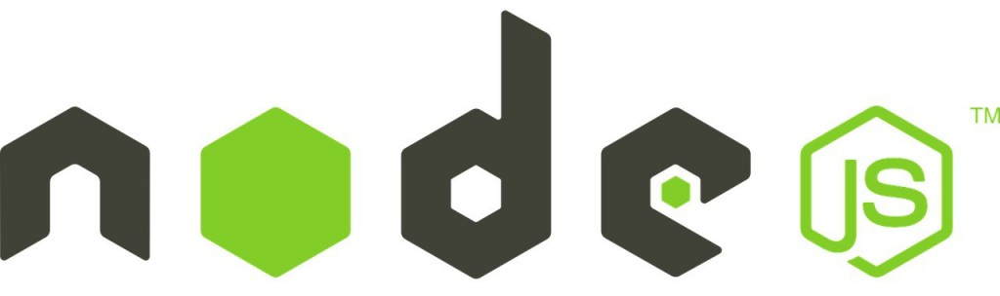

# Introducció a Node.js

En l'àmbit del desenvolupament web, l'entorn client es refereix a la interacció que passa al navegador web de l'usuari. Durant molts anys JavaScript ha estat el llenguatge de programació principal per al desenvolupament en entorn client, permetent la creació d'aplicacions web interactives i dinàmiques. Tot i això, l'ecosistema de JavaScript ha evolucionat considerablement, i una de les tecnologies més influents en aquesta transformació ha estat Node.js.

Node.js és un entorn d'execució de Javascript basat en el motor V8 de Google Chrome. Va ser creat per Ryan Dahl el 2009 i ha revolucionat la manera com els desenvolupadors utilitzen JavaScript, permetent el seu ús més enllà del navegador i estenent-lo al costat del servidor. Això ha proporcionat als desenvolupadors una plataforma unificada per construir aplicacions web escalables i dalt rendiment utilitzant un sol llenguatge de programació.

## L'èxit de Node.js

Una de les característiques clau de Node.js és el model d'entrada i sortida no bloquejant (I/O), basat en esdeveniments. Això permet a les aplicacions manejar múltiples sol·licituds simultàniament sense bloquejar el flux d'execució, cosa que resulta en una major eficiència i menor latència en comparació dels enfocaments tradicionals basats en fils. Aquesta característica ha estat crucial per a l'èxit de Node.js en el desenvolupament d'aplicacions en temps real, com ara xats, jocs en línia i plataformes de col·laboració.

## Gestió de paquets

L'ecosistema de Node.js és un altre aspecte important que cal considerar en el desenvolupament web. Gràcies al seu gestor de paquets, npm, els desenvolupadors tenen accés a una àmplia biblioteca de mòduls i eines de tercers que faciliten la creació i el manteniment d'aplicacions web. Això ha impulsat l'adopció d'enfocaments modulars i la reutilització de codi a la comunitat de desenvolupament, millorant l'eficiència i la qualitat del programari produït.

## Com començar a treballar amb Node.js

Seguiu els passos que es descriuen a continuació per començar a explorar el món de Node.js.

### 1. Instal·lació de Node.js

Per començar, hem d'instal·lar Node.js al nostre sistema. Visiteu el lloc web oficial de Node.js (https://nodejs.org/) i descarregueu la versió recomanada per al vostre sistema operatiu. Executeu l'instal·lador i seguiu les instruccions de la pantalla per completar la instal·lació.

### 2. Verificació de la instal·lació

Quan hàgiu instal·lat el Node.js, obriu una terminal o símbol del sistema i executeu l'ordre següent per verificar que s'ha instal·lat correctament:

```node
node -v
```

Si la instal·lació ha estat ser exitosa, hauríeu de veure la versió de Node.js que heu instal·lat.

### 3. Creació d'un fitxer de projecte

Crea un nou directori per al teu projecte i navega a aquest directori a la terminal. A continuació, crea un fitxer anomenat “app.js” utilitzant un editor de text de la teva elecció. Aquest fitxer contindrà el nostre codi de Node.js.

### 4. Escriure el teu primer programa de Node.js

Obre el fitxer “app.js” al teu editor de text i escriu el codi següent:

`console.log('Hola món des de Node.js!');`

Aquest codi és un senzillíssim programa de Node.js que imprimirà 'Hola món des de Node.js!' a la consola.

### 5. Execució del programa de Node.js

Torna a la terminal i assegura't que ets al directori del projecte. Executeu l'ordre següent per iniciar el programa de Node.js:

`node app.js`

Si tot funciona correctament, hauríeu de veure el missatge 'Hola món des de Node.js!' imprès a la consola.

### 6. Instal·lació de paquets amb npm

Node.js utilitza un gestor de paquets anomenat npm per instal·lar mòduls addicionals. Provem això instal·lant el popular paquet “express” per crear aplicacions web. Executa la següent comanda a la terminal:

```
npm install express
```

Això instal·larà el paquet express i les seves dependències en un directori anomenat “node_modules” al vostre projecte.

### 7. Creació d'un servidor web bàsic amb Express

Esborra la línia de codi que havíem afegit al fitxer ‘app.js’ i afegeix les línies següents a l'inici del teu fitxer per importar Express:

```
const express = require('express');
const app = express();
```

Crearem una ruta bàsica perquè el nostre servidor web respongui amb un “Hola Món” quan s'accedeixi a l'arrel del lloc. Afegeix el codi següent a app.js:

```
app.get('/', (req, res) => {
 res.send('Hola Món!');
});
```

Definirem el port on el nostre servidor web estarà escoltant les sol·licituds. Afegeix el codi següent a app.js:

`const PORT = process.env.PORT || 3000;`

Aquesta línia defineix un port per defecte (3000) si no hi ha cap port assignat a les variables d'entorn del sistema.
Ara, anem a dir a la nostra aplicació que comenci a escoltar al port que especifiquem. Afegeix el codi següent al final de app.js:

``app.listen(PORT, () => { console.log(`Servidor funcionant al port ${PORT}`); });``

Guarda els canvis a app.js i obre una terminal a la carpeta del projecte. Executa la següent ordre per iniciar el servidor:
node app.js
Hauries de veure el missatge “Servidor funcionant al port 3000” a la terminal.
Obre el teu navegador web i visita http://localhost:3000. Hauries de veure el missatge “Hola Món!” a la pàgina.
Felicitats, has creat el teu primer servidor web utilitzant Express i Node.js.

### 8. Creació d'un servidor web amb rutes i paràmetres dinàmics

Ara que ja tenim un servidor web bàsic funcionant al port 3000 amb un fitxer app.js, la nostra tasca és ampliar el servidor perquè manegi rutes dinàmiques i paràmetres. Volem aconseguir el següent:

* Crear una ruta /salutacio que accepti un paràmetre nom i mostri una salutació personalitzada.
* Crear una ruta /suma que accepti dos paràmetres numèrics a i b i torneu el resultat de sumar-los.

Vegem com ho podem fer.

#### Pas 1: Crear la ruta /salut.

Afegeix el codi següent al teu fitxer 'app.js' per crear la ruta /salut:

```
app.get('/salutacio/:nom', (req, res) => {
    const nom = req.params.nom;
    res.send(`Hola, ${nom}!`);
});
```

Aquesta ruta accepta un paràmetre anomenat nom i respon amb una salutació personalitzada.

#### Pas 2: Crear la ruta /suma

Afegeix el codi següent al teu fitxer 'app.js' per crear la ruta /suma:

```
app.get('/suma/:a/:b', (req, res) => {
    const a = parseFloat(req.params.a);
    const b = parseFloat(req.params.b);
    if (isNaN(a) || isNaN(b)) {
        res.status(400).send('Els paràmetres han de ser números vàlids.');
    } else {
        const resultat = a + b;
        res.send(`La suma de ${a} i ${b} és ${resultat}`);
    }
});
```

Aquesta ruta accepta dos paràmetres numèrics, a i b, i torna el resultat de sumar-los. També comprova si els paràmetres són números vàlids i envia un missatge d'error en cas contrari.

#### Pas 3: Provar les rutes

Guarda els canvis a app.js i reinicia el servidor si és necessari. Després, visita les següents adreces al teu navegador per provar les rutes:

1. http://localhost:3000/saludo/Ana – Hauries de veure el missatge “Hola, Ana!”.
2. http://localhost:3000/suma/4/6 – Hauries de veure el missatge “La suma de 4 i 6 és 10”.
3. http://localhost:3000/suma/a/6 – Hauries de veure el missatge “Els paràmetres han de ser números vàlids.”

Amb aquest exemple, heu aprofundit en l'ús de JavaScript usant Node.js i Express en crear rutes dinàmiques i manejar paràmetres en les sol·licituds. Això us permetrà crear aplicacions web més avançades i personalitzades.

Com heu pogut veure, treballar amb Node.js desvincula la programació amb JavaScript del navegador i ens permet resoldre tasques tremendament interessants amb molt poques línies de codi. Evidentment aquest és simplement un punt de partida des d'on iniciar el camí amb la programació JavaScript del costat servidor. Espero que t'hagi servit per iniciar-te en aquesta tecnologia i ho aprofitis per continuar aprofundint en el seu estudi.