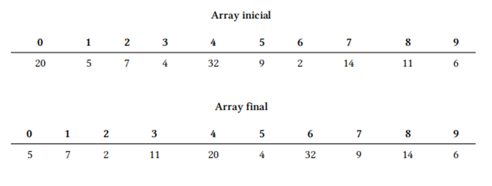
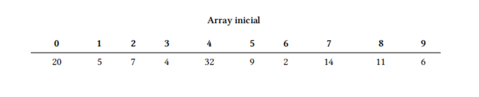
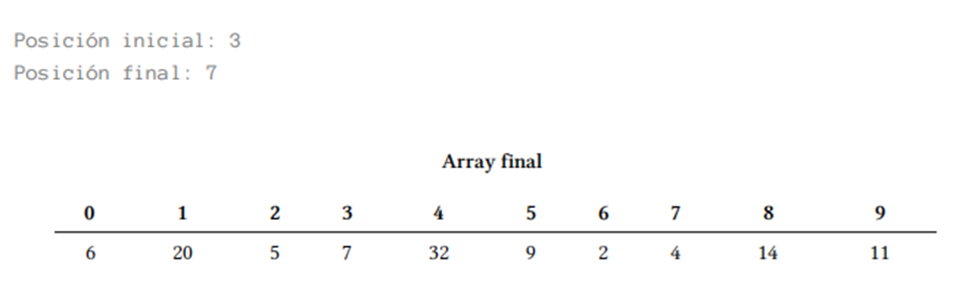

### 1. Conceptes bàsics: Integració de PHP en HTML. Variables. Operadors

   ✏️   EXERCICI 01	Escriu un programa que mostri el teu nom per pantalla. Utilitza codi PHP.

   ✏️   EXERCICI 02	Modifica el programa anterior perquè mostri la teva adreça i el teu número de telèfon. Cada dada s'ha de mostrar en una línia diferent. Barreja d'alguna manera les sortides per pantalla, utilitzant tant HTML com PHP.

   ✏️   EXERCICI 03	Escriu un programa que mostri per pantalla 10 paraules en anglès al costat de la seva corresponent traducció al castellà. Les paraules han d'estar distribuïdes en dues columnes. Utilitza l'etiqueta <table> d'HTML.

   ✏️   EXERCICI 04	Escriu un programa que mostri el teu horari de classe mitjançant una taula. Tot i que es pot fer íntegrament a HTML (igual que els exercicis anteriors), veu intercalant codi HTML i PHP per familiaritzar-te amb aquest últim.

   ✏️   EXERCICI 05	Escriu un programa que utilitzi les variables $x i $y. Assignals els valors 144 i 999 respectivament. A continuació, mostra per pantalla el valor de cada variable, la suma, la resta, la divisió i la multiplicació.

   ✏️   EXERCICI 06	Crea la variable $nombre i així el teu nom complet. Mostra el seu valor per pantalla de tal forma que el resultat sigui el mateix que el de l'exercici 1.

   ✏️   EXERCICI 07	Crea les variables $nombre, $direccion i $telefono i així els valors adequats. Mostra els valors per pantalla de tal forma que el resultat sigui el mateix que el de l'exercici 2.

   ✏️   EXERCICI 08	Realitza un conversor d'euros a pessetes. La quantitat en euros que es vol convertir haurà d'estar emmagatzemada en una variable.

   ✏️   EXERCICI 09	Realitza un conversor de pessetes a euros. La quantitat en pessetes que es vol convertir haurà d'estar emmagatzemada en una variable.

   ✏️   EXERCICI 10	Escriu un programa que pinti per pantalla una piràmide farcida a base de bifocades. La base de la piràmide ha d'estar formada per 9 bifocades.

   ✏️   EXERCICI 11	Igual que el programa anterior, però aquesta vegada la piràmide estarà hui (s'ha de veure únicament el contorn fet amb bifoca).

   ✏️   EXERCICI 12	Igual que el programa anterior, però aquesta vegada la piràmide ha d'aparèixer invertida, amb el vèrtex cap avall.

### 2. Recollida de dades per teclat mitjançant formularis

   ✏️   EXERCICI 13	Realitza un programa que demani dos números i després mostri el resultat de la seva multiplicació.

   ✏️   EXERCICI 14	Realitza un conversor d'euros a pessetes. Ara la quantitat en euros que es vol convertir s'haurà d'introduir per teclat.

   ✏️   EXERCICI 15	Realitza un conversor de pessetes a euros. La quantitat en pessetes que es vol convertir s'haurà d'introduir per teclat.

   ✏️   EXERCICI 16	Escriu un programa que sumi, resti, multipliqui i divideixi dos números introduïts per teclat.

   ✏️   EXERCICI 17	Escriu un programa que calculi l'àrea d'un rectangle.

   ✏️   EXERCICI 18	Escriu un programa que calculi l'àrea d'un triangle.

   ✏️   EXERCICI 19	Escriu un programa que calculi el total d'una factura a partir de la base imposable.

   ✏️   EXERCICI 20	Escriu un programa que calculi el salari setmanal d'un treballador en base a les hores treballades. Es pagaran 12 euros per hora.

   ✏️   EXERCICI 21	Escriu un programa que calculi el volum d'un con mitjançant la fórmula

   ✏️   EXERCICI 22	Realitza un conversor de Mb a Kb.

   ✏️   EXERCICI 23	Realitza un conversor de Kb a Mb.

### 3. Sentència condicional (if i switch)

   ✏️   EXERCICI 24	Escriu un programa que demani per teclat un dia de la setmana i que digui quina assignatura toca a primera hora aquell dia.

   ✏️   EXERCICI 25	Realitza un programa que demani una hora per teclat i que mostri després bons dies, bones tardes o bones nits segons l'hora. S'utilitzaran els trams de 6 a 12, de 13 a 20 i de 21 a 5. respectivament. Només es tenen en compte les hores, els minuts no s'han d'introduir per teclat.

   ✏️   EXERCICI 26	Escriu un programa en què donat un número de l'1 a 7 escrigui el corresponent nom del dia de la setmana.

   ✏️   EXERCICI 27	Vam ampliar un dels exercicis de la relació anterior per considerar les hores extres. Escriu un programa que calculi el salari setmanal d'un treballador tenint en compte que les hores ordinàries (40 primeres hores de treball) es paguen a 12 euros l'hora. A partir de l'hora 41, es paguen a 16 euros l'hora.

   ✏️   EXERCICI 28	Realitza un programa que resolgui una equació de primer grau (del tipus ax + b =0).

   ✏️   EXERCICI 29	Realitza un programa que calculi el temps que trigarà a caure un objecte des d'una alçada h. Aplica la fórmula  sent g = 9.81m/s2

   ✏️   EXERCICI 30	Realitza un programa que calculi la mitjana de tres notes.

   ✏️   EXERCICI 31	Amplia el programa anterior perquè digui la nota del butlletí (insuficient, suficient, bé, notable o sobresortint).

   ✏️   EXERCICI 32	Realitza un programa que resolgui una equació de segon grau (del tipus ax2+ bx + c =0).

   ✏️   EXERCICI 33	Escriu un programa que ens digui l'horòscop a partir del dia i el mes de naixement.

   ✏️   EXERCICI 34	Escriu un programa que donada una hora determinada (hores i minuts), calculi els segons que falten per arribar a la mitjanit.

   ✏️   EXERCICI 35	Realitza un miniqüestionari amb 10 preguntes tipus test sobre les assignatures que s'imparteixen en el curs. Cada pregunta encertada sumarà un punt. El programa mostrarà al final la qualificació obtinguda. Pásale el miniqüestionari als teus companys i pídeles que ho facin per veure què tal anessin de coneixements en les diferents assignatures del curs.

   ✏️   EXERCICI 36	Escriu un programa que ordeni tres nombres enters introduïts per teclat.

   ✏️   EXERCICI 37	Realitza un programa que digui si un nombre introduït per teclat és parell i/o divisible entre 5.

   ✏️   EXERCICI 38	Escriu un programa que digui quina és l'última xifra d'un número sencer introduït per teclat.

   ✏️   EXERCICI 39	Escriu un programa que digui quina és la primera xifra d'un número sencer introduït per teclat. Es permeten números de fins a 5 xifres.

   ✏️   EXERCICI 40	Realitza un programa que ens digui quants dígits té un nombre sencer que pot ser positiu o negatiu. Es permeten números de fins a 5 dígits.

   ✏️   EXERCICI 41	Realitza un programa que digui si un nombre sencer positiu introduït per teclat és capicúa. Es permeten números de fins a 5 xifres.

### 4. Bucles

   ✏️   EXERCICI 42	Mostra els números múltiples de 5 de 0 a 100 utilitzant un bucle for.

   ✏️   EXERCICI 43	Mostra els números múltiples de 5 de 0 a 100 utilitzant un bucle while.

   ✏️   EXERCICI 44	Mostra els números múltiples de 5 de 0 a 100 utilitzant un bucle do-while.

   ✏️   EXERCICI 45	Mostra els números del 320 al 160, comptant de 20 en 20 utilitzant un bucle for.

   ✏️   EXERCICI 46	Mostra els números del 320 al 160, comptant de 20 en 20 utilitzant un bucle while.

   ✏️   EXERCICI 47	Mostra els números del 320 al 160, comptant de 20 en 20 utilitzant un bucle do-while.

   ✏️   EXERCICI 48	Realitza el control d'accés a una caixa forta. La combinació serà un nombre de 4 xifres. El programa ens demanarà la combinació per obrir-la. Si no encertem, se'ns mostrarà el missatge "Ho sento, aquesta no és la combinació" i si encertem se'ns dirà "La caixa forta s'ha obert satisfactòriament". Tindrem quatre oportunitats per obrir la caixa forta.

   ✏️   EXERCICI 49	Mostra la taula de multiplicar d'un nombre introduït per teclat. El resultat s'ha de mostrar en una taula (&lt;table&gt; en HTML).

   ✏️   EXERCICI 50	Realitza un programa que ens digui quants dígits té un número introduït per teclat.

   ✏️   EXERCICI 51	Escriu un programa que calculi la mitjana d'un conjunt de nombres positius introduïts per teclat. A priori, el programa no sap quants números s'introduiran. L'usuari indicarà que ha acabat d'introduir les dades quan meta un número negatiu.

   ✏️   EXERCICI 52	Escriu un programa que mostri en tres columnes, el quadrat i el cubell dels 5 primers nombres sencers a partir d'un que s'introdueix per teclat.

   ✏️   EXERCICI 53	Escriu un programa que mostri els n primers termes de la sèrie de Fibonacci. El primer terme de la sèrie de Fibonacci és 0, el segon és 1 i la resta es calcula sumant els dos anteriors, per la qual cosa hauríem de ser 0, 1, 1, 2, 3, 5, 8, 13, 21, 34, 55, 89, 144... El número n s'ha d'introduir per teclat.

   ✏️   EXERCICI 54	Escriu un programa que llegeixi una llista de deu números i determini quants són positius, i quants són negatius.

   ✏️   EXERCICI 55	Escriu un programa que demani una base i un exponent (sencer positiu) i que calculi la potència.

   ✏️   EXERCICI 56	Escriu un programa que donats dos números, un de real (base) i un sencer positiu (exponent), tregui per pantalla totes les potències amb base el número donat i exponents entre un i l'exponent introduït. No s'han d'utilitzar funcions d'exponenciació. Per exemple, si introduïm el 2 i el 5, s'hauran de mostrar 2¹, 2 ², 2 ³, 2⁴, 2⁵.

   ✏️   EXERCICI 57	Escriu un programa que digui si un número introduït per teclat és o no cosí. Un número cosí és aquell que només és divisible entre ell mateix i la unitat.

   ✏️   EXERCICI 58	Realitza un programa que sumi els 100 números següents a un nombre sencer i positiu introduït per teclat. S'ha de comprovar que la dada introduïda és correcta (que és un nombre positiu).

   ✏️   EXERCICI 59	Escriu un programa que obtingui els nombres enters compresos entre dos nombres introduïts per teclat i validats com a diferents, el programa ha de començar pel menor dels enters introduïts i anar incrementant de 7 en 7.

   ✏️   EXERCICI 60	Realitza un programa que pinti una piràmide per pantalla. L'alçada s'ha de demanar per teclat mitjançant un formulari. La piràmide estarà feta de boletes, maons o qualsevol altra imatge de les 5 que s'han de donar a elegir mitjançant un formulari.

   ✏️   EXERCICI 61	Igual que l'exercici anterior però aquesta vegada s'ha de pintar una piràmide fuita.

   ✏️   EXERCICI 62	Realitza un programa que vagi demanant números fins que s'introdueixi un nombre negatiu i ens digui quants números s'han introduït, la mitjana dels senars i el més gran dels parells . El nombre negatiu només s'utilitza per indicar el final de la introducció de dades però no s'inclou en el còmput.

   ✏️   EXERCICI 63	Mostra per pantalla tots els números cosins entre 2 i 100, ambdós inclosos.

   ✏️   EXERCICI 64	Escriu un programa que permeti anar introduint una sèrie indeterminada de números fins que la suma d'ells superi el valor 10000. Quan això últim passi, s'ha de mostrar el total acumulat, el comptador dels números introduïts i la mitjana.

   ✏️   EXERCICI 65	Escriu un programa que llegeixi un número N i imprimeixi una piràmide de números amb N files com en la següent figura. Recorda utilitzar un tipus de lletra d'ample fix com per exemple Courier perquè els espais tinguin la mateixa amplada que els números. 1

   ✏️   EXERCICI 66	Realitza un programa que demani un número per teclat i que després mostri aquest número al revés.

   ✏️   EXERCICI 67	Realitza un programa que demani primer un número i a continuació un dígit. El programa ens ha de donar la posició (o posicions) comptant d'esquerra a dreta que ocupa aquest dígit en el número introduït.

   ✏️   EXERCICI 68	Escriu un programa que mostri, compti i sumi els múltiples de 3 que hi ha entre 1 i un número llegit per teclat.

   ✏️   EXERCICI 69	Escriu un programa que calculi el factorial d'un número sencer llegit per teclat.

   ✏️   EXERCICI 70	Escriu un programa que mostri per pantalla tots els números enters positius menors a un llegit per teclat que no siguin divisibles entre un altre també llegit de la mateixa manera.

### 5. Matrius

✏️   EXERCICI 71	Defineix tres arrays de 20 números sencers cadascuna, amb noms "numero", "quadrat" i "cub". Carrega la matriu "numero" amb valors aleatoris entre 0 i 100. En la matriu "quadrat" s'han d'emmagatzemar els quadrats dels valors que hi ha a la matriu "numero". En la matriu "cub" s'han d'emmagatzemar les potències de tres dels valors que hi ha en "numero". A continuació, mostra el contingut de les tres matrius disposades en tres columnes.

✏️   EXERCICI 72	Escriu un programa que demani 10 números per teclat i que després mostri els números introduïts juntament amb les paraules "màxim" i "mínim" al costat del màxim i del mínim respectivament.

✏️   EXERCICI 73	Escriu un programa que llegeixi 15 números per teclat i que els emmagatzemi en una matriu. Rota els elements d'aquesta matriu, és a dir, l' element de la posició 0 ha de passar a la posició 1, el de la 1 a la 2, etc. El nombre que es troba en l'última posició ha de passar a la posició 0. Finalment, mostra el contingut de la matriu.

✏️   EXERCICI 74	Escriu un programa que generi 100 números aleatoris del 0 al 20 i que els mostri per pantalla separats per espais. El programa demanarà llavors per teclat dos valors i a continuació canviarà totes les ocurrències del primer valor pel segon en la llista generada anteriorment. Els números que s' han canviat han d' aparèixer ressaltats d' un color diferent.

✏️   EXERCICI 75	Realitza un programa que demani la temperatura mitjana que ha fet en cada mes d'un determinat any i que mostri a continuació un diagrama de barres horitzontals amb aquestes dades. Les barres del diagrama es poden dibuixar a base de la concatenació d' una imatge.

✏️   EXERCICI 76	Realitza un programa que demani 8 números enters i que després mostri aquests números de colors, els parells d'un color i els senars d'un altre.

✏️   EXERCICI 77	Escriu un programa que generi 20 números sencers aleatoris entre 0 i 100 i que els emmagatzemo en una matriu. El programa ha de ser capaç de passar tots els números parells a les primeres posicions de la matriu (del 0 en endavant) i tots els números senars a les cel·les restants. Utilitza arrays auxiliars si és necessari.

✏️   EXERCICI 78	Realitza un programa que demani 10 números per teclat i que els emmagatzemi en una matriu. A continuació es mostrarà el contingut d'aquesta array al costat de l'índex (0 – 9) utilitzant per a això una taula. Seguidament el programa passarà els nombres primers a les primeres posicions, desplaçant la resta de números (els que no són primers) de tal manera que no se'n perdi cap. Al final s' ha de mostrar la matriu resultant. Per exemple:



✏️   EXERCICI 79	Realitza un programa que demani 10 números per teclat i que els emmagatzemi en una matriu. A continuació es mostrarà el contingut d'aquest array al costat de l'índex (0 – 9). Seguidament el programa demanarà dues posicions a les quals anomenarem "inicial" i "final". S'ha de comprovar que inicial és menor que final i que ambdós números estan entre 0 i 9. El programa haurà de col·locar el número de la posició inicial en la posició final, rotant la resta de números perquè no se'n perdi cap. Al final s'ha de mostrar la matriu resultant.
 




✏️   EXERCICI 80	Realitza un programa que esculli a l'atzar 10 cartes de la baralla espanyola i que digui quants punts sumen segons el joc de la brisca. Empra una matriu associativa per obtenir els punts a partir del nom de la figura de la carta. Assegura't que no es repeteix cap carta, igual que si les haguéssim agafat d'una baralla de veritat.

✏️   EXERCICI 81	Crea un mini-diccionari espanyol-anglès que contingui, almenys, 20 paraules (amb la seva traducció). Utilitza una matriu associativa per emmagatzemar les parelles de paraules. El programa demanarà una paraula en espanyol i donarà la corresponent traducció en anglès.

✏️   EXERCICI 82	Realitza un programa que esculli a l'atzar 5 paraules en espanyol del mini-diccionari de l'exercici anterior. El programa demanarà que l'usuari teclegi la traducció a l'anglès de cadascuna de les paraules i comprovarà si són correctes. Al final, el programa haurà de mostrar quantes respostes són vàlides i quantes errònies.

✏️   EXERCICI 83	Omple una matriu bidimensional de 6 files per 9 columnes amb nombres enters positius compresos entre 100 i 999 (ambdós inclosos). Tots els números han de ser diferents, és a dir, no se'n pot repetir cap. Mostra a continuació per pantalla el contingut de la matriu de tal forma que es compleixin els requisits següents:

* Els números de les dues diagonals on hi ha el mínim han d'aparèixer en color verd.
* El mínim ha d'aparèixer en color blau.
* La resta de números ha d'aparèixer en color negre.

✏️   EXERCICI 84	Escriu un programa que, atesa una posició en un tauler d'escacs, ens digui a quines caselles podria saltar un alfil que es troba en aquesta posició. Indica’l de forma gràfica sobre el tauler amb un color diferent per a aquestes caselles on pot saltar la figura. L'alfil es mou sempre en diagonal. El tauler compta amb 64 caselles. Les columnes s'indiquen amb les lletres de la "a" a la "h" i les files s'indiquen de l'1 al 8.

✏️   EXERCICI 85	Realitza un programa que sigui capaç de rotar tots els elements d’una matriu quadrada una posició en el sentit de les agulles del rellotge. La matriu ha de tenir 12 files per 12 columnes i ha de contenir números generats a l' atzar entre 0 i 100. S' ha de mostrar tant la matriu original com la matriu resultat, ambdues amb els números convenientment alineats.

✏️   EXERCICI 86	Omple una matriu amb 50 números aleatoris compresos entre el 0 i el 99, i després mostra-la en una llista desordenada. Per crear un número aleatori, utilitza la funció 'rand(inici, fi)'. Per exemple:


``` php
$num = rand(0, 99)
```

✏️   EXERCICI 87	Prepara un formulari (html) amb un textbox que realitzi una pregunta a l'usuari.  A partir del formulari anterior, crea un programa que mostri la pregunta rebuda i generi una resposta de manera aleatòria entre un conjunt de respostes predefinides, emmagatzemades en una matriu: *Si, no, potser, clar que sí, per suposat que no, no ho tinc clar, segur, jo diria que sí, ni de conya, etc..*. Aquest exercici es basa en el joc de la [Bolla 8 màgica](https://en.wikipedia.org/wiki/Magic_8_Ball)

✏️   EXERCICI 88	A partir de l'exercici 86, genera una matriu aleatòria de 33 elements amb nombres compresos entre el 0 i 100 i calcula:

* El major
* El menor
* La mitjana

✏️   EXERCICI 89	Omple una matriu de 100 elements de manera aleatòria amb valors 'M' o 'F' (per exemple '["M", "M", "F", "M", ...]`). Una vegada completat, torna a recórrer-la i calcula quants elements hi ha de cadascun dels valors emmagatzemant el resultat en una matriu '['M' => 44, 'F' => 66]' (*no utilitzis variables per comptar les 'M' o les 'F'*). Finalment, mostra el resultat per pantalla.

✏️   EXERCICI 90	Mitjançant una matriu associativa, emmagatzema el nom i l'alçada de 5 persones ('nom =>'alçada'). Posteriorment, recorre l' arrelament i mostra’l en una taula HTML. Finalment afegeix una última fila a la taula amb l'alçada mitjana.

✏️   EXERCICI 91	Mitjançant una matriu bidimensional, emmagatzema el nom, alçada i email de 5 persones. Per a això, crea una matriu de persones, sent cada persona una matriu associativa: '[ ['nom'=>'Tofol', 'altura'=>182, 'email'=>'tofol@correu.com'],[...],... ]' Posteriorment, recorre la matriu i mostra-la en una taula HTML.

✏️   EXERCICI 92	Omple una matriu bidimensional de 6 files per 9 columnes amb números aleatoris compresos entre 100 i 999 (ambdós inclosos). Tots els números han de ser diferents, és a dir, no se'n pot repetir cap.  Mostra a continuació per pantalla el contingut de la matriu de tal forma que:

* La columna del màxim ha d'aparèixer en blau.
* La fila del mínim ha d'aparèixer en verd
* La resta de números han d'aparèixer en negre.

### 6. Funcions

✏️   EXERCICI 93	Crea les següents funcions:

* Una funció que esbrini si un número és parell: 'esParell(int $num): bool' 
* Una funció que retorni una matriu de mida '$tam' amb números aleatoris comprès entre '$min' i '$max' : 'arrayAleatori(int $tam, int $min, int $max) : array' 
* Una funció que rebi un '$array' per referència i retorni la quantitat de números parells que hi ha emmagatzemats:  'arrayParells(array &$array): int'

✏️   EXERCICI 94	Crea les funcions següents:

* Una funció que retorni el més gran de tots els números rebuts com a paràmetres: 'function major(): int'. Utilitza les funcions 'func_get_args()', etc... No pots fer servir la funció 'max()'.    
* Una funció que concateni tots els paràmetres rebuts separant-los amb un espai: 'function concatenar(...$paraules) : string'. Utilitza l'operador '...'.

✏️   EXERCICI 95	Afegeix les següents funcions:

* 'digits(int $num): int' → retorna la quantitat de dígits d'un número.    
* 'digitN(int $num, int $pos): int' → retorna el dígit que ocupa, començant per l'esquerra, la posició '$pos'.    
* 'llevaPerDarrera(int $num, int $quant): int' → li treu per darrere (dreta) '$quant' dígits.    
* 'llevaPerDavant(int $num, int $quant): int' → li treu per davant (esquerra) '$quant' dígits.


    Per provar les funcions, fes ús tant de pas d'arguments posicionals com arguments amb nom.

✏️   EXERCICI 96	Crea un arxiu amb funcions per sumar, restar, multiplicar i dividir dos números.

✏️   EXERCICI 97	Fent ús d'una matriu que emmagatzemi el nom de les funcions de l'arxiu anterior, a partir de dos números rebuts per URL, recorre la matriu i invoca les funcions de manera dinàmica fent ús de funcions variable.

✏️   EXERCICI 98	Crea una biblioteca amb dues funcions:

* pessetes2euros: passa de pessetes a euros 
* euros2pesetes: passa d'euros a pessetes 

Cada funció ha de rebre dos paràmetres:

* La quantitat a transformar 
* La cotització, amb un paràmetre per defecte amb el factor de transformació.

✏️   EXERCICI 99	Utilitza l’exercici98 i prova les funcions passant tant les quantitats amb la cotització per defecte, com amb noves cotitzacions. Recorda que 1 euro són/eren 166.360 pessetes.

✏️   EXERCICI 100	Després de llegir les dades del tiquet de compra, enumera en una taula els productes, amb el seu preu en euros i pessetes, i finalment, en una última fila, totalitzar en ambdues monedes.

### 6. Funcions predefinides

Tots els exercicis s'han de realitzar creant noves funcions per encapsular el codi. A més de la pròpia funció, l'exercici ha de contenir codi per poder provar-ho.

✏️   EXERCICI 101	Llegeix una frase i en retorna una de nova amb només els caràcters de les posicions senars. (exercici101frasesenars.php)

✏️   EXERCICI 102	A partir d'una frase, retorna la quantitat de cadascuna de les vocals, i el total d' elles. (exercici102vocals.php)

✏️   EXERCICI 103	A partir d'una frase amb paraules només separades per espais, retornar:
*	Lletres totals i quantitat de paraules 
*	Una línia per cada paraula indicant la seva mida
(exercici103analitzador.php)

* Nota: no es pot fer servir `str_word_count`


✏️   EXERCICI 104	Investiga que fa la funció `str_word_count`, i torna a fer l'exercici 103.(exercici104analitzadorwc.php):

✏️   EXERCICI 105	EsCrIu UnA fUnCiÓ qUe TrAnSfOrMi UnA cAdEnA eN cAnI (exercici105cani.php) {millor no utilitzar les funmcions str_replace i str_split)

✏️   EXERCICI 106	Escriu una funció que retorni un booleà indicant si una paraula és palíndroma (es llegeix igual d'esquerra a dreta que de dreta a esquerra, per exemple, " A la galera farè la gala" o “Lúcid, irònic, i no ridicul”, en espanyol podríem tenir “A Luci le pasa la película” i en anglès “A dog! A panic in a pagoda!”). (exercici106palindrom.php)

✏️   EXERCICI 107	Utilitzant les funcions per treballar amb caràcters, a partir d'una cadena i un desplaçament (exercici107codificar.php) :

*	Si el desplaçament és 1, substitueix la A per B, la B per C, etc.
*	El desplaçament no pot ser negatiu
*	Si se surt de l'abecedari, ha de tornar a començar
*	Cal respectar els espais, punts i comes.

✏️   EXERCICI 108	Crea un programa que permeti a l'usuari llegir un conjunt de números separats per espais. (exercici108filtrat.html)  
El programa filtrarà els números llegits per tornar a mostrar únicament els números parells i indicarà quant de números parells hi ha. (exercici108filtrat.php)
```
Dona’m números: 	1	4	7	9	23	10	8
Els 3 num parells són:  4	10	8
```
✏️   EXERCICI 109	Investiga les següents funcions de cadena (explica per a què serveixen mitjançant comentaris, i programa un petit exemple de cadascuna d'elles): `ucwords`, `strrev`, `str_repeat` y `md5`. (exercici109investiga.php)

!!! note
    Els següents exercicis es basen en la generació de nombres aleatoris.

✏️   EXERCICI 110	Crea una funció que permeti generar una lletra aleatòria, majúscula o minúscula. (exercici110generador.php)

✏️   EXERCICI 111	Crea una funció que a partir d'una mida, generi una contrasenya aleatòria composta de lletres i dígits de manera aleatòria. (exercici111generaContrasenya.php)
