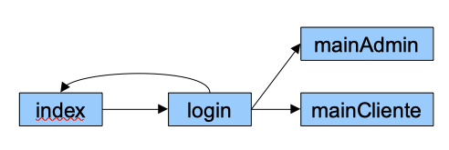
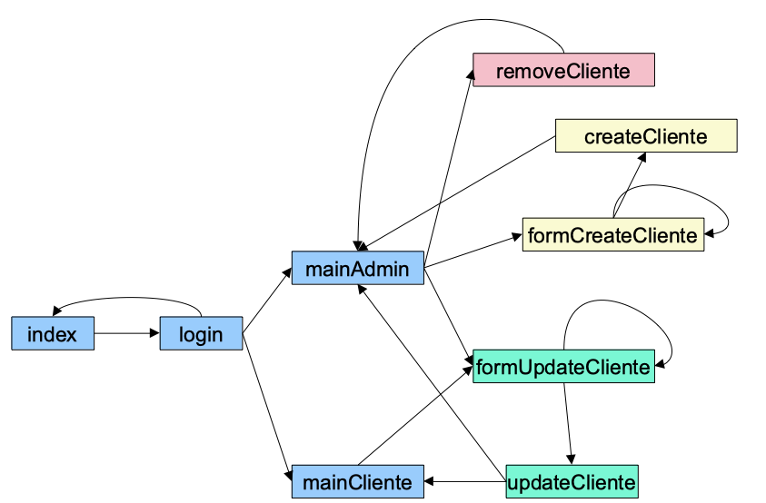

   ✏️ Exercici 123: (`123server.php`): Mostra els valors de `$_SERVER` en executar un script al teu ordinador. Prova a passar-li paràmetres per GET (i a no passar-li cap). Prepara un formulari ('123post.html') que faci un enviament per POST i comprovam de nou. Crea una pàgina ('123enlace.html') que tingui un enllaç a `123server.php` i comprova el valor de `HTTP_REFERER'.

### Formularis

✏️ Exercici 124: (`124formulari.html`  `124formulari.php`): Creeu un formulari que sol·liciti:

* Nom i cognoms.
* Email.
* URL pàgina personal.
* Sexe (ràdio).
* Nombre de convivents al domicili.
* Aficions (checkboxes) – posar mínim 4 valors.
* Menú favorit (llista selecció múltiple) – posar mínim 4 valors.
 
Mostra els valors carregats en una taula-resum.

✏️ Exercici 125: (`125validacio.php`): A partir del formulari anterior, introdueix validacions en HTML mitjançant l'atribut `required` dels camps (usa els tipus adequats per a cada camp), i comprova els tipus de les dades i que compleixen els valors esperats (per exemple, en els checkboxes que els valors recollits formen part de tots els possibles). Pots provar de passar-li dades errònies via URL i comprovar el seu comportament.  
 Tip: Investiga l'ús de la funció `filter_var`.

✏️ Exercici 126: (`126pujada.html` y `126pujada.php`): Crea un formulari que permeti pujar un arxiu al servidor. A més del fitxer, ha de demanar en el mateix formulari dos camps numèrics que demanin l'amplada i l'alçada. Comprova que tant el fitxer com les dades arriben correctament.

✏️ Exercici 127: (`127pujadaImatge.php`): Modifica l'exercici anterior perquè únicament permeti pujar imatges (comprova la propietat `type` de l'arxiu pujat). Si l'usuari selecciona un altre tipus d'arxius, se l'ha d'informar de l'error i permetre que pugi un nou arxiu. En el cas de pujar el tipus correcte, visualitzar la imatge amb la mida d'amplada i alçada rebut com a paràmetre.

### Cookies i Sessió

✏️ Exercici 128: (`128comptadorVisites.php`): Mitjançant l'ús de cookies, informa l'usuari de si és la seva primera visita, o si no ho és, mostri el seu valor (valor d'un comptador). A més, has de permetre que l'usuari reinicialitzi el seu comptador de visites.

✏️ Exercici 129: (`129fons.php`): Mitjançant l'ús de cookies, crea una pàgina amb un desplegable amb diversos colors, de manera que l'usuari pugui canviar el color de fons de la pàgina (atribut `bgcolor'). En tancar la pàgina, aquesta ha de recordar, almenys durant 24h, el color triat i la pròxima vegada que es carregui la pàgina, ho faci amb l'últim color seleccionat.

✏️ Exercici 130: (`130fonsSessio1.php`): Modifica l'exercici anterior per emmagatzemar el color de fons en la sessió i no emprar cookies. A més, ha de contenir un enllaç al següent arxiu. `130fonsSessio2.php`: Ha de mostrar el color i donar la possibilitat de:
    
* tornar a la pàgina anterior mitjançant un enllaç
* i mitjançant un altre enllaç, buidar la sessió i tornar a la pàgina anterior.

✏️ Exercici 131: (Fent ús de la sessió, anam a dividir el formulari de l'exercici `124formulari.php` en 2 subformularis:

* `131formulari.php` envia les dades (nom i cognoms, email, url i sexe) a `131formulari2.php`.
* `131formulari2.php` llegeix les dades i les fica a la sessió. A continuació, mostra la resta de camps del formulari a omplir (convivents, aficions i menú). Envia aquestes dades a `131formulari3.php`.
* `131formulari3.php` recull les dades enviades en el pas anterior i al costat dels que ja estaven en la sessió, es mostren totes les dades en una taula/llista desordenada.

### Autenticació

En els següents exercicis anam a muntar una estructura d'inici de sessió similar a la vista a classe.

✏️ Exercici 132: (`132index.php`): formulari d'inici de sessió

✏️ Exercici 133: (`133login.php`): fa de controlador, per la qual cosa ha de comprovar les dades rebudes (només permet l'entrada de `usuari/usuari` i si tot és correcte, cedir el control a la vista del següent exercici. No conté codi HTML.

✏️ Exercici 134: (`134pelicules.php`): vista que mostra com a títol "Llistat de Pel·lícules", i una llista desordenada amb tres pel·lícules.

✏️ Exercici 135: (`135logout.php`): buida la sessió i ens porta de nou al formulari d'inici de sessió. No conté codi HTML.

✏️ Exercici 136: (`136series.php`): Afegeix una nova vista similar a `134pelicules.php` que mostra un "Llistat de Sèries" amb una llista desordenada amb tres sèries. Tant `134pelicules.php` com la vista acabada de crear, han de tenir un petit menú (senzill, mitjançant enllaços) que permeti passar d'un llistat a un altre. Comprova que si s'accedeix directament a qualsevol de les vistes sense tenir un usuari amb sessió iniciada, via URL del navegador, no es mostra el llistat.

✏️ Exercici 137: Modifica tant el controlador com les vistes perquè:

* les dades les obtingui el controlador (emmagatzema en la sessió un array de pel·lícules i un altre de sèries)
* col·loqueu les dades en la sessió
* En les vistes, les dades es recuperen de la sessió i es *pinten* en la llista desordenada recorrent l'vector corresponent.

### Projecte Videoclub 3.0

✏️ Exercici 138: Per al Videoclub, anam a crear una pàgina `index.php` amb un formulari que contingui un formulari de login/password. Es comprovaran les dades en `login.php`. Els possibles usuaris són admin/admin o usuari/usuari.

* Si l'usuari és correcte, en `main.php` mostrar un missatge de benvinguda amb el nom de l'usuari, al costat d'un enllaç per tancar la sessió, que el portaria de nou al login.
* Si l'usuari és incorrecte, ha de tornar a carregar el formulari donant informació a l'usuari d'accés incorrecte.

✏️ Exercici 139: Si l'usuari és administrador, es carregaran en la sessió les dades de suports i clients del videoclub que teníem en les nostres proves (no mitjançant `include` sinó copiant les dades i inserint-les en un vector associatiu, el qual col·locarem posteriorment en la sessió).

En la següent unitat els obtindrem de la base de dades. En `mainAdmin.php`, a més de la benvinguda, ha de mostrar:

* Llistat de clients
* Llistat de suports

<figure style="float: right;">
   
   <figcaption>Esquema navegació exercici 141</figcaption>
</figure>

✏️ Exercici 140: Anam a modificar la classe `Client` per emmagatzemar l'`user` i la `password` de cada client. Després de codificar els canvis, modificar el llistat de clients de `mainAdmin.php` per afegir al llistat l'usuari.

✏️ Exercici 141: Si l'usuari que accedeix no és administrador i coincideix amb algun dels clients que tenim carregats després del login, ha de carregar `mainCliente.php` on es mostrarà un llistat dels lloguers del client. Per a això, modificarem la classe `Client` per oferir el mètode `getLloguers() : array`, el qual invocarem i després recorrerem per mostrar el llistat sol·licitat.

Ara tornem a la part d'administració

✏️ Exercici 142: A més de mostrar el llistat de clients, vam oferir l'opció de donar d'alta un nou client a `formCreateCliente.php'. Les dades s'enviaran mitjançant POST a `createCliente.php` que les introduirà en la sessió. Un cop creat el client, ha de tornar a carregar `mainAdmin.php` on es podrà veure el client inserit. Si hi ha alguna dada incorrecta, ha de tornar a carregar el formulari d'alta.

✏️ Exercici 143: Crea en `formUpdateCliente.php` un formulari que permeti editar les dades d'un client. Has de recollir les dades a `updateCliente.php`. Les dades de client s'han de poder modificar des de la pròpia pàgina d'un client, així com des del llistat de l'administrador.

✏️ Exercici 144: Des del llistat de clients de l'administrador has d'oferir la possibilitat d'esborrar un client. Al navegador, abans de redirigir el servidor, l'usuari ha de confirmar mitjançant JS que realment desitja eliminar el client. Finalment, a `removeCliente.php` elimina el client de la sessió. Un cop eliminat, ha de tornar al llistat de clients.

<figure style="align: center;">
    
    <figcaption>Esquema navegació Videoclub 3.0</figcaption>
</figure>