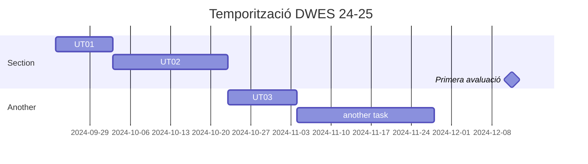

# DWES - Pàgina resum

## RAs treballats (Des 2024)

|     RA      | Descripció                                                                                                                                    | Ja treballats?       |
|:-----------:|-----------------------------------------------------------------------------------------------------------------------------------------------|----------------------|
|   BLOC 1    |||
| **__RA1__** | Selecciona les arquitectures i tecnologies de programació web en entorn servidor, analitzant les seves capacitats i característiques pròpies. | :material-check-all: |
| **__RA2__** | Escriu sentències executables per un servidor web reconeixent i aplicant procediments d’integració del codi en llenguatges de marques.        | :material-check-all: |
| **__RA3__** | Escriu blocs de sentències embeguts en llenguatges de marques, seleccionant i utilitzant les estructures de programació.                      | :material-check-all: |
| **__RA4__** | Desenvolupa aplicacions web embegudes en llenguatges de marques analitzant i incorporant funcionalitats segons especificacions.               | :material-check-all: |
| **__RA5__** | Desenvolupa aplicacions web identificant i aplicant mecanismes per separar el codi de presentació de la lògica de negoci.| :material-check:     |
| **__RA6__** | Desenvolupa aplicacions web d’accés a magatzems de dades, aplicant mesures per mantenir la seguretat i la integritat de la informació.        | :material-check:     |
| **__RA7__** | Desenvolupa serveis web analitzant el seu funcionament i implantant l’estructura dels seus components.                                        |                      |
| **__RA8__** | Genera pàgines web dinàmiques analitzant i utilitzant tecnologies del servidor web que afegeixin codi al llenguatge de marques.               |                      |
| **__RA9__** | Desenvolupa aplicacions web híbrids seleccionant i utilitzant llibreries de codi i dipòsits heterogenis d’informació.                         |                      |

## Unitats de treball
UNIDAD DE TRABAJO 1: Arquitecturas web
UNIDAD DE TRABAJO 2:  Características del lenguaje PHP.
UNIDAD DE TRABAJO 3 : PHP  orientado a objetos
UNIDAD DE TRABAJO 4: Programación Web y herramientas Web
UNIDAD DE TRABAJO 5: Acceso a datos.
UNIDAD DE TRABAJO 6: Frameworks PHP – Laravel.
UNIDAD DE TRABAJO 7: Servicios Web.
UNIDAD DE TRABAJO 8: Aplicaciones web híbridas. 

<article class="iDevice_wrapper EleccionmultiplefpdIdevice em_iDevice" id="id13-4">

<header class="iDevice_header" style="background-image:url(icon_autoevaluacionfpd.gif)"><h2 class="iDeviceTitle">Autoevaluación</h2></header>

<section class="question">
<form name="multi-choice-form-13_60" action="#" onsubmit="return false" class="activity-form">
<h1 class="js-sr-av">Pregunta</h1>

<strong>En lugar de programar un método <code>set</code> para modificar el valor de los atributos privados en que sea necesario, puedo utilizar el método mágico <code>__set</code>.</strong>

<section class="iDevice_answers">
<h1 class="js-sr-av">Respuestas</h1>
<section class="iDevice_answer">

<label for="i13_63" class="sr-av"><a href="#answer-13_63">Opción 1</a></label><input type="radio" name="option13_60" id="i13_63" class="exe-radio-option exe-radio-option-0-2-13_60-multi">

Verdadero.

</section>
<section class="iDevice_answer">

<label for="i13_99" class="sr-av"><a href="#answer-13_99">Opción 2</a></label><input type="radio" name="option13_60" id="i13_99" class="exe-radio-option exe-radio-option-1-2-13_60-multi">

Falso.

</section>
</section>
<section class="iDevice_feedbacks js-feedback" role="status">
<h1 class="js-sr-av">Retroalimentación</h1>
<section id="sa0b13_60" class="feedback js-hidden" style="display: none;">

Sí, pero tendrías que comprobar el nombre del atributo usado y asignar el valor al adecuado.

</section>
<section id="sa1b13_60" class="feedback js-hidden" style="display: block;">

Si el atributo es privado, no es accesible; por tanto, cuando se le intente asignar un valor, se llamará al método mágico <code>__set</code> si existe.

</section>
</section>
</form>
<section class="iDevice_solution feedback js-hidden">
<h1>Solución</h1>
<ol>
<li><a href="#answer-13_63">Incorrecto</a> (<a href="#sa0b13_60">Retroalimentación</a>)</li>
<li><a href="#answer-13_99">Opción correcta</a> (<a href="#sa1b13_60">Retroalimentación</a>)</li>
</ol>
</section>
</section>

</article>