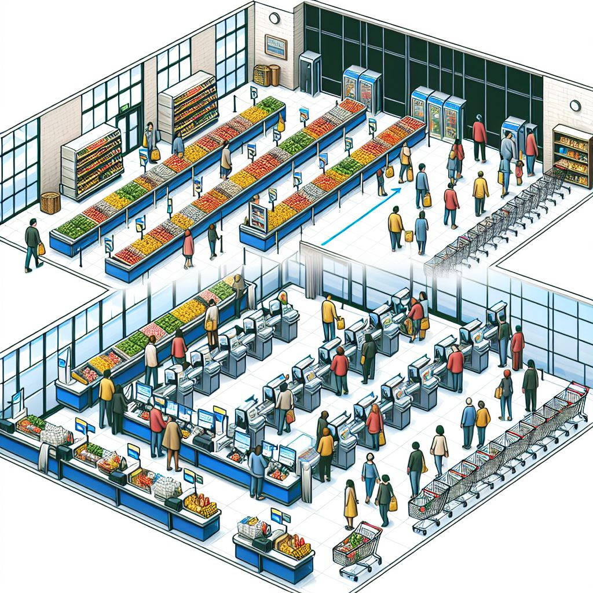

# Una o múltiples coes?

{ style="height:200px; width:100%; object-fit:cover"}

<!---->

### Única cua

**Avantatges:**

- **Equitat:** Els clients<!-- more --> són atesos en l'ordre d'arribada, evitant la frustració de veure com altres cues avancen més ràpidament.

- **Eficiència:** Pot ser més fàcil per als clients triar una cua, ja que no han de decidir quina caixa sembla més ràpida.

**Inconvenients:**

- **Espai:** Pot requerir més espai per acomodar una cua única, especialment en hores punta.

- **Gestió:** Pot ser més complicat gestionar una cua única si hi ha molts clients.

### Múltiples cues

**Avantatges:**

- **Flexibilitat:** Els clients poden triar la cua que sembla més ràpida, i les cues poden ser més curtes en espais reduïts.
 
- **Especialització:** Algunes caixes poden ser designades per a clients amb poques compres o per a pagaments ràpids.

**Inconvenients:**

- **Inequitat:** Els clients poden sentir-se frustrats si una cua avança més ràpidament que una altra.

- **Decisió:** Els clients han de decidir quina cua triar, cosa que pot causar estrès o indecisió.

En general, la millor opció pot dependre de la mida del supermercat, el nombre de clients i l'espai disponible. Alguns supermercats opten per una combinació de les dues opcions, amb una cua única per a caixes ràpides i múltiples cues per a caixes normals. Què en penses? Quina opció creus que funcionaria millor en el teu supermercat?
Resposta d'un sistema d'IA. Ara te toca a tú, formular una nova hipòtesi o mantenir la que ja tenies una vegada fetes les simulacions proposades als [exercicis](../../Moduls/PSP/exercicisisolucions/ExercicisFils.md).