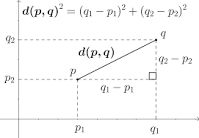

# Distància Euclidiana?

<!--[Foto de Markus Spiske ](https://www.pexels.com/ca-es/foto/ordinador-monitor-mostrar-exhibicio-965345/)-->

<figure markdown="span">
  
</figure>

**Què és la distància euclidiana?**

Arran de l'enunciat del següent exercici: _"Implementa una funció que calculi la distància euclidiana <!-- more -->(comunment anomenada distància) entre dos punts en un pla 2D utilitzant l'objecte Math._", explic, molt breument, què és la distància euclidiana i com es calcula.

!!! info "Què és la distància euclidiana?"

    La distància euclidiana és una mesura de la distància directa entre dos punts en un espai euclidià (un espai de geometria plana). És la forma més comuna de calcular la distància entre dos punts en un pla o en un espai tridimensional. En un pla 2D, la distància euclidiana entre dos punts (A(x1, y1)) i (B(x2, y2)) es calcula utilitzant la fórmula:
    
    $$
    \sqrt{(x_{2}-x_{1})^{2}+(y_{2}-y_{1})^{2}}
    $$

[https://ca.wikipedia.org/wiki/Dist%C3%A0ncia_euclidiana](https://ca.wikipedia.org/wiki/Dist%C3%A0ncia_euclidiana)