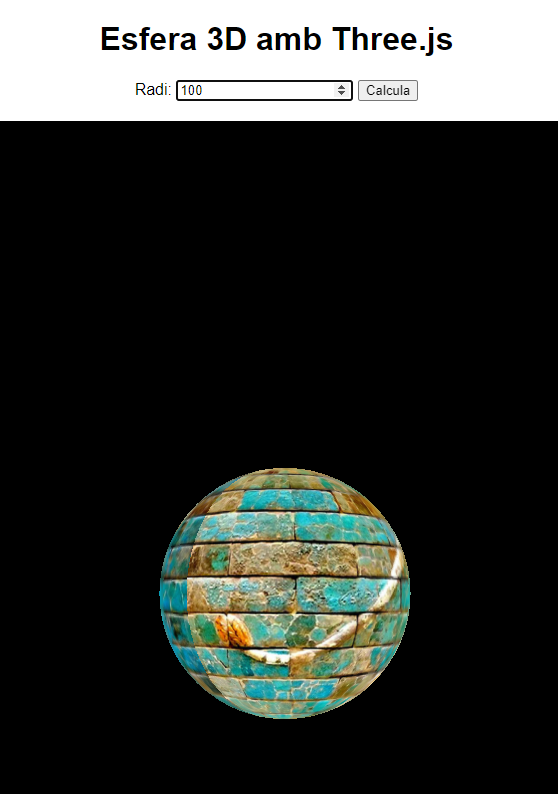

# Crear una esfera 3d

<!--[<span style="font-family:Papyrus; font-size:0.7em;">Foto de Markus Spiske </span>](https://www.pexels.com/ca-es/foto/ordinador-monitor-mostrar-exhibicio-965345/)-->

<figure markdown="span">
  { width="25%" }
  <a href="#vista-captura-ampliada"><figcaption style="font-size:0.7em;">Captura de pantalla de l'execució de l'exemple.</figcaption></a>
</figure>

A partir d'allò que hem vist a classe se va demanar <!-- more --> fer modificacions per fer, **utilitzant llibreries externes** una esfera 3D proporcional al radi inserit per l'usuari.

Aquí teniu un exemple utilitzant la llibreria [**threeJS**](https://codingpotions.com/threejs-introduccion/). Feu click a l'enllaç anterior per accedir a una introducció a la llibreria ThreeJS

Aquest és el codi de **_radi_circumferencia3.js_**
```javascript
// Configuració bàsica de Three.js
const scene = new THREE.Scene();
const camera = new THREE.PerspectiveCamera(75, window.innerWidth / window.innerHeight, 0.1, 1000);
const renderer = new THREE.WebGLRenderer();
renderer.setSize(window.innerWidth, window.innerHeight);
document.body.appendChild(renderer.domElement);

// Carregar la textura
const textureLoader = new THREE.TextureLoader();
const texture = textureLoader.load('https://threejsfundamentals.org/threejs/resources/images/wall.jpg'); // URL de la textura

// Crear una esfera
let sphere;
function createSphere(radius) {
    if (sphere) {
        scene.remove(sphere);
    }
    const geometry = new THREE.SphereGeometry(radius, 32, 32);
    const material = new THREE.MeshBasicMaterial({ map: texture });
    sphere = new THREE.Mesh(geometry, material);
    scene.add(sphere);
}

// Posicionar la càmera
camera.position.z = 5;

// Funció d'animació
function animate() {
    requestAnimationFrame(animate);
    if (sphere) {
        sphere.rotation.y += 0.01; // Rotació sobre l'eix Y
    }
    renderer.render(scene, camera);
}
animate();

// Ajustar la mida del renderer quan la finestra canvia de mida
window.addEventListener('resize', () => {
    renderer.setSize(window.innerWidth, window.innerHeight);
    camera.aspect = window.innerWidth / window.innerHeight;
    camera.updateProjectionMatrix();
});

// Gestionar el formulari
document.getElementById('radiusForm').addEventListener('submit', function(event) {
    event.preventDefault();
    const radius = parseFloat(document.getElementById('radius').value);
    if (isNaN(radius) || radius <= 0) {
        alert('Si us plau, introdueix un radi vàlid.');
        return;
    }
    createSphere(radius/100);
});
```

I aquí teniu el codi html **_radi_circumferencia3.html_**

```html
<!DOCTYPE html>
<html lang="ca">
<head>
  <meta charset="UTF-8">
  <meta name="viewport" content="width=device-width, initial-scale=1.0">
  <title>Esfera 3D amb Three.js</title>
  <style>
    body { margin: 0; font-family: Arial, sans-serif; text-align: center; }
    canvas { display: block; margin: 0 auto; }
    form { margin: 20px; }
  </style>
</head>
<body>
<h1>Esfera 3D amb Three.js</h1>
<form id="radiusForm">
  <label for="radius">Radi:</label>
  <input type="number" id="radius" name="radius" required>
  <button type="submit">Calcula</button>
</form>
<script src="https://cdnjs.cloudflare.com/ajax/libs/three.js/r128/three.min.js"></script>
<script src="radi_circumferencia3.js"></script>
</body>
</html>

```

### Vista captura ampliada

<figure markdown="span">
  { width="100%" }
  <figcaption style="font-size:0.7em;">Captura de pantalla de l'execució de l'exemple.</figcaption></a>
</figure>

[Accediu a l'execució de l'exemple](https://docencia.xaviersastre.cat/Moduls/DWEC/exercicisisolucions/radi_circumferencia3.html)

