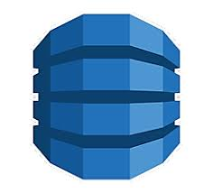

# Informació sobre Amazon SDK PHP

<figure markdown="span">
  { width="25%" }
</figure>

Enllaç a exemples al Github :material-github:

https://github.com/awsdocs/aws-doc-sdk-examples/tree/main/php/example_code/dynamodb#code-examples

Què és dynamoDB?

https://docs.aws.amazon.com/amazondynamodb/latest/developerguide/Introduction.html