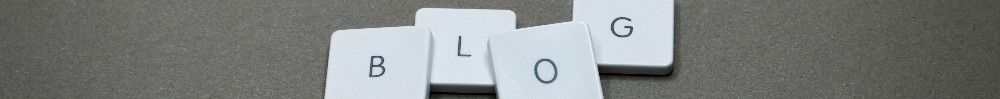

# El bloc!

[Foto de Miguel Á. Padriñán](https://www.pexels.com/ca-es/foto/1591056/)

Doncs en aquest lloc web que estic fent aquest curs, notava a faltar qualcuna manera de publicar documentació que realment no té una estructura clara però que vos pot resultar interessant. Aleshores he revisat si amb el [mkdocs - material](https://squidfunk.github.io/mkdocs-material/) es podia crear qualcuna cosa semblant a un bloc <!-- more --> i efectivament. I a més a més, amb la mateixa facilitat que la resta de coses.

Així doncs, a partir d'ara, també tindrem "entrades" al bloc per documentar coses que no entren dins l'estructura dels cursos.

