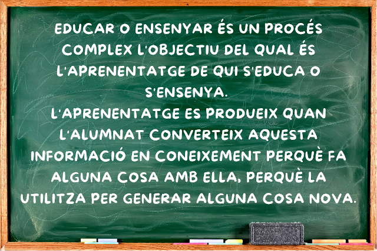

# Recursos Docència Xavier Sastre

## Curs 2024-2025

- :material-server:{ .lg .middle } __DAW DWES__ Desenvolupament Web Entorn Servidor

    ---

- :fontawesome-brands-js: __DAW DWEC__ Desenvolupament Web Entorn Client

    ---

    [:octicons-book-16: Angular :material-lightbulb-on-40:](Moduls/DWEC/angular_menu.md)

    [:octicons-book-16: Asincronía y Promesas :material-lightbulb-on-40:](Moduls/DWEC/promesas.md)

    [:octicons-book-16: Comunicación con el servidor - AJAX :material-lightbulb-on-40:](Moduls/DWEC/ajax.md)

- :material-message-processing: __DAM PSP__ Programació de serveis i processos

    ---

- :material-security: __SMX SI__ Seguretat Informàtica

    ---

- :material-web: __SMX AW__ Aplicacions Web

    ___

- :material-microsoft-word: __SMX AO__ Aplicacions Ofimàtiques

    ___    
 

